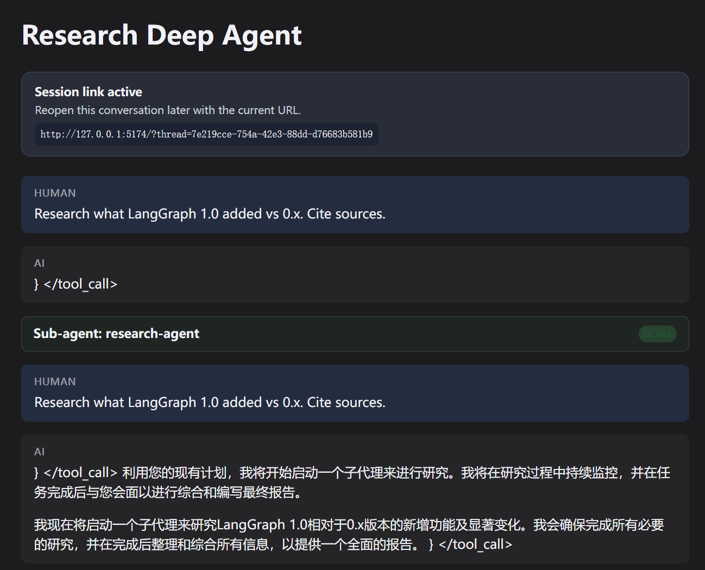
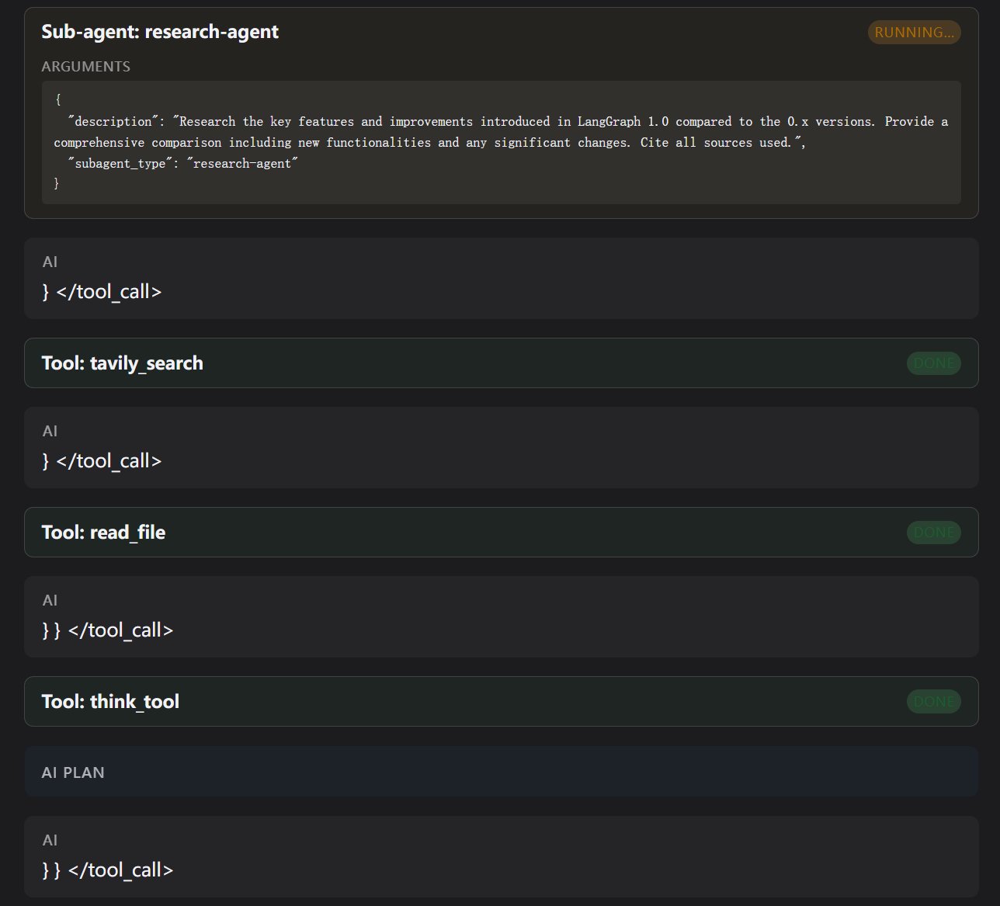
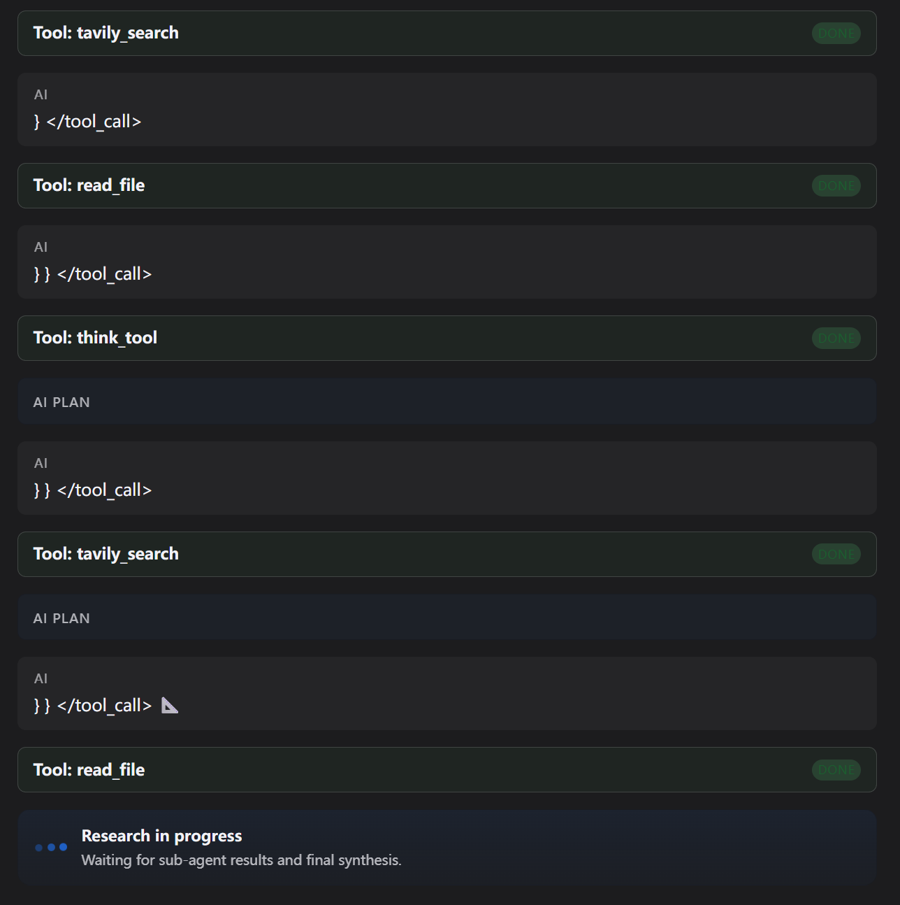
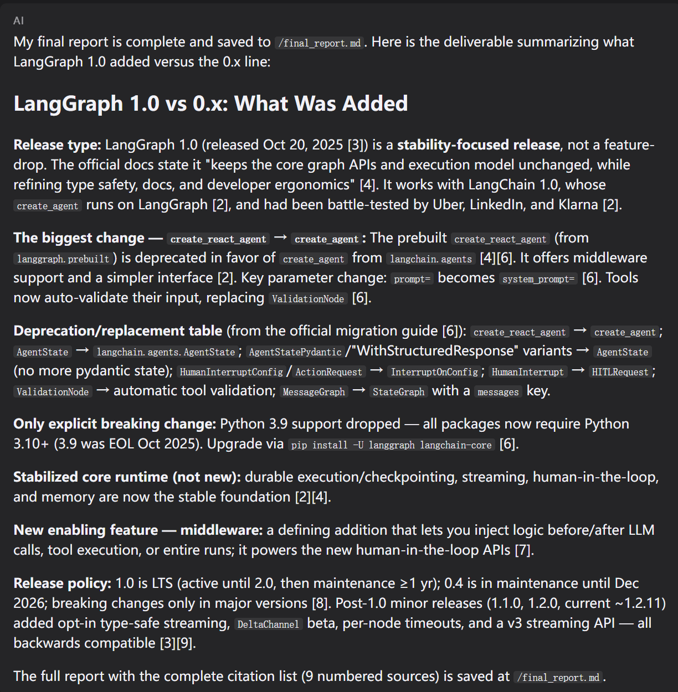
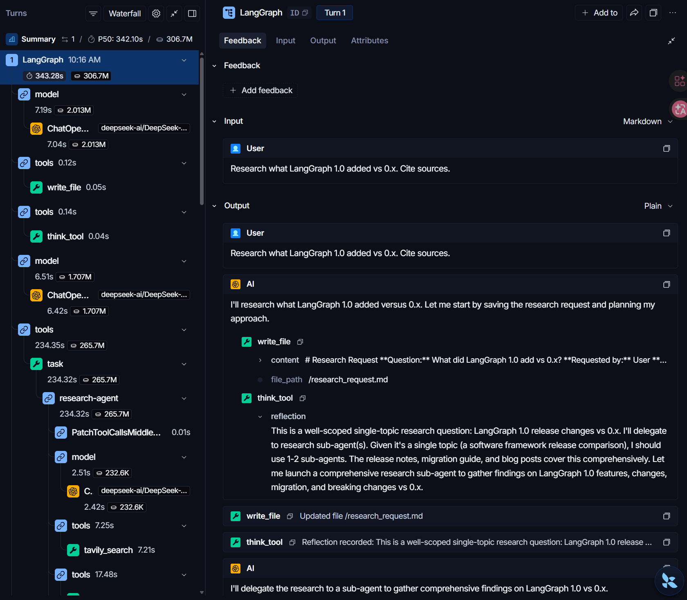
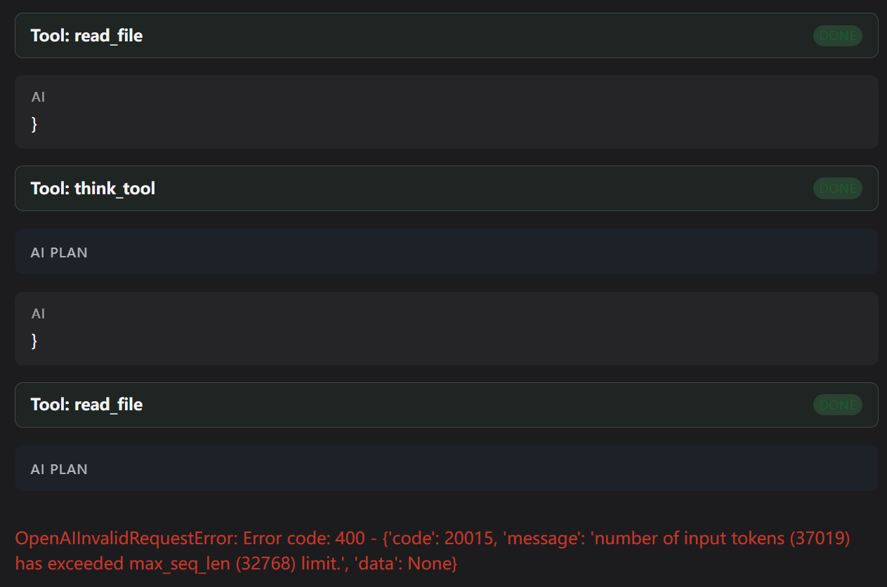

# Deep Agents 准备篇（上）：AgentSeek 环境搭建

> 课程：Datawhale《Deep Agents 实战》准备篇（一）[AgentSeek：用生命周期工作流启动 DeepAgents 模板](https://datawhalechina.github.io/deepagents-in-action/chapters/pre01-agentseek-create/)
> 完成日期：2026-09-14
> 运行环境：Windows 11 + WSL2 (Ubuntu)，conda base
> 推荐版本：AgentSeek 0.1.4（课程验证 0.1.2）

---

## 一、核心结论

AgentSeek 是面向 AI 应用开发的项目脚手架与生命周期工具：从模板生成一个可编辑的完整项目，再用固定命令管理其依赖安装、体检与启动。它不接管应用框架代码，只负责「怎么搭起来、怎么跑起来」。

| 阶段 | 命令 | 作用 |
|------|------|------|
| 创建 | `agentseek create` | 从模板生成可编辑项目 |
| 查看 | `agentseek info` / `task --list` | 看项目入口、环境要求、可运行任务 |
| 准备 | `agentseek task <任务>` | 运行模板声明的依赖安装等一次性任务 |
| 检查 | `agentseek doctor` | 体检：文件、uv、Node、npm、环境变量 |
| 运行 | `agentseek dev` | 一键启动前后端开发进程 |

## 二、模板机制

模板 = 预先做好的项目骨架，`agentseek create` 把模板复制成自己的项目再学习修改。
- **7 个 `deepagents/` 模板**分别预置不同能力：research（搜索+前端）、sandbox（代码沙箱）、mcp（MCP 工具）等
- 本章用 `deepagents/research`：Deep Agents 研究 Agent + Tavily 搜索 + React 前端
- `--checkout main` 拉取模板仓库最新登记清单；不加则用 CLI 内置锁定目录（可能略旧）

## 三、实际操作记录

### 0. 准备本地环境

```bash
# Python 3.12.4 / uv / AgentSeek / Node
uv tool install --upgrade agentseek
agentseek version
agentseek --help   # 看到 create、info、task、doctor、dev
```

### 1. 查看模板列表（联网拉取 main 最新）

```bash
agentseek create --list-templates --checkout main
```

输出可见 3 类 17 个模板：`bub(1)`、`deepagents(7)`、`langchain(9)`。

### 2. 创建 research 项目（用固定 SHA 保证可复现）

```bash
mkdir -p ~/self_study/deepagents/projects && cd ~/self_study/deepagents/projects
agentseek create deepagents/research \
  --checkout 9d3a2c761c9412a0ea0bc0968907cb811808fb9b --no-input
# → Created research_deepagent
```

生成的关键文件：

```
research_deepagent/
├── .agentseek/lifecycle.toml   # 生命周期"说明书"
├── .env.example                # 环境变量配置模板
├── frontend/                   # React 前端
├── langgraph.json
├── pyproject.toml              # Python 依赖
└── src/research_deepagent/     # agent.py / prompts.py / tools.py
```

### 3. 查看项目与任务清单

```bash
agentseek info
agentseek task --list
```

`task --list` 列出两个一次性任务：`sync`（装 Python 依赖）、`frontend`（装前端依赖）。

### 4. 安装后端与前端依赖

```bash
agentseek task sync        # 生成 uv.lock、*.egg-info
agentseek task frontend    # 生成 frontend/node_modules
```

### 5. 配置环境变量

```bash
cp .env.example .env
```

编辑 `.env`，基于**硅基流动**（OpenAI 兼容接口）填写：

```bash
AGENTSEEK_MODEL_PROVIDER=openai
AGENTSEEK_MODEL=Qwen/Qwen2.5-7B-Instruct
OPENAI_API_BASE=https://api.siliconflow.cn/v1
OPENAI_API_KEY=<硅基流动 Key>
TAVILY_API_KEY=<Tavily Key，https://app.tavily.com 注册>
LANGSMITH_TRACING=false
```

注意：`AGENTSEEK_MODEL` 需填硅基流动[模型广场](https://cloud.siliconflow.cn/models)当前可用的完整 ID，并要求模型支持 Tool Call。

### 6. 体检

运行 `agentseek doctor`，全部通过：

```
$ agentseek doctor
ok   lifecycle.toml: Lifecycle spec is present.
ok   uv: uv is available.
ok   node: node is available.
ok   npm: npm is available.
ok   pyproject.toml: pyproject.toml is present.
ok   langgraph.json: langgraph.json is present.
ok   frontend/package.json: frontend/package.json is present.
ok   frontend/node_modules: frontend/node_modules is present.
ok   .env: .env is present.
ok   SEEKDB_EMBED: SEEKDB_EMBED is configured.
ok   SEEKDB_EMBED_DIR: SEEKDB_EMBED_DIR is configured.
ok   OCEANBASE_DB_NAME: OCEANBASE_DB_NAME is configured.
ok   AGENTSEEK_MODEL_PROVIDER: AGENTSEEK_MODEL_PROVIDER is configured.
ok   AGENTSEEK_MODEL: AGENTSEEK_MODEL or DEEPAGENTS_MODEL or BUB_MODEL is configured.
ok   OPENAI_API_KEY: OPENAI_API_KEY or ANTHROPIC_API_KEY or GOOGLE_API_KEY or BUB_OPENAI_API_KEY is configured.
ok   TAVILY_API_KEY: TAVILY_API_KEY is configured.
ok   LANGCHAIN_OPENAI_STREAM_CHUNK_TIMEOUT_S: LANGCHAIN_OPENAI_STREAM_CHUNK_TIMEOUT_S is configured.
ok   langgraph cwd: . is present.
ok   frontend cwd: frontend is present.
```

19 项全部 `ok`，0 项 `fail`，环境就绪。

### 7. 启动（已完成 ✅）

后端与前端分别启动，保持两个终端：

```bash
# 终端 A —— 后端（LangGraph API，必须监听 IPv4）
export NO_PROXY=127.0.0.1,localhost,api.siliconflow.cn,api.tavily.com
export no_proxy=127.0.0.1,localhost,api.siliconflow.cn,api.tavily.com
uv run agentseek-api serve --host 0.0.0.0 --port 2024
# 终端 B —— 前端（Vite React）
npm run dev --prefix frontend
```

- 后端地址 `http://127.0.0.1:2024`（文档页 `/docs`），前端地址 `http://127.0.0.1:5174`
- 在页面输入测试问题：`Research what LangGraph 1.0 added vs 0.x. Cite sources.`
- 预期正常表现：Agent 生成研究计划（Todo）→ 委派研究子 Agent → 多轮 Tavily 搜索 → 最终报告附带来源链接、以 Markdown 渲染

### 8. 最终可用配置要点

| 环节 | 配置 | 原因 |
|------|------|------|
| 后端监听 | `serve --host 0.0.0.0` | 本机 `localhost` 解析优先 IPv6，`dev` 的就绪自检会失败自杀；`::` 又是 IPv6-only，前端（IPv4）连不上 |
| 模型调用 | 直连（`api.siliconflow.cn` 加入 `NO_PROXY`） | 代理会掐断长时间 SSE 流式连接 |
| Tavily 搜索 | 直连（加入 `NO_PROXY`） | 国内可直连，实测 2 秒返回 |
| 国外网页抓取 | 走系统代理 | langchain.com 等直连不通，需代理 |
| 浏览器 | 只连 5174，由 Vite 转发 API 到 2024 | 避开 Windows 侧代理对 2024 长连接的干扰（改 `frontend/.env` 的 `VITE_LANGGRAPH_API_URL=http://127.0.0.1:5174` + `vite.config.ts` 加 proxy 规则） |
| 流式超时 | `LANGCHAIN_OPENAI_STREAM_CHUNK_TIMEOUT_S=0` | 模型生成大段工具调用参数时会长时间停顿，300s 保险丝会误杀正常任务 |
| 模型选择 | `Qwen/Qwen2.5-7B-Instruct`（备选 72B） | 需支持 Tool Call 且流式稳定；72B 质量高但生成大 JSON 参数时停顿明显 |

经验：页面超过 5 分钟无动静，多半是撞上模型服务商的流式停滞（禁用超时后不会自救），可通过 API 取消挂死的 run 再重试，无需重启后端。

### 9. 运行实录

研究 Agent 实际运行界面——会话建立、子 Agent 委派完成：



子 Agent 执行中：Tavily 搜索、读文件、思考工具依次完成：



多轮搜索与阅读后进入最终综合阶段：



换用 DeepSeek-V4-Flash 重试后成功跑通（2026-09-15）——最终报告以 Markdown 渲染并附来源引用：



报告全文已导出：[final_report-langgraph-1.0-vs-0.x.md](learning-records/final_report-langgraph-1.0-vs-0.x.md)（从 thread `2adc158f` 的虚拟文件系统 `/final_report.md` 经 LangGraph API 提取）

本次运行的 **LangSmith 追踪 Trace**（Waterfall 视图）——完整展示了 Turn 1 的执行树：模型调用（deepseek-ai/DeepSeek）→ `write_file` 保存研究请求 → `think_tool` 反思 → `task` 委派 `research-agent` 子 Agent → `tavily_search` 搜索，并可展开每步的输入输出与耗时：



### 试错记录：7B 模型上下文溢出

上述换用 `Qwen/Qwen2.5-7B-Instruct` 后，多轮 `tavily_search` / `read_file` / `think_tool` 调用本身都能正常执行（全部 done），但继续推进最终综合时报错终止：



```
OpenAIInvalidRequestError: Error code: 400 -
{'code': 20015, 'message': 'number of input tokens (37019) has exceeded
max_seq_len (32768) limit.', 'data': None}
```

**原因分析**：

- Qwen2.5-7B 在硅基流动侧的 `max_seq_len` 为 32768 token，而研究 Agent 的对话历史会随每轮工具调用持续膨胀——搜索返回的网页正文、`read_file` 读入的内容都完整堆积在上下文里
- 跑到最后综合阶段时输入已累计到 37019 token，超出上限，服务商直接拒绝请求（400），本轮研究失败
- 这属于 7B 模型固有的**上下文窗口限制**，与前面的代理、流式配置无关——网络问题都解决后它就是最后一块拦路石
- **对策**：换用 32K 以上的大上下文模型；或减少单轮搜索结果长度/工具调用轮数，控制历史膨胀。72B 流式虽慢但上下文更宽，可作为备选

## 四、如何查看生成项目的 Agent 配置

AgentSeek 的 main 模板会持续更新。运行前，先查看生成项目里 Agent 的实际配置在哪，再对照验证界面/ Trace 输出，避免把"某功能未启用"误判为"运行失败"。

### 1. Agent 主配置（agent.py）

入口 [src/research_deepagent/agent.py](file:///home/xiaoberber/self_study/deepagents/projects/research_deepagent/src/research_deepagent/agent.py)：用 `create_deep_agent(...)` 组装系统提示词、工具、子 Agent。

```python
model = init_chat_model(**MODEL_INIT_KWARGS)   # 模型来自 .env 配置

graph = create_deep_agent(
    model=model,
    tools=[tavily_search, think_tool],
    system_prompt=INSTRUCTIONS,                 # research 工作流提示词
    subagents=[research_sub_agent],             # 研究子 Agent（Tavily 搜索）
)
```

- **tools**：`tavily_search`（联网搜索）、`think_tool`（思考）
- **subagents**：`research-agent` 子 Agent，带上自己的 `system_prompt` 与 `tools`
- 模型、provider、api_key/base_url 均由 `.env` 经 `MODEL_INIT_KWARGS` 注入

### 2. 提示词（prompts.py）

[src/research_deepagent/prompts.py](file:///home/xiaoberber/self_study/deepagents/projects/research_deepagent/src/research_deepagent/prompts.py)：研究流程指令、子 Agent 委托指令、`write_todos` 等工具用法说明。

### 3. 判断 Todo/计划面板是否启用

关键：`create_deep_agent` 是否**显式传入** TodoListMiddleware。

- **显式传入** → v0.7 提供 `write_todos`；界面/Trace 应出现 Todo、任务卡、计划面板
- **未传入** → 本模板如此：`agent.py` 的调用里**没有 middleware 参数**，不提供 `write_todos`，运行正常时界面**不一定会出现计划面板/待办**，这不代表运行失败

对照运行正常的表现（此模板）：
- Agent 创建研究计划并更新待办状态（若已启用 Todo）
- 模型选择委派时，界面展示研究子 Agent 的任务卡
- 最终报告展示搜索得到的来源链接
- 最终回答以 Markdown 渲染，并附带来源链接

### 10. 准备篇（下）：安装开发指导技能 ✅

课程新版提供 `agentseek skills` 子命令，但当前 PyPI 发布的 v0.1.4 尚未包含该命令，改用 `npx skills` 工具完成同样安装（非交互模式，效果等价）：

```bash
npx skills add ob-labs/agentseek \
  --skill langchain-dev-guide --skill langsmith-trace \
  --agent codex --agent trae-cn --global --yes
```

安装结果：
- 技能实体存放在 `~/.agents/skills/`（通用目录），并自动软链接到 `~/.trae-cn/skills/` 和 Codex 目录
- **langchain-dev-guide**：LangChain/LangGraph/DeepAgents 工程踩坑手册（含国产模型接入模板），之后修改 agent.py 遇到问题时点名调用
- **langsmith-trace**：LangSmith Trace 调试指南，可选（需开启 `LANGSMITH_TRACING=true` + LangSmith Key）
- 维护命令：更新 `npx skills update -g`；移除 `npx skills remove <技能名> -g --yes`

注意：技能列表在编码助手会话启动时扫描，新开对话才可调用。

### 11. 追加：项目级安装（交互模式）✅

在项目目录 `~/self_study/deepagents/projects/research_deepagent` 下用交互模式再装一次，使技能跟随项目、对项目内所有助手可见：

```bash
npx skills add ob-labs/agentseek --skill langchain-dev-guide --skill langsmith-trace
```

安装过程要点：
- 交互界面会列出全部 73 个 agents 供勾选，本次全选 13 个（Amp、Antigravity、Antigravity CLI、Cline、Codex、Cursor、Deep Agents、Gemini CLI、GitHub Copilot、Kimi Code CLI、OpenCode、Warp、Zed）
- **Installation scope 选 Project**（区别于上次 Global），技能实体复制到项目内：
  - `research_deepagent/.agents/skills/langchain-dev-guide`
  - `research_deepagent/.agents/skills/langsmith-trace`
- 结果：2 个技能均提示 `✓ (copied)` 安装完成

顺带装了 `npx skills` 提示的一次性附加项 **find-skills**（来源 `vercel-labs/skills`，装到全局 `~/.agents/skills/find-skills`）：
- 作用：帮编码助手发现/推荐可用技能
- 安全评估：Gen 评为 Safe、Socket 0 告警、Snyk 评为 Med Risk（详情见 skills.sh/vercel-labs/skills）
- 提示语值得记住：技能以完整 agent 权限运行，使用前先审查其内容

小结：现在技能在**两处**生效——全局（`~/.agents/skills/`，第 10 节装的）与项目级（`.agents/skills/`，本节装的），内容相同，后者随项目目录走，便于团队共享。

验证：`npx skills list` 确认项目内已注册 2 个技能：

```text
$ npx skills list
Project Skills

langchain-dev-guide ~/self_study/deepagents/projects/research_deepagent/.agents/skills/langchain-dev-guide Agents: Codex, GitHub Copilot
langsmith-trace     ~/self_study/deepagents/projects/research_deepagent/.agents/skills/langsmith-trace     Agents: Codex, GitHub Copilot
```

- 列表显示的 `Agents: Codex, GitHub Copilot` 是本机实际检测到的可用助手，安装时虽勾选了 13 个 agents，但只有本机存在的助手会真正挂载
- 两个技能均指向项目内 `.agents/skills/` 路径，说明项目级安装生效

## 五、概念辨析

- **Deep Agents**：要学的框架本体（Python 库，提供 Agent 能力）
- **AgentSeek**：帮你搭项目、跑项目的脚手架/生命周期 CLI
- **`npx skills`**：给编码助手装开发指导技能的工具（课程准备篇下）
- **Runtime / Framework / Harness**：LangGraph（运行时基座）→ LangChain（框架层）→ Deep Agents（工具层/开箱即用 Harness）