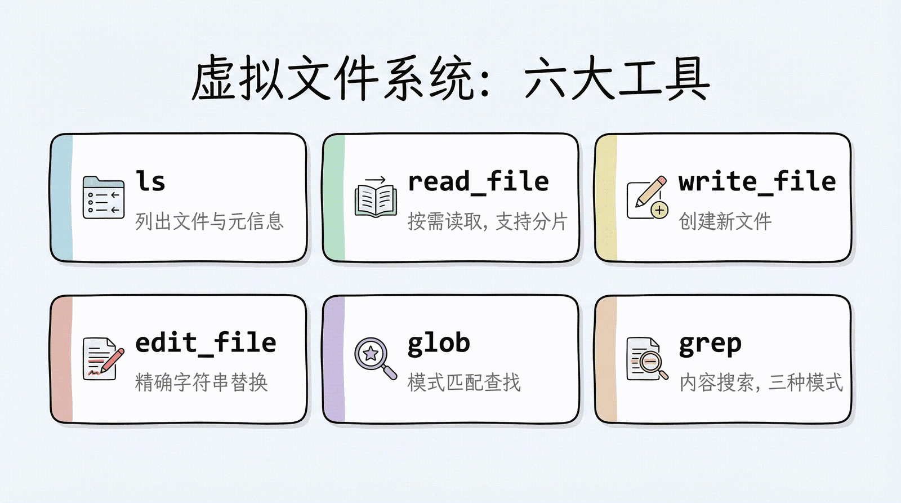
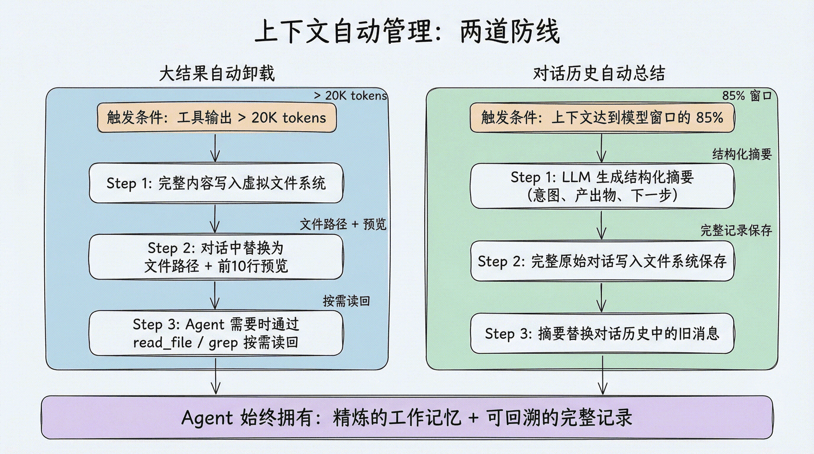
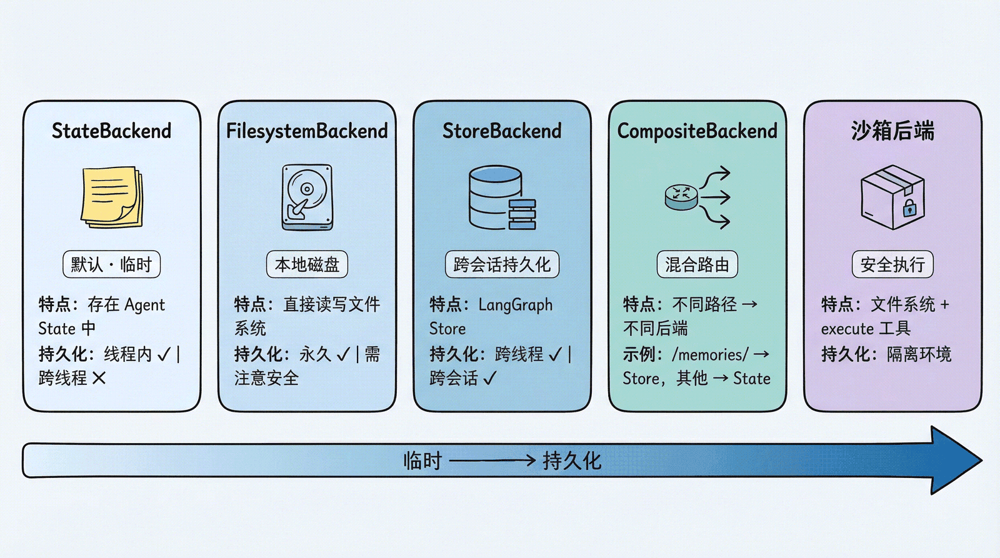

# Deep Agents 第 3 章：虚拟文件系统 — Context Engineering 核心

> 课程：Datawhale《Deep Agents 实战》第 3 章 [虚拟文件系统](https://datawhalechina.github.io/deepagents-in-action/chapters/ch03-virtual-filesystem/)
> 完成日期：2026-09-20
> 运行环境：WSL2 + `research_deepagent/.venv`（deepagents 0.7.13 / langgraph 1.2.11 / Python 3.12.4）
> 上一篇：[第一个工具调用 Agent](../ch02-第一个Agent/README.md)

---

## 一、核心结论

**虚拟文件系统 = 给 Agent 一个"文件柜"，解决传统 Agent "所有信息都塞 prompt" 的致命问题。**

类比人工作的方式：不会把所有资料铺在桌上，而是分门别类存放、按需取出、用搜索定位、在便签上记中间结果。Deep Agents 让 Agent 也能这样工作——大结果不挤占上下文，而是落进"文件"，需要时再读回。

最反直觉的一点（我自己追问后才想通的）：**默认情况下这个"文件系统"根本不在磁盘上**，它只是 LangGraph state 里的一个字典：

```python
state = {
    "messages": [...],
    "files": {                                # ← 虚拟文件系统在这
        "/workspace/report.md": "文件内容字符串...",
    }
}
```

## 二、七个内置文件工具

| 工具 | 用途 | 类比 |
|---|---|---|
| `ls` | 列目录（含大小、修改时间） | 打开文件夹看看有什么 |
| `read_file` | 读文件，支持分页；原生支持多模态 | 翻开某份资料 |
| `write_file` | 创建或**完整覆盖**文件 | 写新备忘录 |
| `edit_file` | 精确字符串替换 | 红笔改文档 |
| `delete` | 删文件/目录（v0.7 新增） | 清理资料 |
| `glob` | 按模式找文件（如 `**/*.py`） | 按标签在文件柜里找 |
| `grep` | 按内容搜索（字面量匹配） | 全文检索 |



### read_file 的两个重点特性

1. **分片读取**：默认最多读前 100 行，`offset` + `limit` 控制读哪段——大文件不会一次性塞爆上下文
2. **原生多模态**：直接"看"图（png/jpg/webp…）、"听"音频（wav/mp3…）、"读"文档（pdf/pptx…），返回多模态内容块

### grep 的三种输出模式

- `files_with_matches`：只返回命中文件路径（快速定位）
- `content`：返回匹配行及上下文（深入查看）
- `count`：返回匹配数量（概览统计）

**v0.7 版本边界提醒**：`grep`/`glob` 可能返回有效但不完整的结果，通过 `truncated=True` 明示截断；调用成功 ≠ 拿到全集，应缩小范围继续搜。空结果返回 `No files found`；`read_file` 行号与正文间是**两个空格**（不再用 Tab）。写解析器时优先消费结构化 Backend 结果，别解析面向模型的文本。

## 三、上下文自动管理：两道防线

虚拟文件系统的最大价值不是"存文件"，而是与**自动上下文管理**联动：

**防线 1 — 大结果自动卸载**（阈值：>20,000 tokens，`tool_token_limit_before_evict` 可配）
1. 完整内容自动写入虚拟文件系统
2. 对话历史中替换为"路径引用 + 前 10 行预览"
3. Agent 需要时 `read_file` 读回
——完全自动，无需手动管理。

**防线 2 — 对话历史自动总结**（阈值：上下文达模型窗口 85% 且无可卸载内容时）
1. LLM 生成结构化摘要（意图、产出物、下一步）
2. 完整原始对话写入文件系统保存
3. 摘要替换旧消息

**双保险效果：精炼的工作记忆（摘要）+ 可回溯的完整记录（文件）。**



## 四、可插拔存储后端（本章核心）

后端决定"文件到底存到哪"。六个后端一张表：

| 后端 | 文件实体位置 | 跨会话存活 | 适用场景 |
|---|---|---|---|
| `StateBackend`（默认） | LangGraph state 的 `files` 字典（**内存**） | ❌（同 thread 内多轮不丢，换 thread 即失） | 学习实验、Agent 的"草稿纸" |
| `FilesystemBackend` | `root_dir` 指定的**真实磁盘目录** | ✅ 普通文件直接可读 | 本地编程助手、CI/CD |
| `LocalShellBackend` | 同上 + 额外 `execute` 工具跑 Shell（`subprocess.run(shell=True)`，**无沙箱**） | ✅ | 个人开发机（极高风险） |
| `StoreBackend` | LangGraph `BaseStore`（传入什么 Store 就存哪：`InMemoryStore`=内存 / SqliteStore / PostgresStore=数据库） | ✅ 跨 thread 共享 | 长期记忆、跨会话知识库 |
| `CompositeBackend` | 按路径前缀路由到不同后端 | 混合 | 临时草稿 + 持久记忆并存 |
| 沙箱后端（Modal/Daytona/Runloop） | 远端隔离环境，附 `execute` | ✅ | 生产环境、不可信代码 |



### 各后端关键代码与注意点

**FilesystemBackend —— 必须显式 `virtual_mode=True`**：

```python
from deepagents.backends import FilesystemBackend

agent = create_deep_agent(
    model=model,
    backend=FilesystemBackend(root_dir="./workspace", virtual_mode=True),
)
```

- `virtual_mode=True` 启用路径沙箱（阻止 `..`、`~`、越界绝对路径）；**不开启则 `root_dir` 不提供任何越界保护**；0.6.0 起此参数必填
- ⚠️ Agent 能读 `root_dir` 下**所有文件**（包括 `.env`、密钥）——Web/API 场景禁用，学习时给个专门空目录
- 模型写 `/report.md` → 真实写到 `root_dir/report.md`，模型只看得到沙箱内的"虚拟路径"

**StoreBackend —— namespace 必填，本地要兜底**：

```python
from langgraph.store.memory import InMemoryStore
from deepagents.backends import StoreBackend

agent = create_deep_agent(
    model=model,
    backend=StoreBackend(
        namespace=lambda rt: (
            (rt.server_info.user.identity,) if rt.server_info else ("local-user",)
        ),   # 按用户隔离；本地 rt.server_info 是 None，直接取会报错
    ),
    store=InMemoryStore(),   # 开发用；部署 LangSmith 时省略，平台自动提供
)
```

- 每个文件 = Store 里一条 item（按 namespace 元组分桶），文件存储位置完全由传入的 Store 实现决定

**CompositeBackend —— 路径前缀路由**：

```python
backend=CompositeBackend(
    default=StateBackend(),          # /workspace/plan.md → 临时
    routes={
        "/memories/": StoreBackend(namespace=...),  # /memories/*.txt → 持久
    },
)
# ls / glob / grep 自动聚合所有后端结果，路径前缀保留
```

### 后端选择速查

| 场景 | 推荐 | 理由 |
|---|---|---|
| 学习和实验 | StateBackend | 零配置，自动清理 |
| 本地编程助手 | FilesystemBackend | 直接操作项目文件 |
| 跨会话记忆 | CompositeBackend | 混合临时+持久 |
| 执行代码 | 沙箱后端 | 安全隔离 |
| 生产部署 | StoreBackend / CompositeBackend | 持久化+可伸缩 |

## 五、权限控制

**声明式权限 `FilesystemPermission`**（工具定义"能做什么"，权限决定"是否可以做"）：

```python
permissions=[
    FilesystemPermission(
        operations=["write"],
        paths=["/policies/**"],
        mode="deny",        # 禁止写入 /policies/ 下任何文件
    ),
]
```

规则按声明顺序 first-match-wins（没匹配上默认允许），所以**具体规则放前面**。三种 mode：

| mode | 行为 | 场景 |
|---|---|---|
| `allow` | 显式放行 | 为特定路径开例外 |
| `deny` | 直接拒绝 | 任何情况下都不该碰的路径 |
| `interrupt` | 暂停等人工审批 | 敏感路径（需 Checkpointer，恢复协议见第 9 章） |

**自定义后端**：实现 `BackendProtocol` 接口（`ls/read/write/edit/grep/glob/delete`，v0.7 暴露删除能力必须实现 `delete()` 且包装器要同步转发或拒绝）。**PolicyWrapper** 拦截模式适合速率限制、审计日志、内容检查——注意不能只保护 `write()`/`edit()` 而漏掉 `delete()`。

## 六、学习过程中的追问记录（自问自答）

这几问把本章最容易混淆的"文件到底在哪"彻底理清了：

**Q1：默认的虚拟文件系统存在哪？**
→ 哪儿都不在磁盘上。就是 state 里的 `files` 字典，活在 Python 进程内存。`invoke` 结束后回到 `result` 变量，脚本一退全部消失。验证法：`result["files"]` 能看到 `hello.txt`，但 `find ~ -name hello.txt` 找不到。

**Q2：配了 checkpointer 呢？**
→ 这时才有磁盘实体：state（连 files）序列化存进你指定的 `checkpoints.db`（SQLite）。但它是二进制快照，不是可读文件；靠同一 `thread_id` 恢复。Checkpointer 管"会话恢复"（游戏存档），Store 管"跨会话共享"（游戏背包），职责不同。

**Q3：StoreBackend 的文件存在哪？**
→ 取决于传入的 Store 实现：`InMemoryStore`=内存、`SqliteStore`=SQLite 文件、`PostgresStore`=PG 数据库。当前 venv 只装了 memory 版，要落盘需 `uv pip install langgraph-checkpoint-sqlite`。

**Q4：FilesystemBackend 呢？**
→ 唯一真实落盘的后端，文件就是 `root_dir` 下的普通文件，且被 `virtual_mode=True` 沙箱限制在根目录树内。

## 七、实操计划（待做）

1. **验证 files 字典**：让 Agent 写 hello.txt，打印 `result["files"]`，再 `find` 确认磁盘无此文件
2. **换 FilesystemBackend**：`root_dir="./agent_workspace", virtual_mode=True`，跑完后去目录里亲眼看到写出的文件；对比 `virtual_mode` 开与关时让 Agent 写 `../../etc/test.txt` 的行为差异（沙箱验证）
3. **触发大结果卸载**：调低 `tool_token_limit_before_evict`，观察搜索结果被替换成"路径+10 行预览"
4. **CompositeBackend**：`/memories/` 路由到 StoreBackend，验证跨 thread 文件仍在
5. **权限实验**：对 `/policies/**` 配 `mode="deny"`，观察写入被拒

## 八、概念辨析

- **虚拟文件系统**：抽象概念，给模型一套统一路径语义的文件工具；实体位置由 Backend 决定（内存/磁盘/数据库/远端沙箱）
- **Backend**：文件的真实存放策略，可插拔；工具定义"能做什么"，Backend 定义"存到哪"，权限定义"可不可以"
- **StateBackend vs Checkpointer vs Store**：state 是运行时数据结构；checkpointer 是按 thread 保存 state 快照的"存档"；Store 是跨 thread 的键值长期记忆库
- **`virtual_mode`**：FilesystemBackend 的路径沙箱开关，防目录穿越；生产必开
- **卸载（evict）**：大结果出上下文、进文件、留引用的自动过程——Context Engineering 的核心手段

---

> 上一篇：[第一个工具调用 Agent](../ch02-第一个Agent/README.md)
> 下一篇预告：第 4 章任务规划——`write_todos` 在 v0.7 中如何按需启用
