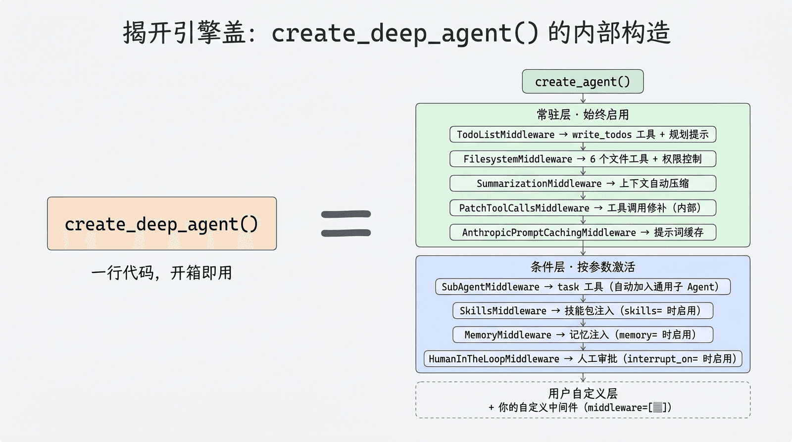
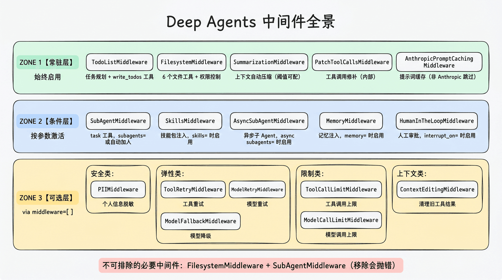
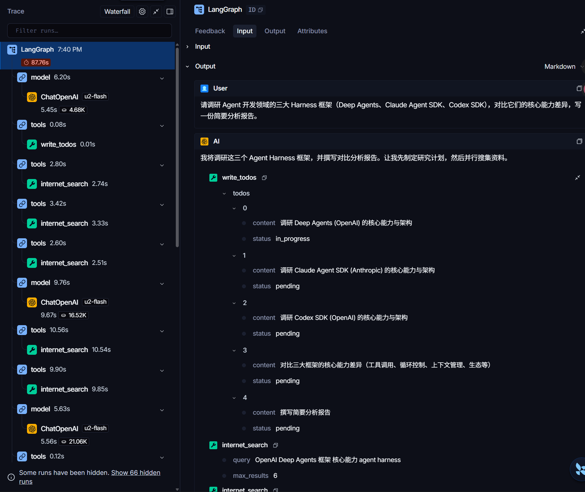
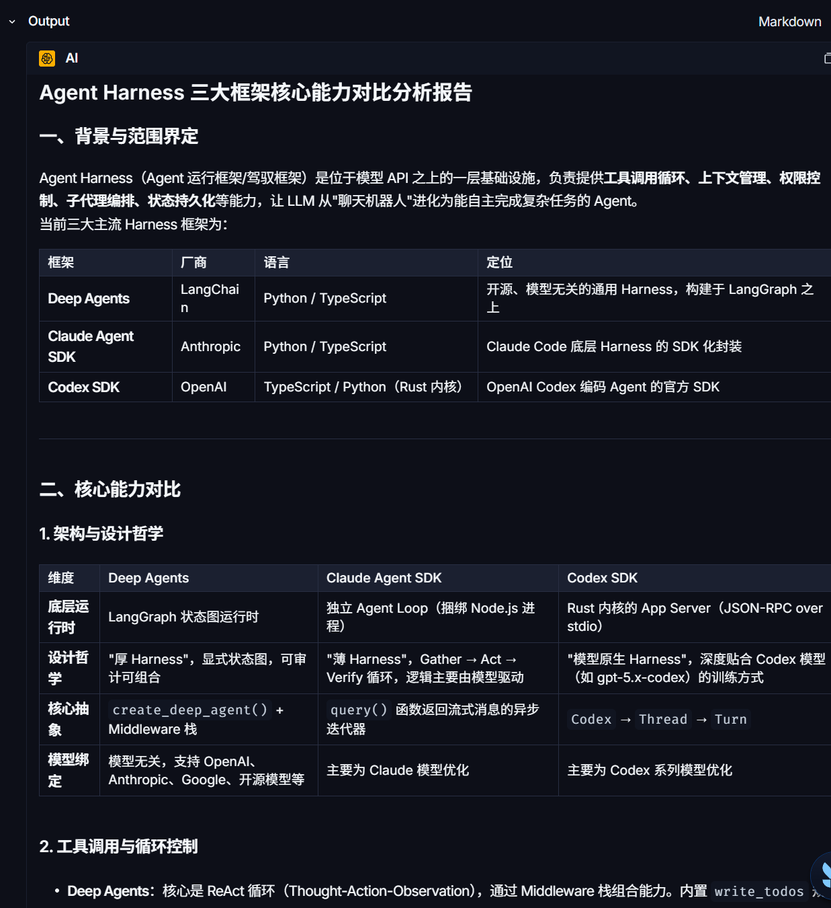
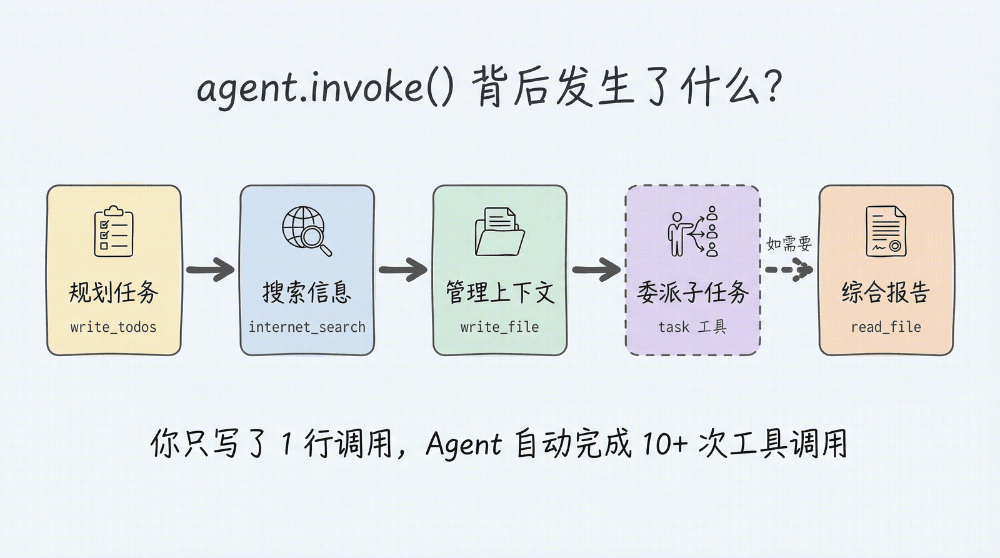

# Deep Agents 第 4 章：任务规划与分解 — 让 Agent 学会拆解复杂任务

> 课程：Datawhale《Deep Agents 实战》第 4 章 [任务规划与分解](https://datawhalechina.github.io/deepagents-in-action/chapters/ch04-task-planning/)
> 完成日期：2026-09-23
> 运行环境：WSL2 + `research_deepagent/.venv`（deepagents 0.7.13 / langgraph 1.2.x / Python 3.12.4，模型 u2-flash via OpenAI 兼容接口）
> 上一篇：[虚拟文件系统](../ch03-虚拟文件系统/README.md)

---

## 一、核心结论

**任务规划（Todo）= 给 Agent 一份"外部任务清单"，让它先思考再行动：把大任务拆成可追踪的小步骤，逐步执行、动态调整。**

本章有两条主线，一条明线、一条暗线：

- **明线**：`write_todos` 工具——Agent 如何用它拆解任务、追踪进度；
- **暗线（"揭开引擎盖"）**：LangChain 的 **Middleware 机制**——Agent 的每一项能力（文件、规划、子 Agent、记忆、摘要）都是可插拔的中间件。`create_deep_agent()` 内部做的事，本质就是把一组中间件自动组装到 Agent 上。

最关键的版本变化：**从 v0.7 起 Todo 不再默认安装**。它从"固定成本"变为"按任务选择"——需要时必须显式传入 `TodoListMiddleware`。

## 二、为什么 Agent 需要规划能力

**简单任务**可以一步到位（调一次工具、出答案）；**复杂任务**涉及搜索、整理、对比、撰写等多步执行。缺少明确清单时，Agent 的典型故障：

| 症状 | 表现 |
|---|---|
| 遗漏关键步骤 | 直接写报告，忘了先搜竞品 |
| 重复劳动 | 同一关键词搜了三次，"忘记"搜过 |
| 半途而废 | 上下文太长后失去对整体进度的把控 |
| 质量不稳定 | 有时做得好，有时莫名跳过重要环节 |

规划让 Agent **先思考再行动**——但效果仍要通过实际任务验证，不能假设"装了就一定更好"（见第八、九节）。

## 三、v0.7 中显式启用任务规划

`TodoListMiddleware` 会**同时**注入 `write_todos` 工具、`todos` 状态和规划提示词：

```python
from deepagents import create_deep_agent
from langchain.agents.middleware import TodoListMiddleware

agent = create_deep_agent(
    model=model,
    middleware=[TodoListMiddleware()],   # v0.7 必须显式启用
)
```

是否启用，课程给出一张决策表：

| 场景 | 建议 |
|---|---|
| 单步问答、短工具调用 | 保持关闭，避免计划比任务本身还长 |
| 长程、多阶段、容易漏步骤的任务 | 启用，用真实任务检查完成率和轨迹长度 |
| **能力较弱、容易失去主线的模型** | **先做 A/B 评测，通常值得尝试**（见第九节） |
| UI 需要展示计划、当前步骤和进度 | 启用；此时 `todos` 也是产品状态协议 |

## 四、`write_todos` 工具详解

### 数据结构与三种状态

```python
{"content": "搜索 LangGraph 官方文档，整理核心架构", "status": "pending"}
```

| 状态 | 含义 |
|---|---|
| `pending` | 待办：刚规划出来，还没开始 |
| `in_progress` | 进行中：正在执行这一步 |
| `completed` | 已完成：Agent 写入的进度标记 |

常见流转：`pending → in_progress → completed`，但这**不是框架强制执行的状态机**，模型也可根据新信息增删条目。

> ⚠️ **重要**：`completed` 只是 Agent 自写的进度标记。清单全部完成 ≠ 任务成功——必须检查实际产物（报告是否生成、引用能否核实、代码是否通过测试）。

### Agent 使用的三个阶段


1. **制定计划**：复杂任务 → 调用 write_todos 列出全部 pending 步骤；
2. **逐步执行**：更新 in_progress → 调工具 → 标记 completed，循环推进；
3. **动态调整**：执行中发现新情况可新增/修改条目（如图中新增任务 6）。

### 清单的持久化

- 清单保存在 **Agent State 的 `todos` 字段**，与消息历史分开管理；默认对话总结**不会删除** `todos`；
- **跨 `invoke()` 接续**清单需要配置 Checkpointer 并复用同一 `thread_id`；只加中间件不会自动接续；
- `InMemorySaver` 进程重启即失；生产需数据库等持久化 Checkpointer；
- 子 Agent 默认继承主 Agent 的 Todo 配置但维护自己的清单；`subagents=[...]` 声明的子 Agent 有独立中间件栈，需在自己的 spec 中启用。

## 五、揭开引擎盖：Middleware 机制（本章暗线）

### 5.1 Middleware 是什么

**Middleware 是 Agent 能力的插件机制：不改变 Agent 循环主干，而在循环的固定位置通过 Hook（钩子）插入自定义逻辑。**

Agent 主干是一个固定循环（调模型 → 执行工具 → 结果回灌 → 再调模型）。加中间件 = 在循环缝隙挂逻辑、注册工具、扩展状态。文件系统、任务规划、子 Agent、记忆、重试、脱敏，每一项都是中间件。

### 5.2 两类 Hook：本章最重要的区分

| 风格 | Hook | 执行方式 | 适合场景 |
|---|---|---|---|
| **Node-style** | `before_agent`、`before_model`、`after_model`、`after_agent` | 编译成图中的**独立节点**，按生命周期顺序运行 | 校验、状态更新、审计、**人工中断** |
| **Wrap-style** | `wrap_model_call`、`wrap_tool_call` | **包裹**一次模型/工具调用；可决定 handler 不调/调一次/调多次 | 重试、缓存、降级、请求/响应转换 |

六个 Hook 相对循环的位置：

```
before_agent                 ← 整次 invoke 只跑 1 次
┌─ 循环（每轮重复）────────────────────
│ before_model               ← 调模型前
│   [wrap_model_call]        ← 包裹整个模型调用（洋葱式）
│        model（LLM）
│ after_model                ← 调模型后
│   [wrap_tool_call]         ← 包裹每次工具执行
│        tools
│        ↑ 结果回灌，进入下一轮
└──────────────────────────────────────
after_agent                  ← 整次 invoke 只跑 1 次
```

Wrap-style 的"包裹"靠 handler 实现——可以调一次（正常）、调多次（重试）、不调（短路/缓存）、改完 request 再调（转换）。多个 Wrap-style 中间件像洋葱一样层层嵌套，列表第一个在最外层。

这个区分对 **`interrupt()`** 是决定性的：Node-style 有清晰节点边界，暂停/恢复时重放范围可推断；Wrap-style 在节点内部，恢复时可能连同 handler 一起重放。**因此自定义人工中断优先放 Node-style。**



### 5.3 中间件的三类来源

| 来源 | 代表中间件 | 装配方式 |
|---|---|---|
| **框架默认层** | Filesystem（7 工具+权限）、Summarization（自动压缩）、PatchToolCalls（补齐缺失响应） | `create_deep_agent()` 自动组装 |
| **条件层** | SubAgent（`task` 工具）、Skills、Memory（AGENTS.md）、HumanInTheLoop | `subagents=` / `skills=` / `memory=` / `interrupt_on=` 参数激活 |
| **应用选择层** | TodoList、PII、ToolRetry、ModelFallback、CallLimit | 显式传 `middleware=[...]` |

两条规则：① 同名实例**原位置换**（不是末尾叠加）；② 置换是**整实例替换**，不按字段合并——替换后要重新验证权限、Backend 等行为。



### 5.4 自定义中间件：继承一个类即可

```python
from langchain.agents.middleware import AgentMiddleware

class AuditMiddleware(AgentMiddleware):
    """审计中间件：每轮模型调用后记录日志。"""

    def after_model(self, state, runtime):
        print("[audit] 一轮结束，消息数:", len(state["messages"]))
        return None   # None=不改状态；也可返回状态更新字典
```

## 六、源码级剖析：TodoListMiddleware 到底用了哪些 Hook

读本机 `langchain/agents/middleware/todo.py` 后发现，它**不是只用一个 Hook，而是两个并用**，各管一件事：

| 组成 | 实现机制 | 职责 |
|---|---|---|
| 规划提示词注入 | `wrap_model_call`（Wrap-style） | 调模型前把规划 system prompt 追加到 system message，再调 handler |
| 并行调用拦截 | `after_model`（Node-style，独立节点） | 检测一轮内是否发出多个 write_todos（整表替换会产生优先级歧义），发现即返回错误 ToolMessage |
| `write_todos` 工具 | `self.tools = [StructuredTool(...)]` | 清单实际由工具本身写入 |
| `todos` 状态字段 | `state_schema = PlanningState` | 扩展 Agent 状态 |

这解释了第 0006 课的实测：启用 Todo 后 `get_graph()` 里多出 `TodoListMiddleware.after_model` 独立节点，而 wrap_model_call 藏在 model 节点内部、图上看不见。

## 七、SummarizationMiddleware 与 trigger：摘要如何实现

本章还讲清了第 3 章"自动摘要"的真身。

### 7.1 trigger：摘要触发阈值

`trigger` 决定上下文长到什么程度就自动摘要，格式为 `(类型, 数值)`：

| 写法 | 触发条件 |
|---|---|
| `("tokens", 4000)` | token 数达到 4000 |
| `("messages", 10)` | 消息条数达到 10 |
| `("fraction", 0.85)` | token 数达模型窗口的 85% |

配套 `keep` 决定摘要后保留多少近期消息。还支持组合：**字典 = AND**（条件同时满足），**字典列表 = OR**（任一满足）。

注意：**手动实例化默认 `trigger=None`，永不主动摘要**；`create_deep_agent()` 的默认值是 `trigger=("fraction", 0.85), keep=("fraction", 0.10)`。

### 7.2 摘要实现链路：本质是"再调一次 LLM"

```
旧消息 ──XML 序列化──▶ 摘要 Prompt + 再调一次模型 ──▶ 摘要文本
```

1. 判断是否达到 trigger；
2. 按 keep 切分消息（旧消息 / 近期保留）；
3. **核心**：旧消息序列化为 XML → 套进摘要提示词 → 再调一次模型（默认用主模型，也可配便宜模型）→ 返回压缩文本；
4. 替换消息——两版做法不同：
   - **LangChain 版**（`before_model` 节点）：`RemoveMessage` 删全部旧消息，写入「摘要 + 近期消息」，状态里的旧消息被真正删除；
   - **Deep Agents 版**（`wrap_model_call`）：删之前先把旧对话追加写入「每会话一个历史 md 文件」，摘要消息附文件路径；只改本次模型输入、原始状态保留，需要时可 read_file 找回原文。

数学类比：像把一长串样本压成**充分统计量**——用少量信息保留后续推断所需。但它是**有损压缩**，细节可能丢失。

## 八、实操：多步骤 Search Agent（含踩坑复盘）

实验脚本：`projects/research_deepagent/easyagents/多步骤search_agent.py`。任务为"调研 Deep Agents、Claude Agent SDK、Codex SDK 三大 Harness 并对比，写分析报告"，显式启用 TodoListMiddleware + Tavily 搜索。

### 成功运行的 LangSmith Trace

最终一次成功运行耗时 **87.76 秒**。Trace 瀑布显示完整的规划-搜索-报告过程：



从 Trace 可见：Agent 先用 `write_todos` 制定 5 步计划（调研三个框架 → 对比差异 → 撰写报告），第一步立即置 in_progress；随后经过多轮 `model → tools`，每轮并行发起搜索。

最终 Output 为结构化报告（Markdown 表格对比框架背景、核心能力等）：



**报告核心结论**：Deep Agents 赢在模型无关与生产级通用编排，Claude Agent SDK 赢在 Claude 原生深度优化与权限/Hooks 体系，Codex SDK 赢在软件工程自动化与 CI/CD 集成；三者可组合使用而非简单替代。

### 踩坑复盘（三个真实故障，按排查顺序）

**坑 1：脚本秒退、零输出、退出码 0 —— 根因是文件 0 字节**

连续多次运行都"什么都没发生"。排查链：① 加了空回复警告仍无输出 → 怀疑运行的不是当前代码；② `ls -la` 字节级核查 → 发现磁盘上文件大小为 **0**（IDE 编辑缓冲区内容未落盘，保存时文件被截断）；③ 写回内容（1597 字节）后重跑 → 立即正常。
**教训：改完代码确认保存；运行前 `ls -la` 自检文件非空。**

**坑 2：模型返回空回复**

弱模型 u2-flash 有时首轮就返回空内容（无文本、无工具调用），图的条件边立刻判定"结束" → 秒退。脚本末行加防护：

```python
answer = result["messages"][-1].content
print(answer if answer.strip() else "[警告] 模型返回了空回复，本次任务实际未完成。")
```

**坑 3：模型跑题（悄无声息地换掉任务对象）**

早期一次诊断运行中，任务要求对比 **Deep Agents / Claude Agent SDK / Codex SDK**，模型实际却去调研了 **LangGraph / CrewAI / AutoGen**——把题目名单整个换掉。这是弱模型"失去主线"的典型表现，且没有任何报错。
**对策：换更强模型，或重跑（弱模型结果有随机性）。**

一次 invoke 背后 Agent 可能调用十几次工具，而代码只有一行调用：



## 九、A/B 评测：弱模型该不该开 Todo

课程决策表中"弱模型先做 A/B 评测"一句，值得展开。

**A/B 评测 = Agent 工程里的控制变量法**（ML 论文中即消融实验）：两个 Agent 除一处配置外完全相同——A 组不加 Todo、B 组加 Todo——喂同一批任务，按预设指标对比。

五要素：

1. **假设**（含收益与代价）：如"B 组完成率更高，且 token/轨迹增幅 ≤20%"；
2. **任务集**：10–30 个真实长程任务，不能只凭一个 demo；
3. **单变量两组**：只有 Todo 有无一处差别；
4. **预设指标**：任务完成率（看**实际产物**，不看 todos completed）、轨迹长度（工具调用数）、token 成本；
5. **重复运行 + 配对比较**：模型输出有随机性，每任务每组跑多次，逐任务比较 B−A。

为什么必须测：Todo 对弱模型既可能是"外部记忆脚手架"（助力），也可能增加工具干扰与 token（负担），**净收益方向事先未知**——这正是本章实操中"同脚本成败看运气、还会跑题"的亲身体验。求职时"做过 A/B，完成率从 X 提到 Y"远比"我觉得有用"有说服力。

## 十、概念辨析

- **任务规划 vs 对话摘要**：Todo 是"要做哪些事"的清单（独立状态字段，摘要不删它）；摘要是压缩"已经说过的话"。trigger 只管何时摘要。
- **Checkpointer vs Backend vs Store**：Checkpointer 按 thread 保存运行状态快照（含 todos、消息），解决跨 invoke 接续与中断恢复；Backend 决定文件真实存哪（内存/磁盘/数据库/沙箱）；Store 是跨 thread 的长期记忆库。
- **Node-style vs Wrap-style**：前者变独立节点（校验/中断），后者洋葱式包裹调用（重试/缓存/转换）；中断放前者。
- **completed ≠ 成功**：进度标记是 Agent 自写的，必须检查实际产物。

## 十一、心得与面试要点

1. **能讲清"为什么 v0.7 把 Todo 改为可选"**：短任务付固定计划成本不划算，长任务才需要脚手架——能力按任务选择而非焊死。
2. **能讲清"中间件如何带来能力"**：工具 + 状态字段 + 提示词整套装配，且可源码级指出 TodoListMiddleware 用了 wrap_model_call + after_model 两个 Hook。
3. **能讲清"摘要是什么"**：再调一次 LLM 做有损压缩，触发靠 trigger，Deep Agents 版删前先把原文存 Backend。
4. **工程素养证据**：遇到"秒退"先看文件是否非空、再看是否空回复、最后用 LangSmith Trace 复盘轨迹——可观测性是 Agent 调试的基础。
5. **弱模型选型有方法论**：不凭感觉，用 A/B 评测让完成率、轨迹、成本三个指标做决策。

---

> 上一篇：[虚拟文件系统](../ch03-虚拟文件系统/README.md)
> 下一篇预告：第 5 章子 Agent —— 用 `task` 工具委派任务与上下文隔离
