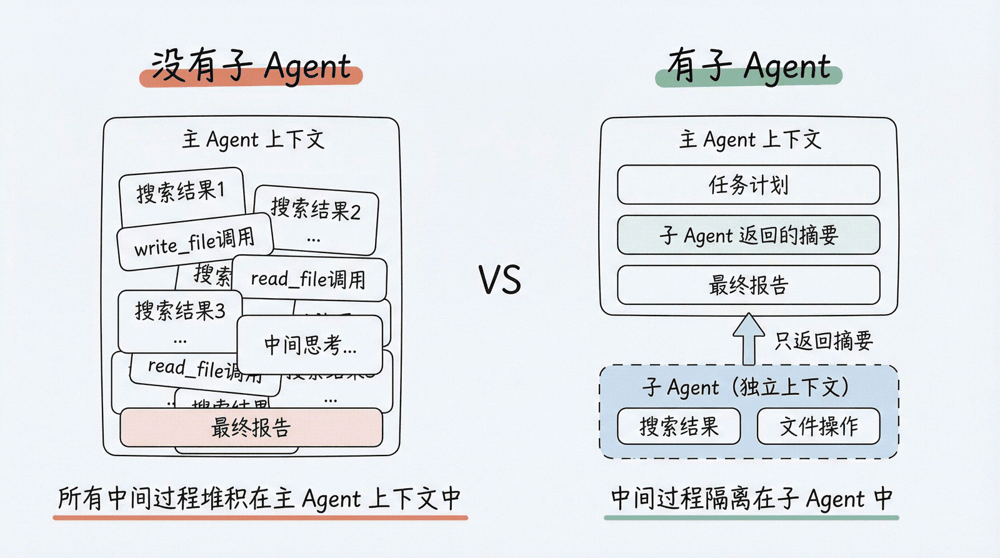
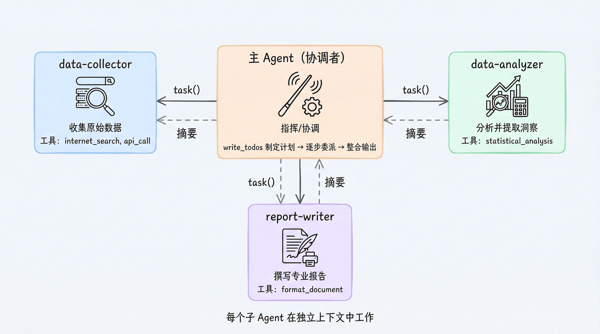

# Deep Agents 第 5 章：子 Agent 与上下文隔离 — 让 Agent 学会委派

> 课程：Datawhale《Deep Agents 实战》第 5 章 [子 Agent 与上下文隔离](https://datawhalechina.github.io/deepagents-in-action/chapters/ch05-subagents/)
> 完成日期：2026-09-25
> 运行环境：WSL2 + `research_deepagent/.venv`（deepagents 0.7.13 / langgraph 1.2.x / Python 3.12，模型 u2-flash via OpenAI 兼容接口）。本章以概念学习、文档与代码精读为主，未跑新实验。
> 上一篇：[任务规划与分解](../ch04-任务规划/README.md)

---

## 一、核心结论

**子 Agent（Subagent）= 让主 Agent 学会"委派"：主 Agent 通过 `task` 工具把子任务交给一个在独立上下文中运行的 Agent，子 Agent 完成后只把最终结果（摘要）返回，主 Agent 的上下文保持干净。**

打个比方：**主 Agent 是项目经理，子 Agent 是专项负责人。** 项目经理不需要参加每一场技术讨论会——他只需要看每个负责人提交的总结报告。

三个必须记住的要点：

1. **核心动机是 Context Quarantine（上下文隔离）**，不是"让 Agent 变多"。子 Agent 的价值在于中间过程（搜索结果、文件读写、多轮工具调用）不污染主上下文；
2. **定义方式有三种形态**：① 字典方式（最常用，框架替你拼标准 Agent）；② 默认自带的 `general-purpose` 子 Agent（不传也有）；③ `CompiledSubAgent`（挂一张自己编译好的 LangGraph 图，适合复杂工作流）；
3. **委派决策靠描述**：主 Agent 读每个子 Agent 的 `description` 决定"要不要委派、委派给谁"，所以描述必须具体、行为导向。

与第 4 章的呼应：子 Agent 能力同样由 **SubAgentMiddleware** 提供（中间件三层装配中的"条件层"，`subagents=` 参数激活），它给主 Agent 注入的就是那个 `task` 工具。

## 二、为什么需要子 Agent：上下文膨胀问题

假设主 Agent 要完成一份研究报告，其中"搜索 LangGraph 技术文档"这个子任务就可能产生：

- 5 次网络搜索，每次返回 3000+ tokens；
- 多次 `write_file` 保存中间结果、`read_file` 回顾整理；
- 大量中间思考消息。

这些全部堆在主 Agent 的上下文里，而主 Agent **根本不需要知道这些细节**——它只要最终的研究摘要。第 3 章的自动摘要（SummarizationMiddleware）能缓解一部分，但那是"事后压缩"；子 Agent 是"事前隔离"，更彻底。



上下文隔离的工作方式：

1. 主 Agent 通过 `task` 工具创建一个子 Agent；
2. 子 Agent 在**独立上下文**中执行任务（自己的工具调用、文件操作都不回到主 Agent）；
3. 子 Agent 完成后，只把**最终结果**返回给主 Agent；
4. 主 Agent 上下文保持干净，继续协调或直接作答。

## 三、什么时候该用 / 不该用

| 场景 | 用子 Agent？ | 理由 |
|---|---|---|
| 需要多次搜索和整理的研究任务 | ✅ | 大量中间结果会膨胀主 Agent 上下文 |
| 需要特殊工具或指令的专业任务 | ✅ | 子 Agent 可以有自己的工具集和系统提示词 |
| 需要不同模型能力的任务 | ✅ | 子 Agent 可以用不同的模型（轻活给小模型，重活给强模型） |
| 需要高层协调的复杂任务 | ✅ | 主 Agent 专注协调，子 Agent 专注执行 |
| 单步简单查询 | ❌ | 委派开销（一次额外的 LLM 路由 + 独立上下文启动）大于收益 |
| 需要保留中间上下文的任务 | ❌ | 子 Agent 的上下文**不回传**给主 Agent，只回最后一条消息 |

判断口诀：**中间过程多、主 Agent 又不需要这些过程 → 委派；一步就能做完、或主 Agent 必须看到全部细节 → 自己做。**

## 四、定义子 Agent：字典方式

最常用的方式是用一个字典描述子 Agent：

```python
from deepagents import create_deep_agent

research_subagent = {
    "name": "researcher",              # 必填：唯一标识符
    "description": "深入研究特定主题，搜索多个信息源并整理成摘要",  # 必填：主 Agent 靠它决定何时委派
    "system_prompt": """你是一位专业的研究员。你的任务是：
1. 把研究问题拆解为多个搜索查询
2. 用 internet_search 搜索相关信息
3. 整理发现，写成简洁摘要
4. 列出关键发现和信息来源
注意：返回结果控制在 500 字以内，只返回核心发现。""",  # 必填：子 Agent 自己的指令
    "tools": [internet_search],        # 可选，默认继承；显式指定后完全替换（不合并）
    "skills": ["/skills/research/"],   # 可选，不继承主 Agent；指定后独立运行 SkillsMiddleware
}

agent = create_deep_agent(
    model="google_genai:gemini-3.1-pro-preview",
    skills=["/skills/main/"],          # 主 Agent 和 general-purpose 子 Agent 继承此处
    subagents=[research_subagent],     # researcher 只获得 /skills/research/，不获得 /skills/main/
)
```

### 字段说明

| 字段 | 必填 | 继承主 Agent？ | 说明 |
|---|---|---|---|
| `name` | ✅ | — | 唯一标识符，主 Agent 通过它指定委派给谁；同时作为流式输出与追踪中的 `lc_agent_name` 元数据 |
| `description` | ✅ | — | 描述子 Agent 的能力，**主 Agent 靠它做路由决策** |
| `system_prompt` | ✅ | ❌ 不继承 | 子 Agent 自己的指令，必须独立定义 |
| `tools` | 可选 | ✅ 默认继承，**指定后完全替换** | 子 Agent 工具集；不是合并关系 |
| `model` | 可选 | ✅ 默认继承 | 可指定不同模型，支持 LangChain 对象或 `"provider:model"` 字符串（如 `"openai:gpt-5.4"`） |
| `middleware` | 可选 | ❌ 不继承 | 子 Agent 自己的中间件栈 |
| `interrupt_on` | 可选 | ✅ 默认继承 | 人工审批配置，可覆盖主 Agent |
| `skills` | 可选 | ❌ 不继承 | 子 Agent 自己的 Skills 路径，技能状态与主 Agent 完全隔离 |
| `response_format` | 可选 | ❌ 不继承 | 结构化输出 schema（需 deepagents>=0.5.3），后主 Agent 收到 JSON 而非自由文本 |
| `permissions` | 可选 | ✅ 默认继承，**指定后完全替换** | 文件系统权限规则 |

三条最容易踩的继承规则：

- **`system_prompt` 不继承**——每个子 Agent 都要有自己专属的指令；
- **`tools` 默认继承，但一旦显式指定就是"完全替换"而非合并**——想在继承基础上加减工具，必须自己把完整工具列表写全；
- **`skills` 不继承**——主 Agent 的 skills 只会传给 `general-purpose` 子 Agent，其他子 Agent 要技能必须显式配置自己的路径。

## 五、General-purpose 子 Agent：默认的"万能助手"

即使一个子 Agent 都不定义，Deep Agents 也**自带一个 `general-purpose` 子 Agent**。它是唯一的例外——**继承主 Agent 的 `system_prompt`、`tools`、`model` 和 `skills`**。

```python
# 不传 subagents 参数，也能用子 Agent
agent = create_deep_agent(
    model=model,
    tools=[internet_search],
    system_prompt="你是一位研究助手。",
)
# 主 Agent 仍可这样委派：
# task(name="general-purpose", task="搜索量子计算的最新进展")
```

它的作用是**纯粹的上下文隔离**：能力和主 Agent 完全相同，但在独立上下文里干活。主 Agent 不必承受 10 次搜索的上下文膨胀，只收一份精炼摘要。

### 禁用

不想让 Agent 拥有 `task` 工具时，要通过 profile 关闭，**两步缺一不可**：

```python
from deepagents import create_deep_agent
from deepagents.profiles import GeneralPurposeSubagentProfile, HarnessProfile

agent = create_deep_agent(
    model=model,
    subagents=[],   # 不传任何同步子 Agent
    profile=HarnessProfile(
        general_purpose_subagent=GeneralPurposeSubagentProfile(enabled=False)
    ),
)
```

> ⚠️ **不要**用 `excluded_middleware` 去排除 SubAgentMiddleware——会直接抛 `ValueError`。正确入口是 `GeneralPurposeSubagentProfile(enabled=False)`。

### 覆盖

用 `name="general-purpose"` 可以给默认子 Agent 换模型/换工具：

```python
agent = create_deep_agent(
    model=model,
    tools=[internet_search],
    subagents=[
        {
            "name": "general-purpose",   # 覆盖默认子 Agent
            "description": "通用助手，处理各种委派任务",
            "system_prompt": "你是一个通用助手。",
            "tools": [internet_search],
            "model": ChatOpenAI(         # 子 Agent 用更强的模型
                model="Pro/zai-org/GLM-5.1",
                api_key=os.environ["SILICONFLOW_API_KEY"],
                base_url="https://api.siliconflow.cn/v1",
            ),
        },
    ],
)
```

## 六、CompiledSubAgent：挂一张自己编译好的 LangGraph 图

对于需要多步骤、带分支/循环逻辑的工作流，字典方式的"模型 ↔ 工具"固定循环不够用，这时可以把一张**预构建的 LangGraph 图**整个作为子 Agent：

```python
from deepagents import create_deep_agent, CompiledSubAgent
from langchain.agents import create_agent

# 用 LangChain 创建一个自定义 Agent 图
custom_graph = create_agent(
    model=model,
    tools=[statistical_analysis, generate_chart],
    system_prompt="你是数据分析专家，擅长统计分析和可视化。",
)

# 包装为 CompiledSubAgent
data_subagent = CompiledSubAgent(
    name="data-analyzer",
    description="执行复杂的数据分析任务，包括统计分析和图表生成",
    runnable=custom_graph,   # 传入编译好的 LangGraph 图
)

agent = create_deep_agent(model=model, subagents=[data_subagent])
```

### 6.1 "编译好的 LangGraph 图"到底是什么

LangGraph 里有两个容易混淆的对象：

| | StateGraph（未编译） | Compiled Graph（编译后） |
|---|---|---|
| 本质 | 一张**设计蓝图** | 一个**可执行的工作流对象**（Runnable） |
| 你在做什么 | 加节点、连边、定义路由 | 调 `.compile()` 把蓝图"冻结" |
| 能否直接跑 | ❌ | ✅ 可 `.invoke()` / `.stream()` |
| 类比 | 画好的电路图纸 | 通电就能运行的电路板 |

手写一张图的完整过程是"画图纸 → 编译 → 运行"：

```python
from langgraph.graph import StateGraph, START, END, MessagesState
from langgraph.prebuilt import ToolNode

# 1. 画图纸
builder = StateGraph(MessagesState)          # State 里必须有 "messages" 键
builder.add_node("agent", call_model)
builder.add_node("tools", ToolNode(tools))
builder.add_edge(START, "agent")
builder.add_conditional_edges("agent", should_continue)  # 调工具就循环，否则结束

# 2. 编译：冻结拓扑，得到 Runnable
graph = builder.compile()

# 3. 运行
result = graph.invoke({"messages": [("user", "分析这组数据并画图")]})
```

而 `langchain.agents.create_agent(...)` 是**快捷工厂函数**：上面"画图纸 + 编译"两步它替你一次做完，**返回值本身就已经是编译好的图**，所以可以直接塞进 `runnable=`。

### 6.2 三个参数与运行时行为

- `name` / `description`：与字典方式含义完全相同（路由用）；
- `runnable`：接收**编译后**的图对象（Runnable），不能传未编译的 StateGraph 蓝图。

运行时的调用链：

```
主 Agent ──task(name="data-analyzer")──▶ CompiledSubAgent 外壳
                                              │ 把任务包成 {"messages": [...]}
                                              ▼
                                         custom_graph 独立运行：
                                         agent → statistical_analysis
                                               → agent → generate_chart → agent
                                              │ 中间多轮工具调用全部留在子图
                                              ▼
主 Agent ◀──只返回最后一条消息（分析结论）────┘
```

**硬性要求**：传入图的 State 中**必须包含 `"messages"` 键**。因为 deepagents 与子图之间的接口协议就是消息列表——用 `{"messages": [...]}` 调图，再从最终 state 的 `messages` 取最后一条作为返回。`create_agent` 生成的图天然满足；手写 StateGraph 时让状态继承 `MessagesState`（或自行声明 `messages` 字段）即可。

### 6.3 学习答疑：`tools=[statistical_analysis, generate_chart]` 里的工具是哪来的？

初看教程容易以为这两个是框架内置工具——**不是，它们是"假设开发者已自行定义好"的两个自定义 @tool 函数**，本章只借它们举例。

**工具（Tool）的本质 = 一个允许大模型调用的 Python 函数。** 普通 LLM 只能输出文字；挂上工具后，函数名 + docstring + 参数 schema 会被传给模型，模型自己判断"直接回答还是调用工具、调哪个"，再由图的 ToolNode 真正执行 Python 代码、把返回值回灌给模型。一个最小实现：

```python
from langchain_core.tools import tool
import pandas as pd

@tool
def statistical_analysis(data: list[float], method: str = "mean") -> dict:
    """对一组数值做统计分析。method 可选 mean / std / describe。"""
    s = pd.Series(data)
    if method == "mean":
        return {"mean": s.mean()}
    if method == "std":
        return {"std": s.std()}
    return s.describe().to_dict()

@tool
def generate_chart(data: list[float], chart_type: str = "line") -> str:
    """根据数据生成图表并保存为图片，返回文件路径。chart_type 可选 line / bar。"""
    # ... matplotlib 绘图、savefig ...
    return "图表已保存到 chart.png"
```

什么时候该给 Agent 配工具？原则是**凡是大模型"靠脑子做不好或做不到"的事，就包成工具**：

- 精确计算（统计、数值模拟，LLM 直接算容易错）；
- 确定性操作（画图、读写文件、查数据库、调 API）；
- 获取实时信息（联网搜索）。
- 反之，聊天、解释概念、写文案不需要工具——工具多了反而干扰选择（最小权限原则）。

### 6.4 字典 vs CompiledSubAgent：怎么选

| 场景 | 推荐方式 | 理由 |
|---|---|---|
| 大多数情况 | 字典 | 简单直观，配置灵活 |
| 子 Agent 需要复杂多步工作流（分支、循环） | CompiledSubAgent | 可用 LangGraph 图 API 自由定义拓扑 |
| 已有一张调试好的 LangGraph 图 | CompiledSubAgent | 直接复用，无需重写 |
| 只是"模型 + 几个工具"的标准循环 | 字典 | 没必要自己建图 |

## 七、多子 Agent 协作模式

实际项目最常见的形态：多个专业子 Agent + 一个负责协调的主 Agent。



```python
subagents = [
    {
        "name": "data-collector",
        "description": "从多个来源收集原始数据，包括网络搜索和 API 调用",
        "system_prompt": "你是数据收集专家。搜索并整理相关数据，返回结构化的数据摘要。",
        "tools": [internet_search, api_call],
    },
    {
        "name": "data-analyzer",
        "description": "对收集到的数据进行统计分析，提取关键洞察",
        "system_prompt": "你是数据分析专家。分析数据并提取 3-5 个关键发现，控制在 300 字以内。",
        "tools": [statistical_analysis],
    },
    {
        "name": "report-writer",
        "description": "根据分析结果撰写专业报告",
        "system_prompt": "你是技术写作专家。根据提供的分析结果撰写清晰、专业的报告。",
        "tools": [format_document],
    },
]

agent = create_deep_agent(
    model=model,   # 协调多子 Agent 属复杂编排，需要 SOTA 模型才能稳定完成
    system_prompt="""你是一位项目协调者。面对复杂任务时：
1. 先用 write_todos 制定计划
2. 将数据收集委派给 data-collector
3. 将分析工作委派给 data-analyzer
4. 将报告撰写委派给 report-writer
5. 整合各子 Agent 的输出，形成最终结果""",
    subagents=subagents,
)
```

执行流程：

1. 主 Agent 用 `write_todos` 制定计划；
2. `task(name="data-collector", task="搜索 AI Agent 领域最新趋势")` → 数据摘要；
3. `task(name="data-analyzer", task="分析以下数据...")` → 关键发现；
4. `task(name="report-writer", task="根据以下发现撰写报告...")` → 报告；
5. 主 Agent 整合输出。

每一步的子 Agent 都在独立上下文中工作，主 Agent 只看到精炼结果——这正是第 4 章 Todo（主线追踪）与本章 Subagent（上下文隔离）的组合拳。

## 八、结构化输出：让子 Agent 返回 JSON

默认情况下主 Agent 收到的是子 Agent 最后一条消息的**自由文本**。通过 `response_format` 可以让它返回符合 Pydantic schema 的 JSON，方便主 Agent 程序化处理（需 deepagents>=0.5.3）：

```python
from pydantic import BaseModel, Field

class ResearchFindings(BaseModel):
    summary: str = Field(description="研究摘要")
    confidence: float = Field(description="置信度 0-1")
    sources: list[str] = Field(description="信息来源 URL 列表")

research_subagent = {
    "name": "researcher",
    "description": "研究特定主题并返回结构化发现",
    "system_prompt": "深入研究给定主题，返回你的发现。",
    "tools": [internet_search],
    "response_format": ResearchFindings,
}
# 主 Agent 的 ToolMessage 将收到：
# '{"summary": "...", "confidence": 0.87, "sources": ["https://..."]}'
```

不设置 → 自由文本；设置后 → **始终**收到符合 schema 的有效 JSON。适合子 Agent 的输出还要被下一个子 Agent / 代码继续消费的流水线场景（如图 14 中 collector → analyzer 的交接）。

## 九、最佳实践（5 条）

1. **描述要具体**：主 Agent 靠 `description` 路由。
   - ✅ `"执行深度网络研究，需要多次搜索、信息交叉验证和综合分析时使用"`
   - ❌ `"做研究"`
2. **System Prompt 要详细**：尤其写清**输出格式与字数限制**——这直接决定返回给主 Agent 的内容质量。
3. **工具集要精简（最小权限原则）**：研究 Agent 就只给 `internet_search`，别塞 `send_email / delete_file / execute_code`。
4. **不同子 Agent 用不同模型**：简单查询派给轻量快速模型（如 Qwen2.5-7B），深度推理派给强模型（如 GLM-5.1），兼顾成本与质量。
5. **返回结果要精简**：在 system_prompt 中明确"只返回核心洞察/置信度/下一步，不要原始数据和中间计算，控制在 300–500 字"。子 Agent 若把大段原始数据回传，上下文隔离就失去了意义；原始数据应让它 `write_file` 落盘，只回摘要。

## 十、常见问题排查

| 故障 | 原因 | 解法 |
|---|---|---|
| 子 Agent 没被调用，主 Agent 自己把活全干了 | 主 Agent 无法从 `description` 判断何时该委派 | ① 描述改成具体、行为导向的写法；② 在主 Agent 的 system_prompt 中明确写"面对复杂任务时使用 task() 委派，保持自身上下文干净" |
| 上下文依然膨胀 | 子 Agent 返回了大量原始数据 | ① system_prompt 强制简洁返回（字数上限、禁贴原始结果）；② 让子 Agent 把原始数据写入文件，只回分析摘要 |
| 调用了错误的子 Agent | 多个子 Agent 的 `description` 过于相似 | 在描述中显式区分使用场景，如 `quick-researcher`（1–2 次搜索的简单事实查询）vs `deep-researcher`（多次搜索综合分析的全面报告） |

## 十一、概念辨析

- **字典方式 vs CompiledSubAgent**：前者由框架按"模型↔工具"标准循环拼装，胜在简单；后者挂自定义编译图，胜在能表达分支、循环与自定义节点，且 State 必须含 `messages` 键。
- **自定义子 Agent vs `general-purpose`**：后者是默认自带、唯一完整继承主 Agent 能力（含 skills）的子 Agent，用途是纯上下文隔离；自定义子 Agent 的 system_prompt/skills 不继承，tools 默认继承但指定即替换。
- **`tools` 继承 vs 替换**：不写 `tools` → 继承主 Agent 全部工具；写了 → 完全替换，不是追加。
- **`task` 委派 vs 第 4 章 `write_todos`**：Todo 是主 Agent 自己的"任务清单状态"，解决"别漏步骤"；task 是把整段子任务交给另一个上下文执行，解决"别污染上下文"。复杂任务里两者配合：先规划，再逐段委派。
- **子 Agent vs 自动摘要**：摘要是事后的有损压缩（第 3 章）；子 Agent 是事前的物理隔离，原始过程对主 Agent 根本不可见。
- **同步子 Agent vs 异步子 Agent**：本章的子 Agent 都是同步的（主 Agent 等它返回才能继续）；长耗时、可并行的后台任务属于第 6 章异步子 Agent 的内容。
- **自由文本 vs `response_format`**：前者给人/主 Agent 阅读，后者给程序化流水线消费（Pydantic 校验的 JSON）。

## 十二、心得与面试要点

1. **能讲清"子 Agent 解决什么问题"**：不是追求多 Agent 形态，而是 Context Quarantine——用一次委派的额外开销，换掉主上下文里数十条中间消息，保护主线推理能力。
2. **能讲清"主 Agent 如何决定委派给谁"**：纯靠 LLM 读 `description` 做语义路由，没有硬编码规则——所以描述质量、主 Agent 模型能力（协调场景要上 SOTA 模型）和 system_prompt 中的委派指令是三个关键杠杆。
3. **能讲清继承规则**：system_prompt/skills/middleware 不继承；tools/model/interrupt_on/permissions 默认继承、指定即整体替换；general-purpose 是唯一例外。
4. **能讲清 CompiledSubAgent 的接口契约**：传入的是 compile 后的 Runnable 而非 StateGraph 蓝图；State 必须含 `messages`；deepagents 以消息列表作为调用与回收协议。
5. **工程意识**：最小权限（精简工具集）、成本意识（强弱模型搭配）、可交接性（结构化输出）、可观测性（name 同时是追踪元数据 `lc_agent_name`，排查路由问题时按名字看 Trace）。
6. **一条系统设计观**：子 Agent 模式与软件工程的"模块化/接口隔离"同构——主 Agent 面向"摘要"这一窄接口编程，子 Agent 内部实现（搜了几次、存了哪些文件）可以自由演化而不影响协调者。

---

> 上一篇：[任务规划与分解](../ch04-任务规划/README.md)
> 下一篇预告：第 6 章 异步子 Agent —— 长耗时任务的后台执行与生命周期管理
