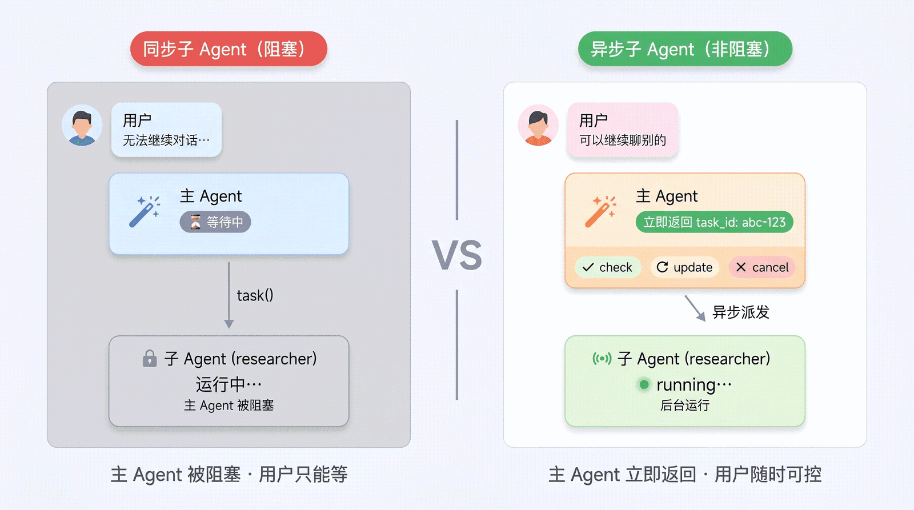
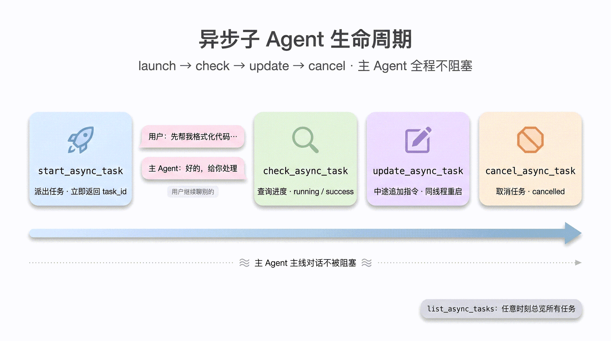
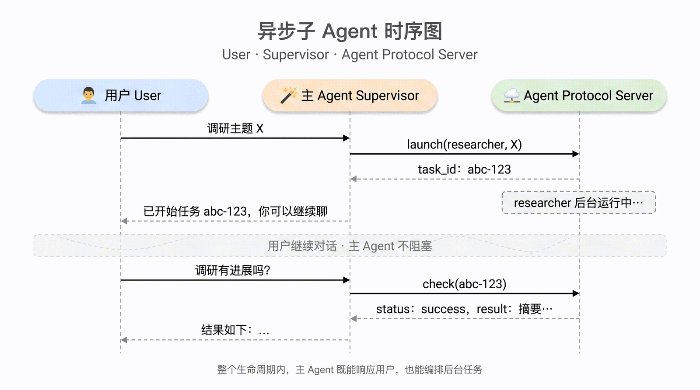

# 第 6 章：异步子 Agent（Async Subagent）学习笔记

> 教材：Datawhale《Deep Agents 实战》[第 6 章](https://datawhalechina.github.io/deepagents-in-action/chapters/ch06-async-subagents)
> 学习日期：2026-09-28 ｜ deepagents 0.5.x 预览特性 ｜ 运行环境：WSL (Linux) + Python venv + `langgraph dev` in-memory server 0.15.1
> 实操项目：`~/self_study/deepagents/projects/async-subagent-demo`（单部署 + ASGI 最小示例，已真实跑通）

---

## 0. 一句话主线

> **同步子 Agent 是"派活后干等"，异步子 Agent 是"派活后立刻拿到任务 ID 返回"——子 Agent 在后台跑，用户可以继续聊、随时查进度、中途追加约束甚至取消。**

这件事在单机 Python 里做不到，它依赖一整套**服务化基础设施**：Agent Protocol、Agent Server、CLI、SDK。本章的难点不在新 API，而在理解这套运行模型。

---

## 1. 同步子 Agent 的两个瓶颈

第 5 章的同步委派：

```python
result = task(name="researcher", task="深入调研 LangGraph 生态")
# 主 Agent 在这里等——60 秒、120 秒……用户只能看转圈
```

1. **长程任务**：深度调研、批量处理等分钟级到小时级任务，对话窗口"死机"。
2. **可交互任务**：子 Agent 跑到一半想补一句"换成 2024 年的数据"，同步模式下**根本插不进去**。

而且被阻塞的不只是用户——**主 Agent 自己也被阻塞**，期间无法处理任何其他话题。

### 1.1 同步 vs 异步：六个维度

| 维度 | 同步子 Agent | 异步子 Agent |
|---|---|---|
| 执行模型 | 阻塞——等到完成才继续 | 非阻塞——立即返回任务 ID |
| 并发性 | 可并行触发，但主 Agent 仍被整批阻塞 | 完全并行，主 Agent 全程不阻塞 |
| 中途追加指令 | ❌ | ✅ `update_async_task` |
| 取消 | ❌ | ✅ `cancel_async_task` |
| 状态性 | 无状态，调用间相互独立 | 有状态，子 Agent 拥有自己的 thread，历史持续累积 |
| 典型场景 | 秒级快速委派、一问一答 | 分钟级以上、过程中需要互动管理的任务 |



判定法则：**5 秒内能完成 → 同步；可能跑几分钟且需要中途交互 → 异步。**

---

## 2. 前置概念：把"服务化"这一层彻底搞懂

本章第一个坎：示例不再是 `python agent.py`，而是"先起一台服务器，再用 SDK 调它"。学习中我把四个角色和三个易混点全部拆开了。

### 2.1 四个角色一张表

| 名字 | 是什么 | 本章实例 |
|---|---|---|
| **Agent Protocol** | 一份框架无关的 **HTTP/流式 API 规范**（OpenAPI 描述），规定 runs / threads / store / agents 等端点，协议 ≠ 实现 | [agent-protocol](https://github.com/langchain-ai/agent-protocol) |
| **Agent Server** | **实现**该协议的服务进程：加载 graph、调度 run、管理状态 | `langgraph dev` 起的 in-memory server（监听 2024） |
| **CLI** | 终端里敲的命令行工具，负责**把服务跑起来** | `langgraph dev` / `langgraph up`（来自 `langgraph-cli[inmem]`） |
| **SDK** | 代码里 `import` 的客户端库，负责**把服务用起来** | `langgraph-sdk` 的 `get_client()` |

关系：**CLI 起服务，SDK 用服务**；协议全程只传一个字符串 ID，不传 graph 对象。

### 2.2 "异步"有三层，别混为一谈

这是我在 Trae 里用子 Agent 时产生的原问题——"Trae 的子 Agent 是异步的吗，为什么中途插不进约束？"。答案要分三层：

1. **编程实现层**：是不是 `async/await` 写的；
2. **编排并发层**：能不能同时派出多个子 Agent；
3. **交互控制层**：派出后是否**立即返回任务句柄**，并支持查/改/取消。

deepagents 的 Async Subagent 三层全有；Trae 的 Task 工具具备前两层、**不具备第三层**——它是一次性无状态委派，没有服务端持久 thread、没有 interrupt 机制和任务句柄通道，所以中途无法插话。这正是本章要解决的问题。

### 2.3 graph 从哪里来、存在哪、怎么被找到

| 东西 | 形态 | 位置 |
|---|---|---|
| graph **定义** | Python 源码编译出的 `CompiledStateGraph`（节点=函数、边=路由、channels=状态+reducer） | 磁盘上的 `graphs/*.py` |
| graph **登记** | `langgraph.json`：`"id": "./文件.py:变量"` 的映射表 | 项目根目录的普通 JSON 文件 |
| id → graph **映射** | 服务启动时 import 代码后在**内存**建的注册表字典 | Agent Server 进程内存 |
| 运行**状态** | 按 `thread_id` 存的 checkpoint 快照（消息、中断点） | checkpointer（in-memory / SQLite / Postgres） |

关键推论：

- 协议请求里传的 `agent_id` / `assistantId` / `graph_id` 是**同一个角色**（登记表主键）在不同子规范里的三个名字；
- **graph 结构不入库**，数据库里存的是关系表形式的状态快照行（checkpoints / checkpoint_writes / checkpoint_blobs），不是图数据库，重启后 graph 靠重新 import 代码重建；
- 改代码靠热重载/重启生效，对话数据不受影响；
- 客户端只知道 `graph_id="researcher"` 这个字符串，靠服务端的 langgraph.json "共同约定的登记册"解析到对象。

### 2.4 `langgraph-cli[inmem]` 与 requirements.txt

- `langgraph-cli` 只是薄壳 CLI；方括号 `[inmem]` 是 Python extras 语法，额外拉入完整的本地 Agent Server 运行时（`langgraph-api` + 内存版 checkpointer）。**裸装 CLI 跑不了 `langgraph dev`**，in-mem 模式还要求 Python ≥ 3.11。
- `requirements.txt` 是应用运行时依赖清单（`pip install -r` 照单安装）；`langgraph-cli[inmem]` 是开发工具，按教程单独安装，不写进 requirements。
- `langgraph dev`（inmem，免 Docker、热重载、仅供开发）vs `langgraph up`（Docker 跑带 Postgres 的完整栈）。

---

## 3. 声明异步子 Agent

```python
from deepagents import AsyncSubAgent, create_deep_agent

AsyncSubAgent(
    name="researcher",          # 必填：唯一标识，派活时用
    description="……",           # 必填：能力描述，主 Agent 据此决定派给谁
    graph_id="researcher",      # 必填：必须与 langgraph.json 的 graphs 键名一致
    # url=不传 → ASGI 进程内传输；传了 → 远程 HTTP 传输
    # headers=可选：自托管服务的鉴权头
)
```

langgraph.json 里同部署注册两个 graph：

```json
{
  "dependencies": ["./"],
  "graphs": {
    "supervisor": "./graphs/supervisor.py:graph",
    "researcher": "./graphs/researcher.py:graph"
  },
  "env": "./.env"
}
```

---

## 4. 主 Agent 的 5 把"遥控器"

`AsyncSubAgentMiddleware` 自动注入 5 个工具：

| 工具 | 作用 | 底层行为 |
|---|---|---|
| `start_async_task` | 启动后台任务，**立即返回 task_id** | 在服务上**新建 thread + 启动 run**，task_id 就是 thread_id；不轮询 |
| `check_async_task` | 查状态/结果 | 读 run 状态；完成则读 thread state 取最终输出 |
| `update_async_task` | 中途追加指令 | 在**同一 thread** 上以 **interrupt** 策略发起新 run，旧 run 被打断、带着完整历史+新指令重启；**task_id 不变、run_id 换代** |
| `cancel_async_task` | 取消 | 调 `runs.cancel()`，本地标记 cancelled（异步生效，需再 check 确认） |
| `list_async_tasks` | 列出全部任务 | 已结束的走缓存，未结束的并发拉实时状态 |





### 4.1 任务元数据为什么要单开一个 `async_tasks` channel

主 Agent 的 graph state 里有一个独立于消息历史的 `async_tasks` 通道，保存每个任务的 task_id、agent_name、thread_id、run_id、status、created_at、last_checked_at、last_updated_at。

原因：对话历史逼近上限时会被**自动压缩**（第 3 章上下文工程）。任务 ID 若只活在某条 ToolMessage 里，压缩后主 Agent 就"忘了"自己派过的活。独立 channel 保证历史可以随便裁，任务永远找得回。

> Deep Agents 一贯哲学：**会被截断的放消息历史，必须长存的进 state channel**（VFS、TodoList、async_tasks 同理）。

---

## 5. 两种传输与三种拓扑

**ASGI（同部署，推荐起手式）**：不传 `url`，SDK 走进程内函数路由，零网络延迟、零额外鉴权，子 Agent 仍在独立 thread 上、状态隔离不打折。

**HTTP（远程）**：传 `url`，请求走网络发到另一台 Agent Server；鉴权由 SDK 从 `LANGSMITH_API_KEY`/`LANGGRAPH_API_KEY` 自动处理，自托管用 `headers`。适用于独立扩缩容、特殊资源画像（GPU/大内存）、跨团队维护。

| 拓扑 | 形态 | 场景 |
|---|---|---|
| Single 单部署 | 全部 ASGI | 绝大多数项目起点 |
| Split 拆分部署 | 主一台、子一台，全 HTTP | 资源画像/扩缩容差异大 |
| Hybrid 混合 | 部分 ASGI + 部分 HTTP | 少数特殊子 Agent 单独扩 |

**Worker slots**：每个活跃 run 占一个槽，1 supervisor + N 子任务至少 N+1，否则任务排队（表现为 start 长时间不返回或 check 长期无进展）：`langgraph dev --n-jobs-per-worker 4`。

---

## 6. 动手实操：本地最小验证（单部署 + ASGI）

目标：用一个**故意 sleep 8 秒**的 researcher，稳定观察"秒回 task_id → 后台 running → 可追加约束 → 最终 success"。

### 6.1 项目结构（与教程逐字一致）

```text
async-subagent-demo/
├── .env
├── langgraph.json
├── requirements.txt
├── run_demo.py
└── graphs/
    ├── researcher.py
    └── supervisor.py
```

依赖与环境：

```bash
python3 -m venv .venv && source .venv/bin/activate
pip install -U "langgraph-cli[inmem]"
pip install -r requirements.txt
```

```text
# requirements.txt
deepagents>=0.5.0
langgraph
langgraph-sdk
langchain-openai
```

### 6.2 慢任务 researcher（不调模型，纯 sleep 8s）

```python
import asyncio

from langgraph.graph import END, START, MessagesState, StateGraph


async def slow_research(state: MessagesState):
    last_human = state["messages"][-1].content if state["messages"] else "No task provided."
    await asyncio.sleep(8)
    return {
        "messages": [
            {
                "role": "ai",
                "content": (
                    "[researcher finished after 8s]\n"
                    f"latest task: {last_human}\n"
                    "summary: async subagents return a task ID immediately, "
                    "run in the background, and can be checked or updated later."
                ),
            }
        ]
    }


builder = StateGraph(MessagesState)
builder.add_node("slow_research", slow_research)
builder.add_edge(START, "slow_research")
builder.add_edge("slow_research", END)
graph = builder.compile()
```

### 6.3 supervisor（不写 url → ASGI；system_prompt 明确禁止立即轮询）

```python
import os

from deepagents import AsyncSubAgent, create_deep_agent


graph = create_deep_agent(
    model=os.environ.get("MODEL_NAME", "openai:gpt-4.1-mini"),
    system_prompt=(
        "You are a supervisor agent for an async-subagent demo. "
        "When the user asks for a long-running research task, you must delegate "
        "to the async subagent named researcher immediately. "
        "After calling start_async_task, return the task_id to the user and stop. "
        "Do not call check_async_task unless the user explicitly asks for progress. "
        "If the user asks to revise the background task, call update_async_task."
    ),
    subagents=[
        AsyncSubAgent(
            name="researcher",
            description=(
                "Use for any long-running background research or async demo task. "
                "This agent intentionally sleeps before returning so the async "
                "behavior is easy to observe."
            ),
            graph_id="researcher",
        )
    ]
)
```

### 6.4 SDK 三连验证脚本

`run_demo.py` 在**同一个 thread** 上做三件事：① 派后台任务；② 立刻追问进度（验证不阻塞）；③ 追加约束（验证 update）。完整脚本见教材，核心调用：

```python
client = get_client(url="http://127.0.0.1:2024")
thread = await client.threads.create()
await client.runs.wait(thread["thread_id"], "supervisor", input={...})
```

### 6.5 踩坑与修复（真实记录）

| 坑 | 现象 | 修复 |
|---|---|---|
| `.env` 用了教程占位 key `sk-...` | 服务正常、graph 注册正常，run 创建后模型请求 `Retrying request (retry 1/2, 2/2)` 反复重试失败 | 填入真实 OpenAI 兼容网关（hivoice）的 key/base_url，`MODEL_NAME=openai:u2-flash`，**无需改代码**（supervisor.py 本来就读环境变量） |
| LangSmith 占位 key | 日志 `metadata/submit 403 Forbidden`（仅遥测失败，不影响运行） | `.env` 设 `LANGSMITH_TRACING=false` |
| 改 .env 不生效 | 环境变量只在启动时加载 | Ctrl+C 重启 `langgraph dev` |

实际使用的 `.env`（key 已脱敏）：

```dotenv
OPENAI_API_KEY=sk-****（真实 key，本机保存，禁止入库/外传）
OPENAI_API_BASE=https://maas-api.hivoice.cn/v1
MODEL_NAME=openai:u2-flash
LANGSMITH_TRACING=false
```

启动与验证：

```bash
langgraph dev --n-jobs-per-worker 4   # 终端1：看到 API: http://127.0.0.1:2024
python run_demo.py                     # 终端2
```

---

## 7. 完整运行结果与解读（2026-09-28 独立跑通）

原始完整输出归档：[run_demo_output.txt](run_demo_output.txt)（588 行，未删改）。下面是三段的关键证据。

### 7.1 first response：派活后秒回，没有等 8 秒

- supervisor 调用 `start_async_task`，工具立即返回 `Launched async subagent. task_id: 01a0e8b0-96ab-7c62-b1b1-8dc4c23dd3c8`；
- 顶层 `async_tasks` channel 中该任务状态已是 `running`，三个时间戳同一秒（15:44:42）；
- supervisor 按 system_prompt 要求把 ID 转述给用户后**立即停止**，没有轮询。

### 7.2 second response：主对话不阻塞 + 实时查进度

- 5 秒后追问，supervisor 调 `check_async_task`，返回 `{"status": "running", "thread_id": "01a0e8b0-96ab-..."}`；
- `last_checked_at` 更新为 15:44:47，而后台 researcher 此时仍在 sleep——两条线并行，互不阻塞。

### 7.3 third response：中途追加约束，任务不重开（interrupt 实证）

- `update_async_task` 返回 `Updated async subagent. task_id: 01a0e8b0-96ab-...`，task_id/thread_id **不变**；
- **最有价值的观察**：channel 里的 `run_id` 从 `01a0e8b0-96ae-7211-be1f-...` **换代**为 `01a0e8b0-beca-70b0-bbb4-...`，`last_updated_at` 跳到 15:44:52。
- 含义：旧 run 被打断，在**同一个 thread**（保留完整历史）上带着新约束起了新 run——这就是 update 底层 **interrupt 多任务策略**的实物证据。
- 随后查询该 thread：两次 run 均 `success`，researcher 最终消息为 `[researcher finished after 8s] latest task: 补充约束：任务完成时，请把答案写成 3 条 bullet …`，证明新指令确实注入。

### 7.4 从输出里直接看到的两个设计

1. **task_id 即 thread_id**：两个 ID 完全相同（`01a0e8b0-96ab-...`），遥控器就是靠它复用会话状态。
2. **`async_tasks` channel 实物**：每段响应最外层都挂着结构化任务字典（id/run_id/status/三个时间戳），与庞大的消息历史解耦——上下文怎么压缩都不影响任务追踪。

<details>
<summary><b>附录：run_demo.py 完整终端输出（点击展开，588 行）</b></summary>

```text
async-subagent-demo$ python run_demo.py
thread_id = 01a0e8b0-7a68-7460-917e-7e896960d16e
\n=== first response ===
{'async_tasks': {'01a0e8b0-96ab-7c62-b1b1-8dc4c23dd3c8': {'agent_name': 'researcher',
                                                          'created_at': '2026-09-28T15:44:42Z',
                                                          'last_checked_at': '2026-09-28T15:44:42Z',
                                                          'last_updated_at': '2026-09-28T15:44:42Z',
                                                          'run_id': '01a0e8b0-96ae-7211-be1f-89e0877a0c51',
                                                          'status': 'running',
                                                          'task_id': '01a0e8b0-96ab-7c62-b1b1-8dc4c23dd3c8',
                                                          'thread_id': '01a0e8b0-96ab-7c62-b1b1-8dc4c23dd3c8'}},
 'files': {},
 'messages': [{'additional_kwargs': {},
               'content': '请把这个任务交给 researcher 异步处理：用后台任务总结 async subagent '
                          '的关键行为。',
               'id': 'd7b99112-ed93-437d-93d0-c1500cd0d919',
               'name': None,
               'response_metadata': {},
               'type': 'human'},
              {'additional_kwargs': {},
               'content': [{'arguments': '{"description":"请总结 async subagent '
                                         '的关键行为。你需要研究并梳理 async subagent '
                                         '的核心机制，包括：1) '
                                         '它的启动方式（start_async_task）；2) '
                                         '它的运行模式（后台运行、立即返回 task_id）；3) '
                                         '它的状态查询机制（check_async_task、list_async_tasks）；4) '
                                         '它的任务更新与取消机制（update_async_task、cancel_async_task）；5) '
                                         '它与同步 subagent '
                                         '的区别。最后以清晰的要点列表形式输出总结报告。","subagent_type":"researcher"}',
                            'call_id': 'call_bb6b5ef093b549389889a8c9',
                            'id': 'fc_b4760ecdb51c459f922b0b7f96a797f2',
                            'name': 'start_async_task',
                            'status': 'completed',
                            'type': 'function_call'},
                           {'annotations': [],
                            'id': 'msg_560c618569c446d1bb0216a8446d3838',
                            'text': '\n\n',
                            'type': 'text'}],
               'id': 'resp_8ae9b17d6b904ae0a1b450d8f769af0e',
               'invalid_tool_calls': [],
               'name': None,
               'response_metadata': {'created_at': 1790610277.0,
                                     'id': 'resp_8ae9b17d6b904ae0a1b450d8f769af0e',
                                     'metadata': {},
                                     'model': 'u2-flash',
                                     'model_name': 'u2-flash',
                                     'model_provider': 'openai',
                                     'object': 'response',
                                     'service_tier': 'auto',
                                     'status': 'completed'},
               'tool_calls': [{'args': {'description': '请总结 async subagent '
                                                       '的关键行为。你需要研究并梳理 async '
                                                       'subagent 的核心机制，包括：1) '
                                                       '它的启动方式（start_async_task）；2) '
                                                       '它的运行模式（后台运行、立即返回 '
                                                       'task_id）；3) '
                                                       '它的状态查询机制（check_async_task、list_async_tasks）；4) '
                                                       '它的任务更新与取消机制（update_async_task、cancel_async_task）；5) '
                                                       '它与同步 subagent '
                                                       '的区别。最后以清晰的要点列表形式输出总结报告。',
                                        'subagent_type': 'researcher'},
                               'id': 'call_bb6b5ef093b549389889a8c9',
                               'name': 'start_async_task',
                               'type': 'tool_call'}],
               'type': 'ai',
               'usage_metadata': {'input_token_details': {'cache_read': 2003},
                                  'input_tokens': 3650,
                                  'output_token_details': {'reasoning': 0},
                                  'output_tokens': 345,
                                  'total_tokens': 3995}},
              {'additional_kwargs': {},
               'artifact': None,
               'content': 'Launched async subagent. task_id: '
                          '01a0e8b0-96ab-7c62-b1b1-8dc4c23dd3c8',
               'id': 'ea6ec2aa-bfd5-40cb-a93f-328a2e53b945',
               'name': 'start_async_task',
               'response_metadata': {},
               'status': 'success',
               'tool_call_id': 'call_bb6b5ef093b549389889a8c9',
               'type': 'tool'},
              {'additional_kwargs': {},
               'content': [{'annotations': [],
                            'id': 'msg_a917a18fe8f8425fb236a0c9e3f8e49a',
                            'text': '已将任务交给 researcher 异步处理。\n'
                                    '\n'
                                    '**任务详情：**\n'
                                    '- **任务 ID：** '
                                    '`01a0e8b0-96ab-7c62-b1b1-8dc4c23dd3c8`\n'
                                    '- **任务内容：** 总结 async subagent '
                                    '的关键行为，包括启动方式、后台运行模式、状态查询、任务更新与取消机制，以及它与同步 '
                                    'subagent 的区别。\n'
                                    '- **处理方式：** 后台异步运行，任务完成后可随时查看结果。\n'
                                    '\n'
                                    '需要查看进度或结果时，告诉我即可，我会为你查询该任务的最新状态。',
                            'type': 'text'}],
               'id': 'resp_99b04d5b1e414ad5a62c1733b3d9b362',
               'invalid_tool_calls': [],
               'name': None,
               'response_metadata': {'created_at': 1790610282.0,
                                     'id': 'resp_99b04d5b1e414ad5a62c1733b3d9b362',
                                     'metadata': {},
                                     'model': 'u2-flash',
                                     'model_name': 'u2-flash',
                                     'model_provider': 'openai',
                                     'object': 'response',
                                     'service_tier': 'auto',
                                     'status': 'completed'},
               'tool_calls': [],
               'type': 'ai',
               'usage_metadata': {'input_token_details': {'cache_read': 2022},
                                  'input_tokens': 3903,
                                  'output_token_details': {'reasoning': 0},
                                  'output_tokens': 157,
                                  'total_tokens': 4060}}]}
\n=== second response ===
{'async_tasks': {'01a0e8b0-96ab-7c62-b1b1-8dc4c23dd3c8': {'agent_name': 'researcher',
                                                          'created_at': '2026-09-28T15:44:42Z',
                                                          'last_checked_at': '2026-09-28T15:44:47Z',
                                                          'last_updated_at': '2026-09-28T15:44:42Z',
                                                          'run_id': '01a0e8b0-96ae-7211-be1f-89e0877a0c51',
                                                          'status': 'running',
                                                          'task_id': '01a0e8b0-96ab-7c62-b1b1-8dc4c23dd3c8',
                                                          'thread_id': '01a0e8b0-96ab-7c62-b1b1-8dc4c23dd3c8'}},
 'files': {},
 'messages': [{'additional_kwargs': {},
               'content': '请把这个任务交给 researcher 异步处理：用后台任务总结 async subagent '
                          '的关键行为。',
               'id': 'd7b99112-ed93-437d-93d0-c1500cd0d919',
               'name': None,
               'response_metadata': {},
               'type': 'human'},
              {'additional_kwargs': {},
               'content': [{'arguments': '{"description":"请总结 async subagent '
                                         '的关键行为。你需要研究并梳理 async subagent '
                                         '的核心机制，包括：1) '
                                         '它的启动方式（start_async_task）；2) '
                                         '它的运行模式（后台运行、立即返回 task_id）；3) '
                                         '它的状态查询机制（check_async_task、list_async_tasks）；4) '
                                         '它的任务更新与取消机制（update_async_task、cancel_async_task）；5) '
                                         '它与同步 subagent '
                                         '的区别。最后以清晰的要点列表形式输出总结报告。","subagent_type":"researcher"}',
                            'call_id': 'call_bb6b5ef093b549389889a8c9',
                            'id': 'fc_b4760ecdb51c459f922b0b7f96a797f2',
                            'name': 'start_async_task',
                            'status': 'completed',
                            'type': 'function_call'},
                           {'annotations': [],
                            'id': 'msg_560c618569c446d1bb0216a8446d3838',
                            'text': '\n\n',
                            'type': 'text'}],
               'id': 'resp_8ae9b17d6b904ae0a1b450d8f769af0e',
               'invalid_tool_calls': [],
               'name': None,
               'response_metadata': {'created_at': 1790610277.0,
                                     'id': 'resp_8ae9b17d6b904ae0a1b450d8f769af0e',
                                     'metadata': {},
                                     'model': 'u2-flash',
                                     'model_name': 'u2-flash',
                                     'model_provider': 'openai',
                                     'object': 'response',
                                     'service_tier': 'auto',
                                     'status': 'completed'},
               'tool_calls': [{'args': {'description': '请总结 async subagent '
                                                       '的关键行为。你需要研究并梳理 async '
                                                       'subagent 的核心机制，包括：1) '
                                                       '它的启动方式（start_async_task）；2) '
                                                       '它的运行模式（后台运行、立即返回 '
                                                       'task_id）；3) '
                                                       '它的状态查询机制（check_async_task、list_async_tasks）；4) '
                                                       '它的任务更新与取消机制（update_async_task、cancel_async_task）；5) '
                                                       '它与同步 subagent '
                                                       '的区别。最后以清晰的要点列表形式输出总结报告。',
                                        'subagent_type': 'researcher'},
                               'id': 'call_bb6b5ef093b549389889a8c9',
                               'name': 'start_async_task',
                               'type': 'tool_call'}],
               'type': 'ai',
               'usage_metadata': {'input_token_details': {'cache_read': 2003},
                                  'input_tokens': 3650,
                                  'output_token_details': {'reasoning': 0},
                                  'output_tokens': 345,
                                  'total_tokens': 3995}},
              {'additional_kwargs': {},
               'artifact': None,
               'content': 'Launched async subagent. task_id: '
                          '01a0e8b0-96ab-7c62-b1b1-8dc4c23dd3c8',
               'id': 'ea6ec2aa-bfd5-40cb-a93f-328a2e53b945',
               'name': 'start_async_task',
               'response_metadata': {},
               'status': 'success',
               'tool_call_id': 'call_bb6b5ef093b549389889a8c9',
               'type': 'tool'},
              {'additional_kwargs': {},
               'content': [{'annotations': [],
                            'id': 'msg_a917a18fe8f8425fb236a0c9e3f8e49a',
                            'text': '已将任务交给 researcher 异步处理。\n'
                                    '\n'
                                    '**任务详情：**\n'
                                    '- **任务 ID：** '
                                    '`01a0e8b0-96ab-7c62-b1b1-8dc4c23dd3c8`\n'
                                    '- **任务内容：** 总结 async subagent '
                                    '的关键行为，包括启动方式、后台运行模式、状态查询、任务更新与取消机制，以及它与同步 '
                                    'subagent 的区别。\n'
                                    '- **处理方式：** 后台异步运行，任务完成后可随时查看结果。\n'
                                    '\n'
                                    '需要查看进度或结果时，告诉我即可，我会为你查询该任务的最新状态。',
                            'type': 'text'}],
               'id': 'resp_99b04d5b1e414ad5a62c1733b3d9b362',
               'invalid_tool_calls': [],
               'name': None,
               'response_metadata': {'created_at': 1790610282.0,
                                     'id': 'resp_99b04d5b1e414ad5a62c1733b3d9b362',
                                     'metadata': {},
                                     'model': 'u2-flash',
                                     'model_name': 'u2-flash',
                                     'model_provider': 'openai',
                                     'object': 'response',
                                     'service_tier': 'auto',
                                     'status': 'completed'},
               'tool_calls': [],
               'type': 'ai',
               'usage_metadata': {'input_token_details': {'cache_read': 2022},
                                  'input_tokens': 3903,
                                  'output_token_details': {'reasoning': 0},
                                  'output_tokens': 157,
                                  'total_tokens': 4060}},
              {'additional_kwargs': {},
               'content': '刚才那个后台任务现在进展如何？',
               'id': '4b9c1921-8751-4d63-adc2-3433d3091297',
               'name': None,
               'response_metadata': {},
               'type': 'human'},
              {'additional_kwargs': {},
               'content': [{'arguments': '{"task_id":"01a0e8b0-96ab-7c62-b1b1-8dc4c23dd3c8"}',
                            'call_id': 'call_46d55869c0864834a666f5a7',
                            'id': 'fc_82201738d544464499e82843e7d53c9e',
                            'name': 'check_async_task',
                            'status': 'completed',
                            'type': 'function_call'},
                           {'annotations': [],
                            'id': 'msg_c2fb847b2c4f48e8a57bdb9e3b47af6d',
                            'text': '\n\n',
                            'type': 'text'}],
               'id': 'resp_a7fddb0180404635873a19e2c383c170',
               'invalid_tool_calls': [],
               'name': None,
               'response_metadata': {'created_at': 1790610286.0,
                                     'id': 'resp_a7fddb0180404635873a19e2c383c170',
                                     'metadata': {},
                                     'model': 'u2-flash',
                                     'model_name': 'u2-flash',
                                     'model_provider': 'openai',
                                     'object': 'response',
                                     'service_tier': 'auto',
                                     'status': 'completed'},
               'tool_calls': [{'args': {'task_id': '01a0e8b0-96ab-7c62-b1b1-8dc4c23dd3c8'},
                               'id': 'call_46d55869c0864834a666f5a7',
                               'name': 'check_async_task',
                               'type': 'tool_call'}],
               'type': 'ai',
               'usage_metadata': {'input_token_details': {'cache_read': 2031},
                                  'input_tokens': 4058,
                                  'output_token_details': {'reasoning': 0},
                                  'output_tokens': 75,
                                  'total_tokens': 4133}},
              {'additional_kwargs': {},
               'artifact': None,
               'content': '{"status": "running", "thread_id": '
                          '"01a0e8b0-96ab-7c62-b1b1-8dc4c23dd3c8"}',
               'id': 'b2f56b3f-3065-4243-82f7-bc3987da2467',
               'name': 'check_async_task',
               'response_metadata': {},
               'status': 'success',
               'tool_call_id': 'call_46d55869c0864834a666f5a7',
               'type': 'tool'},
              {'additional_kwargs': {},
               'content': [{'annotations': [],
                            'id': 'msg_543b4ee6361b47a58e6cb31de616d87f',
                            'text': '当前任务仍在后台运行中。\n'
                                    '\n'
                                    '**任务状态：运行中（running）**\n'
                                    '- **任务 ID：** '
                                    '`01a0e8b0-96ab-7c62-b1b1-8dc4c23dd3c8`\n'
                                    '- **任务内容：** 总结 async subagent 的关键行为\n'
                                    '\n'
                                    '任务尚未完成，目前没有可汇报的结果。需要我稍后再查询，或者有其他处理需求吗？',
                            'type': 'text'}],
               'id': 'resp_ac94eee559f94daa8003f148cd8389ac',
               'invalid_tool_calls': [],
               'name': None,
               'response_metadata': {'created_at': 1790610288.0,
                                     'id': 'resp_ac94eee559f94daa8003f148cd8389ac',
                                     'metadata': {},
                                     'model': 'u2-flash',
                                     'model_name': 'u2-flash',
                                     'model_provider': 'openai',
                                     'object': 'response',
                                     'service_tier': 'auto',
                                     'status': 'completed'},
               'tool_calls': [],
               'type': 'ai',
               'usage_metadata': {'input_token_details': {'cache_read': 2048},
                                  'input_tokens': 4219,
                                  'output_token_details': {'reasoning': 0},
                                  'output_tokens': 92,
                                  'total_tokens': 4311}}]}
\n=== third response ===
{'async_tasks': {'01a0e8b0-96ab-7c62-b1b1-8dc4c23dd3c8': {'agent_name': 'researcher',
                                                          'created_at': '2026-09-28T15:44:42Z',
                                                          'last_checked_at': '2026-09-28T15:44:47Z',
                                                          'last_updated_at': '2026-09-28T15:44:52Z',
                                                          'run_id': '01a0e8b0-beca-70b0-bbb4-8a482ba6a956',
                                                          'status': 'running',
                                                          'task_id': '01a0e8b0-96ab-7c62-b1b1-8dc4c23dd3c8',
                                                          'thread_id': '01a0e8b0-96ab-7c62-b1b1-8dc4c23dd3c8'}},
 'files': {},
 'messages': [{'additional_kwargs': {},
               'content': '请把这个任务交给 researcher 异步处理：用后台任务总结 async subagent '
                          '的关键行为。',
               'id': 'd7b99112-ed93-437d-93d0-c1500cd0d919',
               'name': None,
               'response_metadata': {},
               'type': 'human'},
              {'additional_kwargs': {},
               'content': [{'arguments': '{"description":"请总结 async subagent '
                                         '的关键行为。你需要研究并梳理 async subagent '
                                         '的核心机制，包括：1) '
                                         '它的启动方式（start_async_task）；2) '
                                         '它的运行模式（后台运行、立即返回 task_id）；3) '
                                         '它的状态查询机制（check_async_task、list_async_tasks）；4) '
                                         '它的任务更新与取消机制（update_async_task、cancel_async_task）；5) '
                                         '它与同步 subagent '
                                         '的区别。最后以清晰的要点列表形式输出总结报告。","subagent_type":"researcher"}',
                            'call_id': 'call_bb6b5ef093b549389889a8c9',
                            'id': 'fc_b4760ecdb51c459f922b0b7f96a797f2',
                            'name': 'start_async_task',
                            'status': 'completed',
                            'type': 'function_call'},
                           {'annotations': [],
                            'id': 'msg_560c618569c446d1bb0216a8446d3838',
                            'text': '\n\n',
                            'type': 'text'}],
               'id': 'resp_8ae9b17d6b904ae0a1b450d8f769af0e',
               'invalid_tool_calls': [],
               'name': None,
               'response_metadata': {'created_at': 1790610277.0,
                                     'id': 'resp_8ae9b17d6b904ae0a1b450d8f769af0e',
                                     'metadata': {},
                                     'model': 'u2-flash',
                                     'model_name': 'u2-flash',
                                     'model_provider': 'openai',
                                     'object': 'response',
                                     'service_tier': 'auto',
                                     'status': 'completed'},
               'tool_calls': [{'args': {'description': '请总结 async subagent '
                                                       '的关键行为。你需要研究并梳理 async '
                                                       'subagent 的核心机制，包括：1) '
                                                       '它的启动方式（start_async_task）；2) '
                                                       '它的运行模式（后台运行、立即返回 '
                                                       'task_id）；3) '
                                                       '它的状态查询机制（check_async_task、list_async_tasks）；4) '
                                                       '它的任务更新与取消机制（update_async_task、cancel_async_task）；5) '
                                                       '它与同步 subagent '
                                                       '的区别。最后以清晰的要点列表形式输出总结报告。',
                                        'subagent_type': 'researcher'},
                               'id': 'call_bb6b5ef093b549389889a8c9',
                               'name': 'start_async_task',
                               'type': 'tool_call'}],
               'type': 'ai',
               'usage_metadata': {'input_token_details': {'cache_read': 2003},
                                  'input_tokens': 3650,
                                  'output_token_details': {'reasoning': 0},
                                  'output_tokens': 345,
                                  'total_tokens': 3995}},
              {'additional_kwargs': {},
               'artifact': None,
               'content': 'Launched async subagent. task_id: '
                          '01a0e8b0-96ab-7c62-b1b1-8dc4c23dd3c8',
               'id': 'ea6ec2aa-bfd5-40cb-a93f-328a2e53b945',
               'name': 'start_async_task',
               'response_metadata': {},
               'status': 'success',
               'tool_call_id': 'call_bb6b5ef093b549389889a8c9',
               'type': 'tool'},
              {'additional_kwargs': {},
               'content': [{'annotations': [],
                            'id': 'msg_a917a18fe8f8425fb236a0c9e3f8e49a',
                            'text': '已将任务交给 researcher 异步处理。\n'
                                    '\n'
                                    '**任务详情：**\n'
                                    '- **任务 ID：** '
                                    '`01a0e8b0-96ab-7c62-b1b1-8dc4c23dd3c8`\n'
                                    '- **任务内容：** 总结 async subagent '
                                    '的关键行为，包括启动方式、后台运行模式、状态查询、任务更新与取消机制，以及它与同步 '
                                    'subagent 的区别。\n'
                                    '- **处理方式：** 后台异步运行，任务完成后可随时查看结果。\n'
                                    '\n'
                                    '需要查看进度或结果时，告诉我即可，我会为你查询该任务的最新状态。',
                            'type': 'text'}],
               'id': 'resp_99b04d5b1e414ad5a62c1733b3d9b362',
               'invalid_tool_calls': [],
               'name': None,
               'response_metadata': {'created_at': 1790610282.0,
                                     'id': 'resp_99b04d5b1e414ad5a62c1733b3d9b362',
                                     'metadata': {},
                                     'model': 'u2-flash',
                                     'model_name': 'u2-flash',
                                     'model_provider': 'openai',
                                     'object': 'response',
                                     'service_tier': 'auto',
                                     'status': 'completed'},
               'tool_calls': [],
               'type': 'ai',
               'usage_metadata': {'input_token_details': {'cache_read': 2022},
                                  'input_tokens': 3903,
                                  'output_token_details': {'reasoning': 0},
                                  'output_tokens': 157,
                                  'total_tokens': 4060}},
              {'additional_kwargs': {},
               'content': '刚才那个后台任务现在进展如何？',
               'id': '4b9c1921-8751-4d63-adc2-3433d3091297',
               'name': None,
               'response_metadata': {},
               'type': 'human'},
              {'additional_kwargs': {},
               'content': [{'arguments': '{"task_id":"01a0e8b0-96ab-7c62-b1b1-8dc4c23dd3c8"}',
                            'call_id': 'call_46d55869c0864834a666f5a7',
                            'id': 'fc_82201738d544464499e82843e7d53c9e',
                            'name': 'check_async_task',
                            'status': 'completed',
                            'type': 'function_call'},
                           {'annotations': [],
                            'id': 'msg_c2fb847b2c4f48e8a57bdb9e3b47af6d',
                            'text': '\n\n',
                            'type': 'text'}],
               'id': 'resp_a7fddb0180404635873a19e2c383c170',
               'invalid_tool_calls': [],
               'name': None,
               'response_metadata': {'created_at': 1790610286.0,
                                     'id': 'resp_a7fddb0180404635873a19e2c383c170',
                                     'metadata': {},
                                     'model': 'u2-flash',
                                     'model_name': 'u2-flash',
                                     'model_provider': 'openai',
                                     'object': 'response',
                                     'service_tier': 'auto',
                                     'status': 'completed'},
               'tool_calls': [{'args': {'task_id': '01a0e8b0-96ab-7c62-b1b1-8dc4c23dd3c8'},
                               'id': 'call_46d55869c0864834a666f5a7',
                               'name': 'check_async_task',
                               'type': 'tool_call'}],
               'type': 'ai',
               'usage_metadata': {'input_token_details': {'cache_read': 2031},
                                  'input_tokens': 4058,
                                  'output_token_details': {'reasoning': 0},
                                  'output_tokens': 75,
                                  'total_tokens': 4133}},
              {'additional_kwargs': {},
               'artifact': None,
               'content': '{"status": "running", "thread_id": '
                          '"01a0e8b0-96ab-7c62-b1b1-8dc4c23dd3c8"}',
               'id': 'b2f56b3f-3065-4243-82f7-bc3987da2467',
               'name': 'check_async_task',
               'response_metadata': {},
               'status': 'success',
               'tool_call_id': 'call_46d55869c0864834a666f5a7',
               'type': 'tool'},
              {'additional_kwargs': {},
               'content': [{'annotations': [],
                            'id': 'msg_543b4ee6361b47a58e6cb31de616d87f',
                            'text': '当前任务仍在后台运行中。\n'
                                    '\n'
                                    '**任务状态：运行中（running）**\n'
                                    '- **任务 ID：** '
                                    '`01a0e8b0-96ab-7c62-b1b1-8dc4c23dd3c8`\n'
                                    '- **任务内容：** 总结 async subagent 的关键行为\n'
                                    '\n'
                                    '任务尚未完成，目前没有可汇报的结果。需要我稍后再查询，或者有其他处理需求吗？',
                            'type': 'text'}],
               'id': 'resp_ac94eee559f94daa8003f148cd8389ac',
               'invalid_tool_calls': [],
               'name': None,
               'response_metadata': {'created_at': 1790610288.0,
                                     'id': 'resp_ac94eee559f94daa8003f148cd8389ac',
                                     'metadata': {},
                                     'model': 'u2-flash',
                                     'model_name': 'u2-flash',
                                     'model_provider': 'openai',
                                     'object': 'response',
                                     'service_tier': 'auto',
                                     'status': 'completed'},
               'tool_calls': [],
               'type': 'ai',
               'usage_metadata': {'input_token_details': {'cache_read': 2048},
                                  'input_tokens': 4219,
                                  'output_token_details': {'reasoning': 0},
                                  'output_tokens': 92,
                                  'total_tokens': 4311}},
              {'additional_kwargs': {},
               'content': '补充约束：完成时请把答案写成 3 条 bullet。',
               'id': '4fd77e96-e5b5-4b4b-97f1-59a7e26f436d',
               'name': None,
               'response_metadata': {},
               'type': 'human'},
              {'additional_kwargs': {},
               'content': [{'arguments': '{"message":"补充约束：最终报告请将答案写成恰好 3 条 '
                                         'bullet 的格式，内容仍为总结 async subagent '
                                         '的关键行为。任务完成后请按此格式输出。","task_id":"01a0e8b0-96ab-7c62-b1b1-8dc4c23dd3c8"}',
                            'call_id': 'call_18f150b8d4204a8fb1d9f1b0',
                            'id': 'fc_526c01d5b6d34f35a9102ec60baf20bb',
                            'name': 'update_async_task',
                            'status': 'completed',
                            'type': 'function_call'},
                           {'annotations': [],
                            'id': 'msg_f51ca693ae7f4e69ab3463f78020c451',
                            'text': '\n\n',
                            'type': 'text'}],
               'id': 'resp_998c1245ec79446ab944aca6f5824f95',
               'invalid_tool_calls': [],
               'name': None,
               'response_metadata': {'created_at': 1790610291.0,
                                     'id': 'resp_998c1245ec79446ab944aca6f5824f95',
                                     'metadata': {},
                                     'model': 'u2-flash',
                                     'model_name': 'u2-flash',
                                     'model_provider': 'openai',
                                     'object': 'response',
                                     'service_tier': 'auto',
                                     'status': 'completed'},
               'tool_calls': [{'args': {'message': '补充约束：最终报告请将答案写成恰好 3 条 '
                                                   'bullet 的格式，内容仍为总结 async '
                                                   'subagent '
                                                   '的关键行为。任务完成后请按此格式输出。',
                                        'task_id': '01a0e8b0-96ab-7c62-b1b1-8dc4c23dd3c8'},
                               'id': 'call_18f150b8d4204a8fb1d9f1b0',
                               'name': 'update_async_task',
                               'type': 'tool_call'}],
               'type': 'ai',
               'usage_metadata': {'input_token_details': {'cache_read': 0},
                                  'input_tokens': 4346,
                                  'output_token_details': {'reasoning': 0},
                                  'output_tokens': 127,
                                  'total_tokens': 4473}},
              {'additional_kwargs': {},
               'artifact': None,
               'content': 'Updated async subagent. task_id: '
                          '01a0e8b0-96ab-7c62-b1b1-8dc4c23dd3c8',
               'id': 'b6e2971d-06e2-492b-a624-43296fbbf3aa',
               'name': 'update_async_task',
               'response_metadata': {},
               'status': 'success',
               'tool_call_id': 'call_18f150b8d4204a8fb1d9f1b0',
               'type': 'tool'},
              {'additional_kwargs': {},
               'content': [{'annotations': [],
                            'id': 'msg_77b5426b800d4c549dbf25e5b25f8c7d',
                            'text': '已向后台任务发送补充指令。\n'
                                    '\n'
                                    '**更新内容：** 要求最终答案采用**恰好 3 条 bullet** '
                                    '的格式输出，同时保留原有的任务主题（总结 async subagent '
                                    '的关键行为）。\n'
                                    '\n'
                                    '- **任务 ID：** '
                                    '`01a0e8b0-96ab-7c62-b1b1-8dc4c23dd3c8`\n'
                                    '- **当前状态：** 仍在运行中，已接收新约束\n'
                                    '\n'
                                    '任务完成时会按新的格式要求返回结果。需要我查询最新进展时，随时告诉我。',
                            'type': 'text'}],
               'id': 'resp_9b68950c0cf94a609d7001801f02f67e',
               'invalid_tool_calls': [],
               'name': None,
               'response_metadata': {'created_at': 1790610294.0,
                                     'id': 'resp_9b68950c0cf94a609d7001801f02f67e',
                                     'metadata': {},
                                     'model': 'u2-flash',
                                     'model_name': 'u2-flash',
                                     'model_provider': 'openai',
                                     'object': 'response',
                                     'service_tier': 'auto',
                                     'status': 'completed'},
               'tool_calls': [],
               'type': 'ai',
               'usage_metadata': {'input_token_details': {'cache_read': 0},
                                  'input_tokens': 4562,
                                  'output_token_details': {'reasoning': 0},
                                  'output_tokens': 119,
                                  'total_tokens': 4681}}]}
(async-subagent-demo) (base) xiaoberber@DESKTOP-V8BOMP3:~/self_study/deepagents/projects/async-subagent-demo$ 
```

</details>

---

## 8. 排查清单（教程要点 + 自踩）

| 现象 | 优先检查 |
|---|---|
| `start_async_task` 报找不到 Agent | `graph_id` 与 langgraph.json 注册名是否完全一致（大小写、下划线） |
| 拿到 ID 后模型请求一直 Retrying | `.env` 的 key/base_url/模型名是否真实有效；注意代理环境变量对国内网关的干扰 |
| start 长时间不返回 / check 长期无进展 | worker pool 打满，调大 `--n-jobs-per-worker` |
| 异步退化成伪同步（派完立刻轮询） | system_prompt 强化"派完立刻交还控制权" |
| 报告了过时状态 | 强制"回答进度前必须先 check/list，不信对话历史" |
| task ID 被模型缩写导致找不到 | prompt 加"使用完整 task_id，不截断不改写" |
| cancel 后状态没变 | 服务端取消异步生效，再 check 一次确认 |
| trace 对不上 | 保留完整 task_id，用 thread ID 串联主 Agent 工具调用与子 Agent run |

---

## 9. 小结

1. **动机**：主 Agent 不阻塞 + 任务可中途控制（update/cancel）。
2. **基础设施**：Agent Protocol（规范）→ Agent Server（实现）→ CLI（起服务）→ SDK（用服务）；graph 靠 langgraph.json 登记、启动时 import 进内存，状态靠 checkpointer 按 thread 持久化。
3. **5 把遥控器**：start / check / update / cancel / list；update = 同 thread 上 interrupt 旧 run、run_id 换代、task_id 不变。
4. **状态独立**：`async_tasks` channel 与消息历史解耦，扛得住上下文压缩。
5. **传输与拓扑**：起手单部署 + ASGI，按需 HTTP 拆分；worker slots ≥ 1 + 并发子任务数。
6. **实操闭环**：最小 demo 已用真实模型（u2-flash / OpenAI 兼容网关）跑通"秒回 ID → running → update → success"全链路。

下一步：把 researcher 从 sleep 桩替换成真正带搜索工具的研究 Agent；再之后尝试 Hybrid 拓扑（一个 ASGI + 一个 HTTP 远程子 Agent）。

## 参考资料

- 教材：[第 6 章 异步子 Agent](https://datawhalechina.github.io/deepagents-in-action/chapters/ch06-async-subagents)
- 官方文档：[Async subagents（deepagents）](https://docs.langchain.com/oss/python/deepagents/async-subagents)
- 协议：[Agent Protocol](https://github.com/langchain-ai/agent-protocol) ｜ CLI：[LangGraph CLI Docs](https://docs.langchain.com/langsmith/cli) ｜ 本地服务：[Run a local server](https://docs.langchain.com/oss/python/langgraph/local-server)
- 参考实现：[async-deep-agents](https://github.com/langchain-ai/async-deep-agents)
- 关联笔记：[第 5 章 子 Agent 与上下文隔离](../ch05-子Agent与上下文隔离/README.md)
