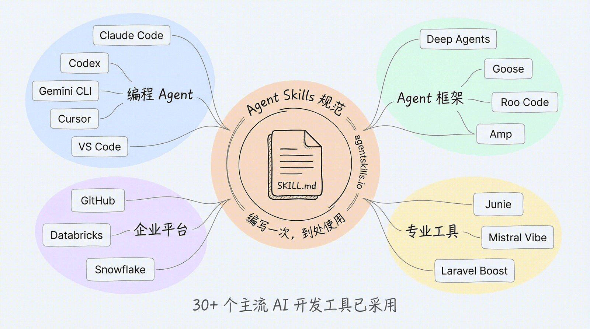
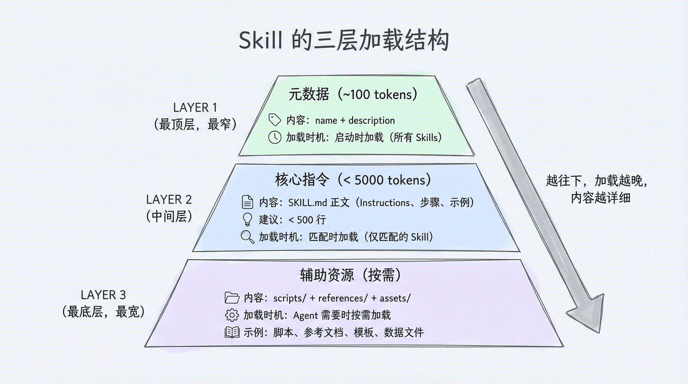
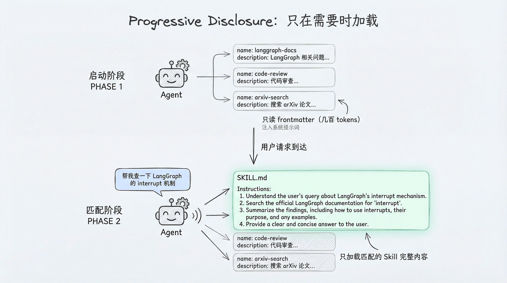
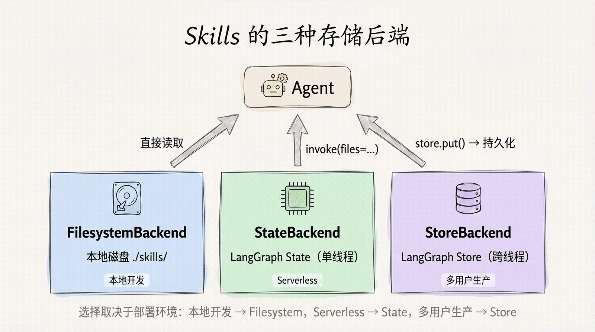
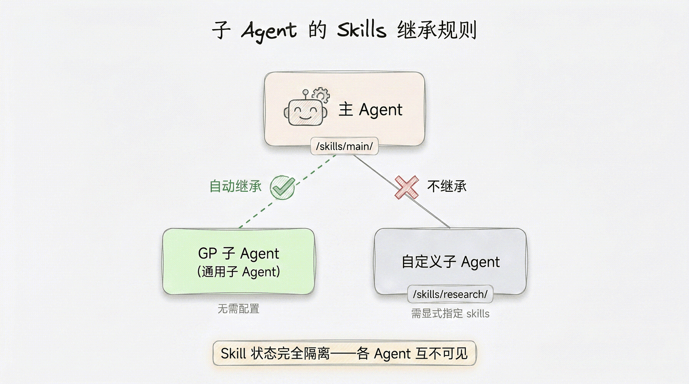
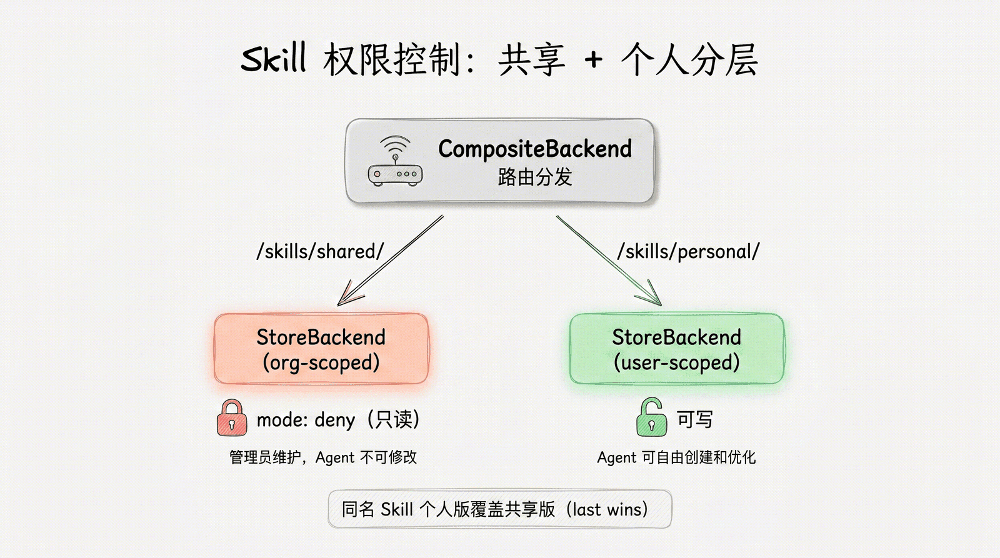
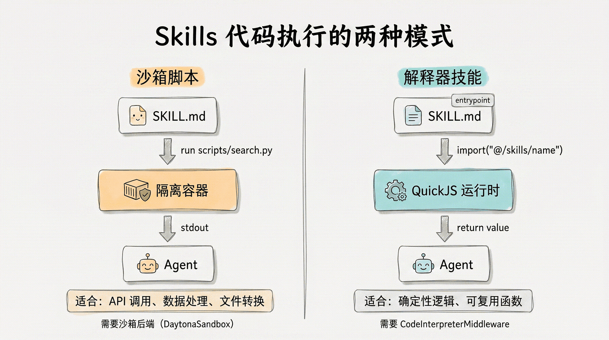

# 第 7 章：Skills — 可复用的 Agent 能力包 学习笔记

> 教材：Datawhale《Deep Agents 实战》[第 7 章](https://datawhalechina.github.io/deepagents-in-action/chapters/ch07-skills/)
> 学习日期：2026-09-29 ｜ 对应 deepagents v0.7（权限部分需 ≥0.6.8，解释器技能需 `deepagents[quickjs]`）
> 前置章节：第 3 章虚拟文件系统（三种 Backend）、第 5 章子 Agent、第 11 章文件系统权限（本章引用）

---

## 0. 一句话主线

> **Tools 是"一个函数"，Skills 是"一个目录"——把多步骤工作流、领域知识、脚本和模板打包成一个遵循开放规范的文件夹，Agent 启动时只看它的"名片"（name + description），判定相关才拆封阅读，需要细节时再翻附录。**

本章没有新的运行时模型，真正的主角只有一个设计思想：**Progressive Disclosure（渐进式披露）**。围绕它展开的目录规范、三种存储后端、继承规则、权限控制和代码执行，都是为"让 Agent 只在需要时看到需要的内容"服务的。

一个意外的发现：**我现在用的 Trae 本身就是这套规范的活样本**——系统提示里那一长串 `available_skills` 清单（每条只有 name + description）就是 Level 1，调用 Skill 工具才加载正文是 Level 2，GitHub/Lark/WeCom 这些插件则是"打包分发的 skills 集合"。读章节时可以不断与自己的环境对照。

---

## 1. 为什么需要 Skills：Tools 解决不了的那类问题

第 2 章起我们一直在用 Tools，但 Tools 是**原子操作**：搜索一次、读一个文件、调一次 API。而现实中的一类能力需要的是组合体：

- "按照团队规范做代码审查"——审查清单 + 输出格式 + 分步流程；
- "查阅 LangGraph 最新文档并据此回答"——先读索引、再选链接、再抓取综合；
- "生成符合公司格式的技术报告"——流程指导 + 模板文件。

这些能力的共同点是 **多步骤工作流 + 领域知识 + 模板资源**。把它们全塞进 system prompt 会永久占用上下文，写成一个 Tool 又过于僵硬（Tool 是代码函数，装不下长指令和参考文档）。Skills 就是介于两者之间的载体。

### 1.1 Skills 不是私有概念，而是开放规范

一个 Skill = 一个目录，核心是 `SKILL.md`，外带可选的脚本、参考文档和模板。它遵循开放的 [Agent Skills Specification](https://agentskills.io/specification)：



截至 2026 年，30+ 主流工具已采用该规范，分四类：

| 类别 | 代表产品 |
|---|---|
| 编程 Agent | Claude Code、OpenAI Codex、Gemini CLI、Cursor、VS Code |
| Agent 框架 | Deep Agents、Goose、Roo Code、Amp、Letta |
| 企业平台 | GitHub、Databricks、Snowflake、Spring AI |
| 专业工具 | JetBrains Junie、Mistral Vibe、Laravel Boost、Qodo |

含义很实在：**编写一次，到处使用**，团队积累的领域知识不会被锁死在某个工具里。教材给的类比是：**Skills 之于 AI Agent，就像 npm 包之于 Node.js**——标准化的能力分发与复用机制。我在 Trae 里看到的插件（Codex Obsidian、GitHub、Lark、WeCom）正是这种"打包分发"形态：一个插件 = 一束 skills + MCP + 命令。

### 1.2 规范定义的目录结构

```
skills/
└── langgraph-docs/
    ├── SKILL.md              # 必需：元数据 + 指令正文
    ├── scripts/              # 可选：可执行脚本
    │   └── fetch_docs.py
    ├── references/           # 可选：详细参考文档
    │   ├── api-patterns.md
    │   └── style-guide.md
    └── assets/               # 可选：模板、数据文件、schema
        ├── report-template.md
        └── schema.json
```

| 目录 | 用途 | 加载时机 |
|---|---|---|
| `SKILL.md` | 元数据 + 核心指令 | frontmatter 启动时加载；正文匹配时加载 |
| `scripts/` | 可执行脚本（Python、Bash、JS 等） | Agent 按指令需要时执行 |
| `references/` | 详细参考文档（API 模式、风格指南） | 需要深入信息时按需读取 |
| `assets/` | 模板、数据文件、schema 等静态资源 | 需要时按需读取 |

记忆要点：**一个必需文件 + 三个可选目录**；三个可选目录正好对应三种内容形态——可执行的、需细读的、直接套用的。

---

## 2. SKILL.md 解剖：元数据 + 剧本

每个 Skill 的核心文件由两部分组成：**YAML frontmatter（元数据）** 和 **Markdown body（指令正文）**。

### 2.1 Frontmatter 字段

| 字段 | 必填 | 说明 |
|---|---|---|
| `name` | 是 | 小写字母、数字、连字符，1–64 字符；**必须与父目录名一致** |
| `description` | 是 | 功能与适用场景，最大 1024 字符 |
| `license` | 否 | 许可证名称 |
| `compatibility` | 否 | 环境要求（需联网、需特定 CLI），最大 500 字符 |
| `metadata` | 否 | 任意键值对（author、version、entrypoint 等） |
| `allowed-tools` | 否 | 空格分隔的预授权工具列表 |

一个完整示例（langgraph-docs 官方示例）：

```markdown
---
name: langgraph-docs
description: Use this skill for requests related to LangGraph in order to fetch relevant documentation to provide accurate, up-to-date guidance.
---

# langgraph-docs

## Instructions
### 1. Fetch the documentation index
用 fetch_url 读取 https://docs.langchain.com/llms.txt
### 2. Select relevant documentation
根据问题从索引中选出 2-4 个最相关的文档 URL
### 3. Fetch and synthesize
抓取所选页面，综合后回答用户问题
```

### 2.2 description 是最重要的字段（没有之一）

Agent 选择 Skill 的**唯一依据**就是 `description`——它不会提前读正文。所以 description 的质量直接决定召回质量：

```yaml
# ✅ 好：具体、带明确触发条件（"Use when..."句式）
description: 当用户要求审查代码质量、安全性或性能时使用此技能。执行结构化代码审查并输出报告。

# ❌ 差：模糊、无触发信号
description: A helpful skill for developers.
description: 处理各种任务。
```

差的 description 导致两类故障：**漏召回**（该用时匹配不到）和**误召回**（不该用时被触发）。

对照 Trae 环境里现成的 description 很容易验证这一点：写得好的都是"触发场景 + 产出物"结构，例如 *"Review the changes since a fixed point... Use when the user wants to review a branch, a PR..."*；而模型决定是否调用 Skill，靠的确实只有这一句话。

### 2.3 正文是写给 Agent 的"剧本"

frontmatter 之后的 Markdown body 是 Skill 被激活后实际执行的指令。它和普通技术文档的受众不同：**读者是 LLM，不是人**（最佳实践见第 9 节），所以正文偏好步骤化指令、决策分支、输入输出示例，而非大段论述。

---

## 3. Progressive Disclosure：本章最核心的设计

如果把所有 Skill 的完整正文都塞进系统提示词，5 个 Skill 还行，50 个 Skill 上下文窗口就爆了。Skills 的答案是分三层逐步加载：



### 3.1 三级加载机制

| 层级 | 加载内容 | 加载时机 | 处理者 |
|---|---|---|---|
| Level 1: Metadata | name + description | Agent 启动时，所有 Skills 一起 | SkillsMiddleware |
| Level 2: Instructions | SKILL.md 完整正文 | 某个 Skill 被匹配激活时 | SkillsMiddleware |
| Level 3: Resources | scripts/、references/、assets/ 文件 | 指令中引用到某文件时 | LLM 自行决策读取 |

三个阶段：

1. **启动阶段**：`SkillsMiddleware` 扫描配置的 Skill 目录，解析每个 `SKILL.md` 的 frontmatter，把 name/description（外加文件路径）注入系统提示词。20 个 Skills 只占几百 token，正文一个字都不进上下文。
2. **匹配阶段**：用户请求到达后，Agent 依据 description 判定需要某个 Skill，该 Skill 的完整 SKILL.md 正文才被加载进上下文。
3. **执行阶段**：Agent 按正文指令工作；正文若引用了 `references/`、`assets/` 下的文件，由 LLM 自己决定读不读——中间件不再干预。

> 注意一个措辞细节："启动时只读 frontmatter"指的是**进入模型上下文的内容**只有元数据；中间件在扫描阶段仍会打开文件以解析 frontmatter，并不是不碰磁盘。

匹配流程：



```
用户："帮我查一下 LangGraph 的 interrupt 机制"

Agent 思考：
  - 扫描 Skills 列表（只有 name + description）...
  - langgraph-docs: "Use this skill for requests related to LangGraph..." ← 匹配！
  - 加载 /skills/langgraph-docs/SKILL.md 完整正文
  - 按剧本执行：fetch_url 读索引 → 选文档 → 抓取 → 综合回答
```

### 3.2 这样设计的三个收益

1. **节省 token**：启动时加载 20 条 description（几百 token）而不是 20 份完整指令（可能数万 token）。
2. **精准匹配**：只有当前任务需要的指令进入上下文，无关"剧本"不会干扰 LLM 判断。
3. **近乎无限扩展**：Skills 从 5 个增到 50 个，启动开销只线性增加几十条 description，上下文窗口不构成瓶颈。

### 3.3 我的现场对照：Trae 就是三级模型

读到这里时我直接对照了当前对话的系统提示：

- **Level 1**：系统提示里挂着全部可用 Skill 的 name + description 清单（TRAE-browseruse、code-review、find-skills、skill-creator……），每条一两句话——这正是"启动时全量加载元数据"；
- **Level 2**：只有当我真的发起浏览器任务时，才通过 Skill 工具加载 `TRAE-browseruse` 的完整指引（工具描述明确写了"load this skill before using browser tools"）——匹配后才读正文；
- **Level 3**：Skill 内部若再引用脚本或参考文件，则按需读取。

换句话说，本章不是抽象理论，而是这门课学习过程中每天都在触发的机制。也正因如此，**description 写得好不好，直接决定我提问时系统会不会激活对的 Skill**——这与第 2.2 节完全吻合。

---

## 4. 三种 Backend：Skills 文件放在哪

Skills 本质上是"被 SkillsMiddleware 特殊扫描的一类文件"，所以第 3 章虚拟文件系统的 Backend 体系在这里原样复用。三种后端对应三种部署环境：



选型口诀：**本地开发 → Filesystem，Serverless → State，多用户生产 → Store。**

### 4.1 FilesystemBackend：直接读本地磁盘

```python
from deepagents import create_deep_agent
from deepagents.backends.filesystem import FilesystemBackend

backend = FilesystemBackend(root_dir="./my-project", virtual_mode=True)

agent = create_deep_agent(
    model="anthropic:claude-sonnet-4-6",
    backend=backend,
    skills=["/skills/"],          # 路径列表，指向 Skill 子目录的"父目录"
)
```

关键细节（容易踩坑）：

- `skills` 接受的是**路径列表**，每个路径指向包含 Skill 子目录的**父目录**：`/skills/` 对应磁盘上的 `./my-project/skills/myskill/SKILL.md`；直接传 `/skills/myskill.md` 不符合目录扫描约定，参数也不会替你创建目录或文件。
- 路径以正斜杠、相对 Backend 根目录书写。
- 本地磁盘后端建议显式传 `virtual_mode=True`（与第 3 章路径沙箱一致）。
- 多个路径出现同名 Skill 时 **last wins（后面的覆盖前面的）**。

### 4.2 StateBackend：无磁盘，随 state 注入

适合 serverless 等无磁盘环境，或需要动态注入 Skill 内容的场景：

```python
from deepagents.backends import StateBackend
from deepagents.backends.utils import create_file_data

backend = StateBackend()

# Skill 内容可从远程 URL 拉取，也可本地读取
skill_content = urlopen(skill_url).read().decode("utf-8")
skills_files = {
    "/skills/langgraph-docs/SKILL.md": create_file_data(skill_content),
}

agent = create_deep_agent(model=..., backend=backend, skills=["/skills/"],
                          checkpointer=MemorySaver())

agent.invoke(
    {"messages": [...], "files": skills_files},   # 每次 invoke 都要经 files 注入
    config={"configurable": {"thread_id": "12345"}},
)
```

四个要点：文件存 LangGraph agent state（单线程）；虚拟路径必须以 `/` 开头；**必须用 `create_file_data()` 包装**，裸字符串会报错；每次调用都要随 `files` 传入。

### 4.3 StoreBackend：写一次，跨线程共享

与 StateBackend 的关键差别：文件经 `store.put()` 写入**一次**，所有线程都能读，适合多用户生产环境：

```python
from deepagents.backends import StoreBackend

store = InMemoryStore()
backend = StoreBackend(namespace=lambda _rt: ("filesystem",))

store.put(
    namespace=("filesystem",),
    key="/skills/langgraph-docs/SKILL.md",
    value=create_file_data(skill_content),
)

agent = create_deep_agent(model=..., backend=backend, store=store,
                          skills=["/skills/"])
```

要点：底层是 LangGraph Store，数据跨线程持久化；`namespace` 是一个接收 runtime config、返回命名空间元组的函数——这为后面按组织/按用户隔离埋下伏笔。

### 4.4 多源 Skills 与 last-wins 分层

```python
skills=[
    "/skills/shared/",    # 团队共享（低优先级）
    "/skills/project/",   # 项目专属（同名时覆盖前者）
]
```

典型的三层覆盖策略，和配置文件的层级覆盖（系统级 → 用户级 → 项目级）是同构的：

| 层级 | 路径 | 内容 |
|---|---|---|
| 组织级 | `/skills/org/` | 公司规范、安全审查 |
| 团队级 | `/skills/team/` | 团队工作流、Code Review 标准 |
| 项目级 | `/skills/project/` | 项目特定流程（同名时最终生效） |

### 4.5 运行时动态加载

`skills` 就是普通 Python 列表，完全可以运行时构造：

```python
SKILLS_BY_ROLE = {
    "engineering": ["/skills/code-review/", "/skills/testing/"],
    "data":        ["/skills/sql-analysis/", "/skills/visualization/"],
    "support":     ["/skills/ticket-triage/", "/skills/runbook/"],
}

def create_agent_for_user(user_role: str):
    return create_deep_agent(model=..., skills=SKILLS_BY_ROLE.get(user_role, []))
```

四种常见筛选维度：**用户角色、租户配置、请求意图、环境变量**。收益和 Progressive Disclosure 一脉相承——Agent 只面对与当前任务相关的 Skills，既省 token 又降误匹配。

---

## 5. Skills 与子 Agent：继承边界

第 5 章学过三种子 Agent 形态，本章补上它们与 Skills 的继承规则：



- **通用子 Agent（General-Purpose Subagent）**：自动继承主 Agent 的全部 Skills，零配置。
- **自定义子 Agent**：**不继承**，必须在定义时用 `skills` 字段显式声明。
- **Skill 状态完全隔离**：每个 Agent 拥有独立的 Skill 状态空间，一个 Agent 修改 Skill 文件不影响其他 Agent——并发执行时不会出现竞态。

```python
research_subagent = {
    "name": "researcher",
    "description": "Research assistant with specialized skills",
    "system_prompt": "You are a researcher.",
    "tools": [web_search],
    "skills": ["/skills/research/", "/skills/web-search/"],  # 自带 Skills
}

agent = create_deep_agent(
    model=...,
    skills=["/skills/main/"],            # 主 Agent + GP 子 Agent 可用
    subagents=[research_subagent],       # researcher 只能用自己声明的两个
)
```

职责清晰是这道边界存在的理由：研究型子 Agent 不需要、也不应该接触主 Agent 的编排类 Skill。这与我在 Trae 里观察到的 Task 子 agent 现象可以互相印证：search/general_purpose/browser 三类子 agent 各自带着**固定的、互不相同的工具清单**，能力边界在派出时就已确定，而不是继承主对话里的全部技能。

---

## 6. Skill 权限控制：生产环境的三道关

生产环境中要管三个维度：

1. **可见性（Visibility）**：能否发现、读取某个 Skill；
2. **写入权限（Write Access）**：能否修改 Skill 文件；
3. **审批流程（Approval）**：写入是否需要人类确认。

### 6.1 只读 Skill 库：mode="deny"

企业知识库场景：运维维护一套经审核的 Skill，Agent 只能读和执行。用 `FilesystemPermission` + `CompositeBackend` 实现——目标是"允许读 `/skills/**`、拒绝写"，而非关闭全部文件能力：

```python
agent = create_deep_agent(
    model=...,
    backend=CompositeBackend(
        default=StateBackend(),
        routes={"/skills/": StoreBackend(namespace=org_skill_namespace)},
    ),
    skills=["/skills/"],
    permissions=[
        FilesystemPermission(operations=["write"],
                             paths=["/skills/**"], mode="deny"),
    ],
    store=store,
)
```

`deny` 会直接拦截 `write_file`、`edit_file` 以及 v0.7 默认提供的 `delete`；Skill 库更新只能由管理员代码直接操作 Store。

**一个必须记住的路径细节**：`CompositeBackend` 收到 `/skills/test-skill/SKILL.md` 后，会先剥离挂载前缀 `/skills/`，再把 `/test-skill/SKILL.md` 交给内部的 StoreBackend。所以用 Store API 预填路由时，key 要写 `/test-skill/SKILL.md`；多写一层会变成 `/skills/skills/test-skill/...`。只有不经 CompositeBackend、直接把 StoreBackend 当根 Backend 时，Store key 才保留完整的 `/skills/...` 路径。

### 6.2 写入需审批：mode="interrupt"

允许 Agent 提修改建议，但必须人类点头才生效——人在回路：

```python
agent = create_deep_agent(
    model=...,
    skills=["/skills/personal/"],
    permissions=[
        FilesystemPermission(operations=["write"],
                             paths=["/skills/**"], mode="interrupt"),
    ],
    checkpointer=MemorySaver(),   # interrupt 必须有 checkpointer
)
```

写入尝试会让执行流暂停，把改动呈给审批者：通过则恢复，拒绝则回滚。注意三点：依赖 checkpointer 保存暂停状态；需要 `deepagents>=0.6.8`；LangGraph Studio 会自动渲染审批 UI，走 API 时则要客户端轮询并提交审批结果。

### 6.3 共享 + 个人两层结构（最常见的部署模式）



用 `CompositeBackend` 把两个前缀路由到两个不同命名空间的 Store：

```python
backend=CompositeBackend(
    default=StateBackend(),
    routes={
        "/skills/shared/":   StoreBackend(namespace=shared_skill_namespace),   # 组织级
        "/skills/personal/": StoreBackend(namespace=personal_skill_namespace), # 用户级
    },
)
skills=["/skills/shared/", "/skills/personal/"]
permissions=[
    FilesystemPermission(operations=["write"],
                         paths=["/skills/shared/**"], mode="deny"),  # 共享库只读
]
```

- `/skills/shared/` → 组织级 Store，写入 deny，仅管理员可更新；
- `/skills/personal/` → 用户级 Store，Agent 可自由创建、优化个人 Skill；
- 两处都在 `skills` 列表里，启动时同时扫描。

**同名覆盖**：personal 在列表中靠后，按 last-wins 个人版覆盖共享版——用户可以基于团队 Skill 做个性化调整，又不影响别人。命名空间函数从 `rt.context`（如 `org_id`、`user_id`）解析租户身份，这正是 4.3 节埋下的伏笔。

---

## 7. 用 Skills 执行代码：两种模式

Skills 不只能装文本指令，还能装可执行代码。



### 7.1 沙箱脚本（Sandbox Scripts）

`scripts/` 里放完整脚本（如 `arxiv-search/scripts/search.py`），SKILL.md 指示 Agent "运行 `scripts/search.py` 并把 query 作为参数"。真正执行需要支持沙箱的后端（如 DaytonaSandbox）：脚本在**隔离容器**中运行，Agent 拿 stdout 作为结果。

- 适合：API 调用、数据处理、文件转换等需要 Shell / 装包 / 完整文件系统的任务；
- 若 Skill 文件存在沙箱之外（如 StateBackend），需自定义中间件做文件同步：`before_agent` 把脚本上传进沙箱，`after_agent` 把输出文件下载回来；
- 注意区分：从任何后端都能**读取**脚本内容，但**执行**脚本必须有沙箱后端。

### 7.2 解释器技能（Interpreter Skills）

把 Skill 里的代码模块直接暴露给 Agent 的代码解释器，Agent 一行 `import` 就能复用**经过测试的确定性函数**，而不必每次让 LLM 重新生成逻辑。

运行前提：安装 QuickJS 中间件（`deepagents[quickjs]`，要求 `langchain-quickjs>=0.2.0`、Python ≥ 3.11）；QuickJS 是内存中的 JS/TS 运行时，要跑 Shell/装包/访问完整文件系统仍应回到沙箱后端。

三步配置：

```markdown
---
name: order-helpers
description: Helper functions for normalizing and grouping order records.
metadata:
  entrypoint: scripts/index.ts        # ① frontmatter 指定入口
---
```

```python
# ② 中间件与 Agent 使用同一个 backend
middleware=[CodeInterpreterMiddleware(skills_backend=backend)]
```

```typescript
// ③ Agent 在解释器里按约定路径导入
const { groupByStatus } = await import("@/skills/order-helpers");
```

价值在**确定性**：测试过的函数不会因 LLM 临场重写而产生偏差，同时一行 import 替代几十行生成代码，节省 token。两种模式的选择标准：**外部进程能力（网络/Shell/文件）选沙箱脚本；纯确定性的 JS/TS helper 选解释器技能。**

---

## 8. Skills、Memory 与 Tools：三种能力注入方式

这是本章对我最有梳理价值的一张表：

| | Skills | Memory（`AGENTS.md`） | Tools |
|---|---|---|---|
| 用途 | 按需加载的领域能力（渐进式披露） | 启动即加载的持久上下文 | Agent 可调用的编程操作 |
| 加载时机 | 判断相关时才读取 | Agent 启动时加载 | 每轮都可用 |
| 形态 | 命名目录中的 `SKILL.md` | `AGENTS.md` 文件 | 绑定到 Agent 的函数 |
| 优先级 | last wins 覆盖 | 用户级 + 项目级合并 | 创建时定义 |
| 适用场景 | 任务专属、可能很大的指令集 | 始终相关的全局规范与偏好 | 需要执行操作，或没有文件系统时 |

实用决策规则：

- **"所有对话都需要"** → Memory：编码规范、语言偏好、项目架构说明；
- **"特定任务才需要的专业指令"** → Skills：文档查询流程、审查清单、报告模板；
- **"需要执行的原子操作"** → Tools：搜索、读写文件、发 HTTP 请求。

这三者我在自己环境里都能找到对应物，理解一下子就落地了：

- 我的 `user_profile.md`、`project_memory.md`（沟通语言、硬约束、工程约定）每轮自动注入，正是 **Memory**——内容不多但条条"始终相关"；
- 本课程笔记的写作规范、代码审查流程这种"偶尔才用、写下来很长"的东西，适合做成 **Skill**；
- 读文件、跑命令这类动作是 **Tools**。

教材还点出一个进阶视角：Skills 和 Memory 处在一个**连续光谱**上。Agent 可以在工作中更新自己的 Skills（类似更新记忆），所以 Skills 也能充当"**渐进式披露的记忆**"——只在需要时才加载的领域知识库。区别于每轮全量注入的 Memory，它用"按需"换"容量"。

---

## 9. 编写高效 Skills 的最佳实践

1. **frontmatter 保持精简，description 具体化**
   写清"什么时候触发 + 做什么 + 产出什么"，避免"帮助用户解决编程问题"这类万能句式。再次强调：description 是唯一召回依据。

2. **正文控制在 5000 tokens / 500 行以内**
   超出去的内容拆到 `references/`，在正文里引用即可（如 `references/rest-conventions.md`、`references/error-codes.md`）。这其实就是在 Skill 内部再做一次 Progressive Disclosure。

3. **为 Agent 而非人类组织结构**
   - 步骤化流程：明确的 1-2-3，而非段落叙述；
   - 决策标准：if X then A, else B；
   - 输入/输出示例：给出期望格式；
   - 边界情况：常见异常如何应对。

4. **管控 Skill 数量**
   少量定义清晰的 Skills 优于大量模糊重叠的 Skills——数量一多，description 选择面变大导致误匹配，重叠 Skill 让 Agent 困惑。定期做三件事：**合并重叠的、删除过时的、拆分过大的**。

（Trae 技能库里的 `skill-creator`、`writing-for-agents` 本身就是"教人写 Skill 的元 Skill"，本节的规范和它们的指引一致。）

---

## 10. 小结

1. **定位**：Skills 把"多步骤工作流 + 领域知识 + 模板资源"打包成目录，遵循开放的 Agent Skills 规范（30+ 工具采纳），跨框架复用，类比 npm 包。
2. **结构**：`SKILL.md`（必需）+ `scripts/` + `references/` + `assets/`（均可选）；frontmatter 中 `name` 必须与目录同名，`description` 是召回的唯一依据。
3. **核心设计 Progressive Disclosure**：元数据（启动全量，几百 token）→ 正文（匹配后加载）→ 辅助资源（LLM 按需读取），换来省 token、准匹配、可无限扩展。
4. **三种 Backend**：Filesystem（本地磁盘）、State（随 `invoke(files=...)` 注入、单线程）、Store（`store.put()` 一次、跨线程）；多源同名 last wins；可按角色/租户/意图/环境动态构造 skills 列表。
5. **子 Agent 继承**：GP 子 Agent 自动继承，自定义子 Agent 显式声明，状态彼此隔离。
6. **权限**：可见性 / 写入 / 审批三维度；`deny` 只读、`interrupt` 人工审批（需 checkpointer、≥0.6.8）；共享只读 + 个人可写是最常见的生产分层；小心 CompositeBackend 的前缀剥离导致的 Store key 双层路径。
7. **代码执行**：沙箱脚本（隔离容器跑外部脚本，适合 API/数据处理）与解释器技能（QuickJS 中 `import("@/skills/<name>")`，适合确定性 JS/TS helper）。
8. **三者分工**：Skills 按需加载、Memory 始终生效、Tools 执行原子操作；Skills 也可视为"渐进式披露的记忆"。

下一章进入长期记忆——让 Agent 拥有跨对话、跨会话的持久记忆。第 8 节里 Memory 与 Skills 的连续光谱，正好是通往那一章的桥。

## 参考资料

- 教材：[第 7 章 Skills — 可复用的 Agent 能力包](https://datawhalechina.github.io/deepagents-in-action/chapters/ch07-skills/)
- 开放规范：[Agent Skills Specification](https://agentskills.io/specification)
- 官方文档：[Skills（deepagents）](https://docs.langchain.com/oss/python/deepagents/)
- 关联笔记：[第 3 章 虚拟文件系统](../ch03-虚拟文件系统/README.md) ｜ [第 5 章 子 Agent 与上下文隔离](../ch05-子Agent与上下文隔离/README.md) ｜ [第 6 章 异步子 Agent](../ch06-异步子Agent/README.md)
