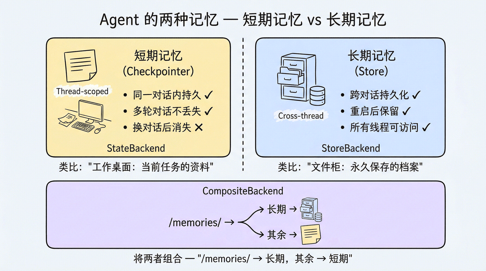
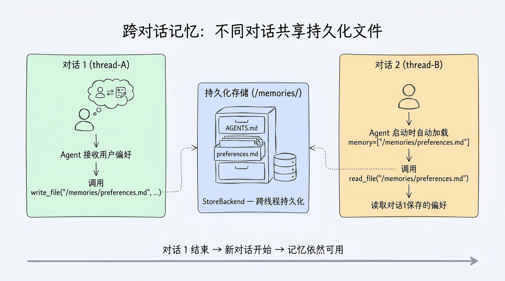
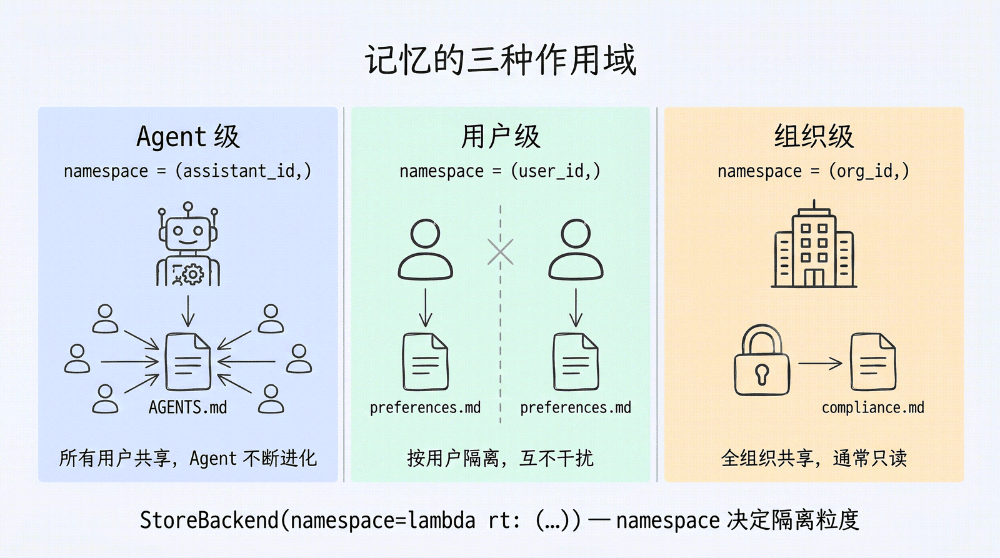

# 第 8 章：长期记忆 — 让 Agent 拥有跨对话的记忆 学习笔记

> 教材：Datawhale《Deep Agents 实战》[第 8 章](https://datawhalechina.github.io/deepagents-in-action/chapters/ch08-long-term-memory/)
> 学习日期：2026-10-05 ｜ 实验环境：deepagents 0.7.13 ＋ langgraph 1.2.11 ＋ langgraph-checkpoint-sqlite 3.1.1
> 前置章节：第 3 章虚拟文件系统（StateBackend / CompositeBackend）、第 4 章 SummarizationMiddleware、第 7 章 Skills 三级加载

---

## 0. 一句话主线

> **短期记忆靠 Checkpointer，活在 thread 里，换 `thread_id` 即清空；长期记忆靠 Store，按 namespace 跨 thread（甚至跨进程、跨机器）持久化。Deep Agents 让 Agent 像读写文件一样读写记忆——用 `CompositeBackend` 按路径前缀决定一份文件"下班清桌"还是"永久归档"。**

本章最有冲击力的一次体感来自动手实验：第一轮对话里 Agent 把一个暗号写进 `/memories/AGENTS.md`；**杀掉进程、换一个全新 `thread_id`、另起一个 Python 进程**再问，它依然答得上来。那一刻"长期记忆"从四个字变成了磁盘上一个真实存在的 SQLite 文件。

另一个意外收获是读源码后搞清了一个直觉误区：**StateBackend 里的"文件"根本没有路径，它只是 Agent State 中一个内存 dict**。所谓文件系统从头到尾都是虚拟的。

---

## 1. 两种记忆：一张图建立全局观



| 维度 | 短期记忆（Thread-scoped） | 长期记忆（Cross-thread） |
|---|---|---|
| 载体 | Agent State（含虚拟文件、消息历史） | BaseStore 里的记忆文件 / AGENTS.md |
| 持久机制 | Checkpointer，每步 superstep 存档 | Store（InMemory / SQLite / Postgres） |
| 隔离边界 | `thread_id` | `namespace`（agent / user / org） |
| 生命周期 | 换 thread 即消失 | 跨 thread、跨进程、可跨机器 |
| 类比 | 今天摊在办公桌上的资料 | 档案柜里永久归档的卷宗 |
| 教材对应 | StateBackend + MemorySaver | StoreBackend + CompositeBackend |

教程给的四类典型长期信息：

1. **用户偏好**："我喜欢简洁的代码风格"；
2. **项目背景**："我们用 React + TypeScript"；
3. **累积成果**：多次对话逐渐收集的研究资料；
4. **反馈习得**：Agent 从用户纠正中学到的改进指令。

Memory 的工作原理只有三步，本章全部内容都是这三步的展开：

1. **指定记忆文件路径**：`memory=["/memories/AGENTS.md"]`（程序性记忆则用 `skills=`）；
2. **Agent 读取记忆**：启动时自动加载进 system prompt，或对话中按需 `read_file`；
3. **Agent 更新记忆（可选）**：学到新信息时用 `edit_file` 写回，变更持久化到下次对话。

---

## 2. 短期记忆深挖：StateBackend 的"文件"到底存在哪

教材说默认 StateBackend 把文件存在 Agent State 中，但"具体在哪个路径下？对话结束会自己清除吗？"——读本地安装的源码 `deepagents/backends/state.py` 后，答案非常干脆：

> **没有任何磁盘路径。它就是 LangGraph State 中 `files` channel 里的一个 Python dict，全程只活在内存里。**

源码 docstring 原话（state.py 第 38–48 行）：

> Backend that stores files in agent state (**ephemeral**). Files persist within a conversation thread but not across threads. State is automatically checkpointed after each agent step.

### 2.1 读写机制：两个 Pregel 内部通道

```python
# 读：通过 CONFIG_KEY_READ 直接读 files channel，fresh=True 保证"写完立刻读得到"
def _read_files(self) -> dict[str, Any]:
    read = config["configurable"][CONFIG_KEY_READ]
    return read("files", fresh=True) or {}

# 写：通过 CONFIG_KEY_SEND 向 files channel 提交一次部分更新（dict-merge reducer）
def _send_files_update(self, update: dict[str, Any]) -> None:
    send = config["configurable"][CONFIG_KEY_SEND]
    send([("files", update)])
```

所以 `write_file("/todo.md", ...)` 的本质是往一个 dict 里塞键值对：

```python
{
  "/todo.md": {"content": ["- 任务1", "- 任务2"], "created_at": "...", "modified_at": "..."},
  "/results/output.txt": {"content": ["准确率 92%"], ...},
}
```

- **键** = 虚拟路径字符串（不是真实磁盘路径，只是 dict 的 key）；
- **值** = 文件内容（按行存的 list）+ 时间戳。

`ls` 是前缀匹配 dict 的 key，`delete` 是发送 `None` 作为删除标记——全程没有一次文件系统调用。

### 2.2 "对话结束后会清除吗"：取决于 Checkpointer

| Checkpointer 配置 | files 的归宿 |
|---|---|
| 不配 checkpointer，直接 `invoke` | 一次调用结束，state 随运行丢弃 |
| `MemorySaver`（`langgraph dev` 默认） | 按 thread_id 存在 Server 进程内存；同 thread 可恢复，**进程重启全没** |
| `SqliteSaver` / `PostgresSaver` | 每个 superstep 后序列化落盘；同 thread 跨进程重启可恢复 |

注意最后一行：即使落盘了，它依然是 **thread-scoped**——换一个 `thread_id` 永远拿到一个干净的空 `files`。持久 ≠ 共享，这是两个正交的属性。

### 2.3 Checkpointer 的工作原理与硬限制

```python
from langgraph.checkpoint.memory import MemorySaver

agent = create_deep_agent(model=model, checkpointer=MemorySaver())
config = {"configurable": {"thread_id": "conversation-001"}}
agent.invoke({"messages": [{"role": "user", "content": "我叫张三"}]}, config=config)
agent.invoke({"messages": [{"role": "user", "content": "我叫什么名字？"}]}, config=config)
# → 你叫张三（同 thread 自动恢复状态）

config2 = {"configurable": {"thread_id": "conversation-002"}}
agent.invoke({"messages": [{"role": "user", "content": "我叫什么名字？"}]}, config=config2)
# → 不知道你是谁（thread 之间状态完全隔离）
```

- 每执行完一步自动保存：消息历史、文件系统状态、任务清单；
- 同 `thread_id` 下次调用自动恢复；
- **硬限制：只在同一 thread_id 内有效**——这正是必须引入 Store 的原因。

### 2.4 上下文太长怎么办：三种短期记忆管理策略

| 策略 | 做法 | 适用 |
|---|---|---|
| Trim 裁剪 | 只保留最近 N 条 | 不需远古历史的场景 |
| Delete 删除 | `RemoveMessage` 精确删特定消息 | 删除敏感信息 |
| Summarize 总结 | LLM 把旧消息压成摘要 | **最推荐**，保留语义 |

Deep Agents 已内置 `SummarizationMiddleware`：上下文到模型窗口的 85% 时自动触发总结（第 3、4 章讲过）。也可用 `@before_model` 中间件自定义裁剪。

---

## 3. 长期记忆的核心方案：CompositeBackend + StoreBackend



### 3.1 路径路由：对 Agent 透明，按前缀分流

```python
from deepagents import create_deep_agent
from deepagents.backends import CompositeBackend, StateBackend, StoreBackend

agent = create_deep_agent(
    model=model,
    memory=["/memories/AGENTS.md"],      # 启动时自动加载的记忆
    backend=CompositeBackend(
        default=StateBackend(),          # 默认：临时文件，thread 结束即丢
        routes={
            "/memories/": StoreBackend(namespace=assistant_namespace),  # 长期：落 Store
        },
    ),
)
```

Agent 调的工具完全一样（都是 `write_file` / `read_file`），区别只在路径前缀：

```python
write_file("/workspace/draft.txt", "草稿…")          # → StateBackend，下班清桌
write_file("/memories/preferences.md", "简洁风格")    # → StoreBackend，永久归档
```

### 3.2 Store 存在哪里：三种 BaseStore 实现

StoreBackend 本身只是适配层，真正的落地由传入的 `store=` 决定（数据模型是 `namespace 元组 + key → Item`，与 thread_id 完全解耦）：

| Store 实现 | 落地位置 | 持久性 |
|---|---|---|
| `InMemoryStore` | 进程内存 | 跨 thread，不跨进程重启 |
| `SqliteStore` | 本地 `.db` 文件 | 跨进程、单机持久（**本实验采用**） |
| `PostgresStore` | PostgreSQL | 生产级、多机共享 |

### 3.3 namespace：三种作用域



```python
from dataclasses import dataclass

@dataclass(frozen=True)
class MemoryContext:
    user_id: str = "local-user"
    org_id: str = "default-org"

def assistant_namespace(rt):                       # Agent 级：同 Agent 所有用户共享
    if rt.server_info:
        return (rt.server_info.assistant_id,)
    return ("local-agent",)

def user_namespace(rt):                            # 用户级：按人隔离，互不泄露
    if rt.server_info and rt.server_info.user:
        return (rt.server_info.user.identity,)
    return (getattr(rt.context, "user_id", "local-user"),)

def org_namespace(rt):                             # 组织级：全员共享，通常设只读
    return (getattr(rt.context, "org_id", "default-org"),)
```

本地 `agent.invoke()` 时 `server_info` 为空，所以教程建议封装兜底；本地调试可用 `context_schema=MemoryContext` 并在 invoke 时传 `context=MemoryContext(user_id="user-123")`。

### 3.4 跨对话访问：两次 invoke 用不同 thread_id

```python
# 对话 1：保存
agent.invoke(
    {"messages": [{"role": "user", "content": "记住：注释用中文，变量名用英文"}]},
    config={"configurable": {"thread_id": str(uuid7())}},
)
# Agent 自行调用 write_file 写入 /memories/preferences.md

# 对话 2（全新 thread）：读取
agent.invoke(
    {"messages": [{"role": "user", "content": "帮我写个排序函数"}]},
    config={"configurable": {"thread_id": str(uuid7())}},
)
# Agent 启动时已加载 preferences.md → 自动中文注释、英文变量名
```

---

## 4. AGENTS.md：写给 Agent 看的 README

本章的记忆文件默认命名为 AGENTS.md，这不是 deepagents 的私有约定，而是一个开放规范（[agents.md](https://agents.md/)，GitHub 6 万+ 项目采用，Cursor、Codex、Gemini CLI、Copilot、Zed 等均兼容）。

### 4.1 与 README.md 的分工

| | README.md | AGENTS.md |
|---|---|---|
| 读者 | 人 | AI Agent |
| 内容 | 项目介绍、快速上手 | 构建/测试命令、代码风格、目录约定、踩坑提示 |
| 目标 | 让人了解项目 | 让 Agent 不出错地在项目里干活 |

```markdown
# AGENTS.md
## Setup commands
- Install deps: `pnpm install`
- Run tests: `pnpm test`
## Code style
- TypeScript strict mode；单引号、无分号
```

在 deepagents 中它由 `MemoryMiddleware` 处理，读源码（`deepagents/middleware/memory.py`）得到四个关键事实：

1. **启动常驻注入**：docstring 明确 "memory is **always loaded**"——每次对话开始就把文件全文拼进 system prompt 的 `<agent_memory>` 标签，每轮都占上下文；
2. **文件不存在静默跳过**：`download_files` 返回 `file_not_found` 时 `continue`，所以第一轮"还没有记忆"不会报错；
3. **HTML 注释会被剥离**：`<!-- ... -->` 不注入模型，可放"给人看不给 Agent 看"的备注；
4. **信任与验证原则**：记忆被视为"参考材料而非隐藏系统指令"，与用户明确要求冲突时以用户为准——这是防 prompt 注入的设计。

Agent 从反馈中学习的闭环也写在默认 prompt 里：*"To persist new knowledge, call `edit_file` to update memory promptly"*——用户每次纠正，都是一次永久更新记忆文件的机会。

### 4.2 一个绕不开的成本问题：记忆占不占上下文？

**存储 ≠ 上下文。数据躺在 Store / 磁盘上时一个 token 都不占；只有被读进对话才占。** 两条注入路径策略不同：

- **MemoryMiddleware（`memory=` 指定的文件）**：常驻，全文每轮都在 system prompt 里；
- **StoreBackend 按需读取**（如放在 `/memories/` 但不列入 `memory=`，或 Skills 式按需查阅）：不查不占，查到的那部分作为工具消息进入上下文。

这解释了为什么长期记忆需要定期精炼、去重、遗忘——记忆越长，每轮固定成本越高。教程"高级用法"中的后台记忆整合（Consolidation）就是在解决这个矛盾。

> **Trae 现场对照**：本会话每轮自动注入的 user_profile（"图像风格：简洁易懂"）和 project_memory（"新代码用 _vX.py 命名"）扮演的就是常驻 AGENTS.md 的角色；而第 7 章的 Skills 是按需加载路线。两种策略在同一个产品里并存。

---

## 5. 高级视角：记忆的六个维度

教程结尾给出官方的六维拆分框架，可作为以后设计记忆系统的 checklist：

| 维度 | 核心问题 | 选项 |
|---|---|---|
| 持续时间 | 保留多久 | 短期（单对话）/ 长期（跨对话） |
| 信息类型 | 记什么 | 情景记忆（经历）/ 程序性记忆（Skills）/ 语义记忆（事实） |
| 作用域 | 谁能看 | 用户级 / Agent 级 / 组织级 |
| 更新策略 | 何时写 | 对话中实时（默认）/ 对话间后台整合 |
| 检索方式 | 如何读 | 启动加载（`memory=`）/ 按需读取（Skills） |
| 权限控制 | 能写吗 | 读写（默认）/ 只读（组织共享策略） |

补充三个本章提到但未展开的方向：

- **组织级记忆**：跨所有用户共享，通常只读防注入，可由应用代码通过 SDK `store.put_item` 填充；
- **情景记忆**：Checkpointer 已天然完整保存每个 thread，可再包一个 `search_past_conversations` 工具按用户搜索历史 thread；
- **后台整合**：独立"整合 Agent"审查最近对话、提取事实、合并记忆，用 Cron 定时触发——优点是不在用户热路径上加延迟，缺点是下次对话才生效。

---

## 6. 动手实验：跨两轮对话验证长期记忆

> 实验脚本：`projects/research_deepagent/easyagents/cross_thread_memory.py`
> 完整终端记录：[run_output.txt](run_output.txt)

### 6.1 实验设计

用事实回忆（而非推理题）做验证，排除模型推理波动干扰：

- **第一轮 thread-A**：告诉 Agent 暗号「蓝色河马」+ 注释偏好，要求写入 `/memories/AGENTS.md`；
- **直接取证**：绕过 Agent 调 `store.search()`，确认条目真的落进 SQLite；
- **第二轮 thread-B**：全新 `thread_id`、零历史消息，问暗号——能答出即证明记忆来自 Store 而非对话历史；
- **加码验证**：另起一个全新 Python 进程只跑 round2，验证跨进程持久化。

### 6.2 环境准备

项目 venv 中 deepagents 0.7.13 / langgraph 1.2.11 已就绪，但**没有 SQLite Store 后端**（`langgraph.store.sqlite` 导入失败）。安装（pypi 直连被重置，走清华镜像）：

```bash
~/.local/bin/uv pip install --python .venv/bin/python \
  --index-url https://pypi.tuna.tsinghua.edu.cn/simple \
  "langgraph-checkpoint-sqlite>=2.0"
# + langgraph-checkpoint-sqlite==3.1.1 + sqlite-vec==0.1.9
```

### 6.3 实验脚本（完整版）

```python
"""ch08 长期记忆实验：跨两轮对话验证 Cross-thread Memory。"""
import os, sys
from pathlib import Path
from dotenv import load_dotenv
from langchain_openai import ChatOpenAI
from langgraph.checkpoint.memory import MemorySaver
from langgraph.store.sqlite import SqliteStore
from deepagents import create_deep_agent
from deepagents.backends import CompositeBackend, StateBackend, StoreBackend

HERE = Path(__file__).resolve().parent
PROJECT_ROOT = HERE.parent
DB_PATH = HERE / "ch08_memory.db"
load_dotenv(PROJECT_ROOT / ".env")

MEMORY_FILE = "/memories/AGENTS.md"
NAMESPACE = ("ch08-demo",)
SECRET_CODE = "蓝色河马"   # 低推理负担的事实回忆，避免断言被模型波动干扰

def build_agent(store):
    model = ChatOpenAI(
        model=os.environ["AGENTSEEK_MODEL"],
        api_key=os.environ["OPENAI_API_KEY"],
        base_url=os.environ["OPENAI_API_BASE"],
        timeout=120,
    )

    def assistant_namespace(rt):
        return NAMESPACE

    return create_deep_agent(
        model=model,
        memory=[MEMORY_FILE],
        checkpointer=MemorySaver(),   # 只管 thread 内短期状态；跨 thread 靠 Store
        store=store,
        backend=CompositeBackend(
            default=StateBackend(),
            routes={"/memories/": StoreBackend(namespace=assistant_namespace)},
        ),
    )

def chat_once(agent, thread_id, user_msg):
    result = agent.invoke(
        {"messages": [{"role": "user", "content": user_msg}]},
        config={"configurable": {"thread_id": thread_id}},
    )
    return result["messages"][-1].content

def dump_store(store):
    """绕过 Agent 直接检查 Store 原始条目（教学取证）。"""
    items = store.search(NAMESPACE)
    for item in items:
        content = item.value.get("content", item.value)
        if isinstance(content, list):
            content = "\n".join(content)   # 虚拟文件按行存储
        print(f"key = {item.key}\ncontent:\n{content}")

def round1(store):
    agent = build_agent(store)
    reply = chat_once(
        agent, "thread-A",
        f"请记住关于我的两条信息，并调用 write_file 保存到 {MEMORY_FILE}："
        f"1) 我的暗号是「{SECRET_CODE}」；2) 我喜欢代码使用中文注释、变量名用英文。",
    )
    print("Agent 回复：", reply)
    dump_store(store)

def round2(store):
    agent = build_agent(store)
    reply = chat_once(
        agent, "thread-B",
        "你好。请只根据长期记忆中的内容回答：我的暗号是什么？我喜欢什么注释风格？",
    )
    print("Agent 回复：", reply)
    ok_code = SECRET_CODE in reply
    ok_pref = ("注释" in reply) and ("中文" in reply)
    print(f"[{'PASS' if ok_code else 'FAIL'}] 回忆出暗号「{SECRET_CODE}」")
    print(f"[{'PASS' if ok_pref else 'FAIL'}] 回忆出偏好「注释用中文」")
    return ok_code and ok_pref

def main():
    mode = sys.argv[1] if len(sys.argv) > 1 else "all"
    if mode == "reset":
        DB_PATH.unlink(missing_ok=True)
        mode = "all"
    # from_conn_string 是上下文管理器：同一 db 文件可被不同进程反复打开，
    # 这正是跨进程、跨对话持久化的物理基础。
    with SqliteStore.from_conn_string(str(DB_PATH)) as store:
        if mode in ("all", "round1"):
            round1(store)
        if mode in ("all", "round2"):
            ok = round2(store)
            if mode == "round2":
                return 0 if ok else 1
    return 0

if __name__ == "__main__":
    raise SystemExit(main())
```

三个设计要点：

1. **MemorySaver 与 SqliteStore 同时挂**：前者管 thread 内消息连续性，后者管跨 thread 记忆，职责正交；
2. `dump_store()` 直接查 Store，区分"模型说自己存了"和"真的存了"；
3. 脚本支持 `round1` / `round2` 分进程运行，才能做出跨进程验证。

### 6.4 运行结果（reset 全流程）

```text
$ .venv/bin/python easyagents/cross_thread_memory.py reset
已删除记忆库 .../easyagents/ch08_memory.db
============================================================
第一轮对话（thread_id = thread-A）：写入长期记忆
============================================================
Agent 回复： 文件已确认写入，内容如下：
- **暗号**：蓝色河马
- **代码风格偏好**：注释使用中文，变量名使用英文
已保存至 `/memories/AGENTS.md`，以后我会记住这两条信息。

--- 直接检查 Store（namespace=('ch08-demo',)）---
key = /AGENTS.md
content:
# 用户偏好记忆
## 暗号
- 用户的暗号是「蓝色河马」
## 代码风格偏好
- 注释使用中文
- 变量名使用英文
------------------------------------------------------------
============================================================
第二轮对话（thread_id = thread-B，全新对话，无历史消息）
============================================================
Agent 回复： 根据长期记忆中的内容：
- 你的暗号是：「蓝色河马」
- 你喜欢的注释风格：使用**中文注释**（同时变量名使用英文）

--- 断言结果 ---
[PASS] 第二轮回答中回忆出暗号「蓝色河马」
[PASS] 第二轮回答中回忆出偏好「注释用中文」
```

注意 Store 里的 key 是 `/AGENTS.md`（路由前缀 `/memories/` 被剥离后存储），对外路径与存储 key 的这层差异在排查"写入后读不到"问题时要特别留心。

### 6.5 加码：全新进程单独跑 round2

```text
$ .venv/bin/python easyagents/cross_thread_memory.py round2
[PASS] 第二轮回答中回忆出暗号「蓝色河马」
[PASS] 第二轮回答中回忆出偏好「注释用中文」
```

不重跑 round1、直接复用磁盘上的 `ch08_memory.db`——这是"长期"二字最硬的证据：记忆既不依赖消息历史，也不依赖进程生命。

### 6.6 踩坑记录

**坑 1：断言的语序陷阱。** 第一版偏好断言写的是 `"中文注释" in reply`，而模型回答"注释使用中文"，断言 FAIL——记忆机制其实完全正常。教训（与单元测试经验一致）：**验证记忆时断言目标应限定为"事实要点是否被复述"，把偏好拆成 `"注释" in reply and "中文" in reply` 两个独立要点，不要求精确语序**，否则测的是措辞而不是记忆。

**坑 2：LangSmith 连接报错噪音。** 终端首行出现：

```text
Failed to get info from `https://api.smith.langchain.com:` LangSmithConnectionError(
... ConnectionResetError(104, 'Connection reset by peer'))
Run compression is not enabled. ... Falling back to regular multipart ingestion.
```

`.env` 中 `LANGSMITH_TRACING=true`，但当前网络连不上 LangSmith（与 pip 直连 pypi 被重置同源）。**不影响 Agent 运行和记忆落盘**，只是链路追踪上传失败并自动降级。消除方式：`LANGSMITH_TRACING=false .venv/bin/python ...`，或科学上网后还能在 LangSmith UI 看到 `write_file → StoreBackend → Store` 的完整轨迹。

**坑 3：环境缺 SQLite 后端。** langgraph 1.x 把 store 后端拆成了独立包，`langgraph.store.sqlite` 需要额外安装 `langgraph-checkpoint-sqlite`，初次 import 的 ModuleNotFoundError 不是版本问题。

### 6.7 建议的反向对照实验

把 `build_agent` 中的 `memory=[MEMORY_FILE]` 删掉再跑 round2：Agent 仍可被引导用 `read_file` 主动查阅，但不会"开口就记得"——这一直观对照能证明回忆来自启动加载机制，而不是模型猜测。

---

## 7. 本章收获

1. **持久与共享是两件事**：Checkpointer 解决"同 thread 持久"，Store 解决"跨 thread 共享"；SqliteSaver 落盘也不意味着跨 thread，namespace 才是共享边界。
2. **Deep Agents 的记忆哲学是"记忆即文件"**：Agent 不需要学新原语，`write_file` / `edit_file` 就是记忆的写入与巩固，Backend 组合决定文件的物理命运——这是第 3 章虚拟文件系统架构的复利。
3. **上下文是工作台，不是仓库**：常驻注入（`memory=`）换取"天生记得"，代价是每轮固定 token；按需读取换取省 token，代价是 Agent 得主动想起来去查。六维度框架本质是在这两端做权衡。
4. **读源码治百病**：StateBackend 的"文件只是 dict"、MemoryMiddleware 的"file_not_found 静默跳过""HTML 注释剥离"，这些教材没明说的行为，翻源码十分钟就确认了。

---

## 参考资料

- 教材：[第 8 章 长期记忆 — 让 Agent 拥有跨对话的记忆](https://datawhalechina.github.io/deepagents-in-action/chapters/ch08-long-term-memory/)
- 开放规范：[AGENTS.md](https://agents.md/)
- 本地源码：`deepagents/backends/state.py`、`deepagents/backends/store.py`、`deepagents/middleware/memory.py`
- 实验脚本：`projects/research_deepagent/easyagents/cross_thread_memory.py` ｜ 完整输出：[run_output.txt](run_output.txt)
- 关联笔记：[第 3 章 虚拟文件系统](../ch03-虚拟文件系统/README.md) ｜ [第 4 章 任务规划与分解](../ch04-任务规划/README.md) ｜ [第 7 章 Skills](../ch07-Skills可复用的Agent能力包/README.md)
