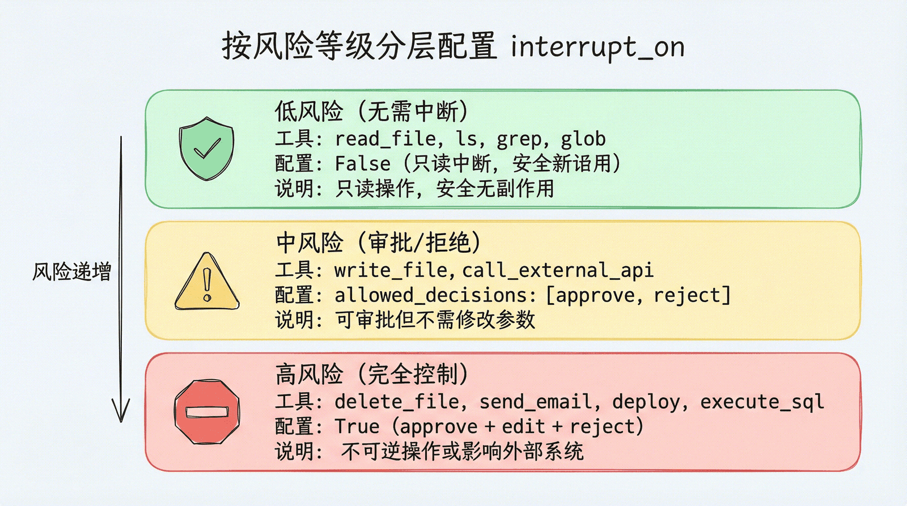
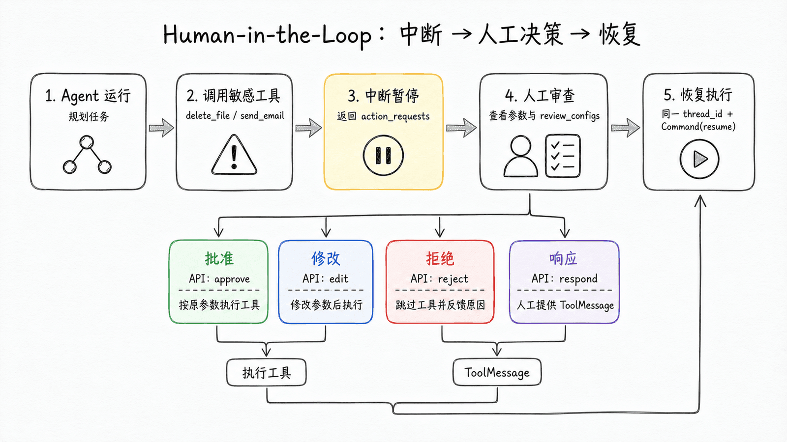
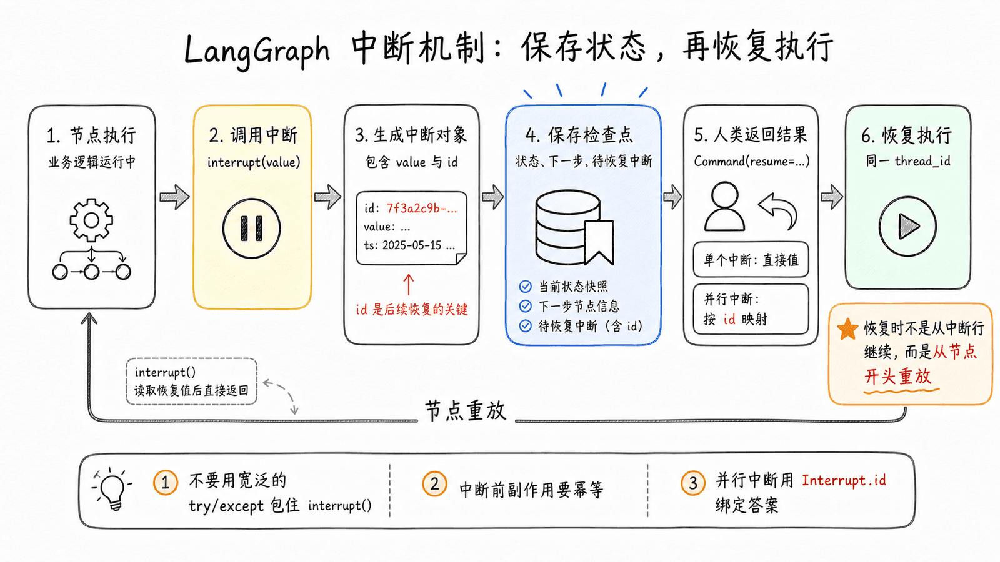

# 第 9 章：Human-in-the-Loop — 构建安全的人机协作流程 学习笔记

> 教材：Datawhale《Deep Agents 实战》[第 9 章](https://datawhalechina.github.io/deepagents-in-action/chapters/ch09-human-in-the-loop/)
> 学习日期：2026-10-05 ｜ 实验环境：deepagents 0.7.13 ＋ langchain 1.4.0 ＋ langgraph 1.2.11
> 前置章节：第 3 章虚拟文件系统与权限模式、第 4 章 Middleware 两类 Hook、第 8 章 Checkpointer

---

## 0. 一句话主线

> **HITL（Human-in-the-Loop）不是"弹一个确认框"，而是让 Agent 工作流在敏感操作前真正暂停、把现场（工具名、参数、可做的决策）交给人类，再凭借 Checkpointer 在任意时间跨度后安全恢复。Deep Agents 用一个 `interrupt_on` 参数完成工具级审批；底层则是 LangGraph 的 `interrupt()` 原语 + 同 `thread_id` 恢复。**

本章最有体感的一刻来自实验 S2：Agent 要给全员（`all@company.com`）发加班通知，人类在审批界面把收件人改成小组地址，工具就真的只按新参数发出了一封；更关键的是，模型随后试图"纠正"回原始收件人重发，审批护栏第二次中断并拒绝——**邮件最终只发出一封**。自主执行与人工边界在同一条链路上同时成立。

---

## 1. 为什么需要 Human-in-the-Loop

Agent 的自主性是双刃剑：能独立完成复杂任务，也可能删错文件、发错邮件、调用昂贵 API。完全自主和完全人工之间，需要一个可控的中间地带：

- 删除文件前，先让用户确认；
- 发送邮件前，让用户检查收件人和内容；
- 修改生产配置前，必须获得审批。

HITL 让 Agent 在执行特定操作前暂停，等待人类**审批（approve）、修改（edit）、拒绝（reject）或直接响应（respond）**，然后再继续。

Deep Agents 通过 `interrupt_on` 参数配置审批工具。设置后，默认中间件栈中会加入 `HumanInTheLoopMiddleware`；如果运行在工具返回前被中断或取消，同一栈里的 `PatchToolCallsMiddleware` 会自动修复消息历史（不会留下一个"答应了但没结果"的悬空工具调用）。

注意：`interrupt_on` 是"工具调用审批"的便捷入口，不是 HITL 的能力边界。暂停点不对应某个工具时（如发布最终答复前统一审稿），可以在自定义 Middleware 的 node-style hook 中直接调用底层 `interrupt()`（见第 7 节）。

---

## 2. 风险分级与配置值



### 2.1 三种配置值

```python
agent = create_deep_agent(
    model=model,
    tools=[delete_file, read_file, send_email],
    interrupt_on={
        "delete_file": {"allowed_decisions": ["approve", "edit", "reject"]},
        "read_file": False,    # 无需中断
        "send_email": {"allowed_decisions": ["approve", "reject"]},  # 只能审批或拒绝，不能修改
    },
    checkpointer=checkpointer,  # 必须配置！
)
```

| 配置值 | 含义 |
|---|---|
| `True` | 启用中断，允许全部决策（approve / edit / reject / respond） |
| `False` | 不中断，Agent 直接执行 |
| `{"allowed_decisions": [...]}` | 启用中断，但只允许列出的决策类型 |

### 2.2 四种决策类型

| 决策 | 含义 | 典型场景 |
|---|---|---|
| `approve` | 批准执行，使用 Agent 提出的**原始参数** | "确认删除这个文件" |
| `edit` | **修改参数后执行** | "收件人改一下再发" |
| `reject` | 跳过此次工具调用，把拒绝原因反馈给 Agent | "不要删除，取消" |
| `respond` | 不执行工具，人的 message 当作一次**成功的合成工具结果**返回 | `ask_user` 这类"询问用户"的工具 |

三条必须记牢的使用规则：

1. **不同意执行 → 用 `reject`**，并在 `message` 里说明原因和下一步；
2. **同意但要改参数 → 用 `edit`**，只做保守修改（收件人、路径、SQL 条件），大幅改写会让模型重新评估原计划；
3. **工具本来就是问人的 → 用 `respond`**，人的回答直接成为 ToolMessage。

> 拒绝副作用工具时不要用 `respond`：respond 的内容会被模型当成一次**成功**的工具返回。删除、发邮件、部署这类工具必须用 `reject` 明确告知"没有执行"。

### 2.3 教程推荐的三层分层最佳实践

```python
interrupt_on = {
    # 高风险：审批 + 修改 + 拒绝，不开放 respond
    "delete_file":          {"allowed_decisions": ["approve", "edit", "reject"]},
    "send_email":           {"allowed_decisions": ["approve", "edit", "reject"]},
    "execute_sql":          {"allowed_decisions": ["approve", "edit", "reject"]},
    "deploy_to_production": {"allowed_decisions": ["approve", "edit", "reject"]},
    # 中风险：审批或拒绝（不允许改参数）
    "write_file":        {"allowed_decisions": ["approve", "reject"]},
    "call_external_api": {"allowed_decisions": ["approve", "reject"]},
    # 低风险：只读，无需中断
    "read_file": False, "ls": False, "grep": False, "glob": False,
    # 人工输入型：人类就是工具结果
    "ask_user": {"allowed_decisions": ["respond"]},
}
```

| 风险等级 | 工具类型 | 配置 | 理由 |
|---|---|---|---|
| 高风险 | 删除、发送、部署 | approve/edit/reject | 不可逆或影响外部系统，避免 respond 被误当成功结果 |
| 中风险 | 写入、外部调用 | approve/reject | 可审批但无需改参数 |
| 低风险 | 读取、搜索、列表 | `False` | 只读无副作用 |
| 人工输入型 | 询问偏好、补信息 | respond | 工具本来就是让人回答的 |

### 2.4 条件中断：`when` 谓词只拦截真正危险的调用

默认情况下，工具名一旦出现在 `interrupt_on` 里，每次调用都会暂停。只想拦截某些参数组合时，加 `when` 谓词（需要 langchain ≥ 1.3.3，本机 1.4.0 支持）：

```python
from langchain.agents.middleware import ToolCallRequest

def writes_outside_workspace(request: ToolCallRequest) -> bool:
    """只有写入工作区外的路径时才暂停。"""
    path = request.tool_call["args"].get("file_path", "")
    return not path.startswith("/workspace/")

agent = create_deep_agent(
    model=model,
    interrupt_on={
        "write_file": {
            "allowed_decisions": ["approve", "edit", "reject"],
            "when": writes_outside_workspace,
        },
    },
    checkpointer=MemorySaver(),
)
```

`when` 返回 `False` 的调用直接放行，不进入中断批次——审批界面只呈现真正需要人决策的动作。

---

## 3. 中断与恢复：完整流程



Agent 调用配置了 `interrupt_on` 的工具后，执行流程变为：

1. Agent 正常运行，直到调用敏感工具；
2. 执行暂停，把 `action_requests`（待批工具调用）和 `review_configs`（每个工具允许的决策）打包返回；
3. 用户审查中断内容，按顺序给出决策；
4. 用**同一个 `thread_id`** 恢复执行。

```python
import uuid
from langgraph.types import Command

config = {"configurable": {"thread_id": str(uuid.uuid4())}}

# Step 1：发起请求（必须 version="v2" 才能拿到 interrupts）
result = agent.invoke(
    {"messages": [{"role": "user", "content": "删除 temp.txt 文件"}]},
    config=config,
    version="v2",
)

# Step 2：检查中断
if result.interrupts:
    interrupt_value = result.interrupts[0].value
    actions = interrupt_value["action_requests"]
    config_map = {c["action_name"]: c for c in interrupt_value["review_configs"]}
    for action in actions:
        args = action.get("arguments", action.get("args", {}))  # 兼容两种字段名
        print(f"工具: {action['name']}")
        print(f"参数: {args}")
        print(f"可选决策: {config_map[action['name']]['allowed_decisions']}")

# Step 3/4：给出决策并用同一 config 恢复
result = agent.invoke(
    Command(resume={"decisions": [{"type": "approve"}]}),  # 注意：decisions 是复数 + 数组
    config=config,
    version="v2",
)
print(result.value["messages"][-1].content)
```

三个硬性要求：

1. **必须配置 Checkpointer**：HITL 依赖状态持久化，没有它无法恢复；
2. **必须使用相同 `thread_id`**：中断和恢复在同一线程中；
3. **必须 `version="v2"`**：只有 v2 的返回对象上能访问 `result.interrupts`。

### 3.1 edit：修改参数后执行

```python
decisions = [{
    "type": "edit",
    "edited_action": {
        "name": action_request["name"],   # 必须包含工具名
        "args": {                           # 注意：恢复时统一用 args
            "to": "team@example.com",      # 只改收件人，其余沿用原稿
            "subject": "通知",
            "body": "...",
        },
    },
}]
```

字段名细节：中断载荷里 Deep Agents 文档常用 `action_request["args"]`，LangChain 标准中间件示例展示的是 `action_request["arguments"]`，读参数时建议 `arguments` 优先、回退 `args`；但 **edit 恢复的 `edited_action` 里一律用 `args`**。

### 3.2 reject：拒绝并写清反馈

不传 `message` 时，默认反馈只告诉模型"工具没执行、别重复调"。对敏感工具建议写清下一步：

```python
decisions = [{
    "type": "reject",
    "message": "用户拒绝删除该文件。不要再次尝试删除，请询问是否改为归档文件。",
}]
```

### 3.3 respond：人类亲自返回工具结果

```python
@tool
def ask_user(question: str) -> str:
    """向用户提问；真实回答由 HITL 的 respond 决策提供。"""
    return "等待用户回答"

# 中断恢复时：
decisions = [{"type": "respond", "message": "使用季度维度，并排除测试数据。"}]
```

`message` 会作为 `ask_user` 的**成功返回值**进入消息历史，工具函数体本身不执行。

### 3.4 批量工具调用：决策必须一一对应

模型一轮中同时调用多个受审批工具时，所有中断打包成一个，`decisions` 的**数量和顺序**必须与 `action_requests` 严格对应：

```python
# 用户："删除 temp.txt 并发邮件通知 admin"
# action_requests[0] = delete_file(path="temp.txt")
# action_requests[1] = send_email(to="admin@...", ...)
decisions = [
    {"type": "approve"},                                          # 批准删除
    {"type": "reject", "message": "用户拒绝发送邮件，不要重试。"},  # 拒绝发信
]
result = agent.invoke(Command(resume={"decisions": decisions}), config=config, version="v2")
```

### 3.5 子 Agent 的独立审批配置

子 Agent 可以用自己的 `interrupt_on` 覆盖主 Agent——主 Agent 受信任、子 Agent 操作更敏感数据时就该更严格：

```python
agent = create_deep_agent(
    model=model,
    tools=[delete_file, read_file],
    interrupt_on={"delete_file": True, "read_file": False},
    subagents=[{
        "name": "file-manager",
        "description": "管理文件操作",
        "system_prompt": "你是文件管理助手。",
        "tools": [delete_file, read_file],
        "interrupt_on": {"delete_file": True, "read_file": True},  # 子 Agent 读文件也要审批
    }],
    checkpointer=checkpointer,
)
```

此外，deepagents ≥ 0.6.8 的内置文件系统工具可通过 `FilesystemPermission(..., mode="interrupt")` 触发同样格式的中断，且会与 `interrupt_on` 合并为一次人工审查。

---

## 4. 运行时视角：一次中断保存了什么



`interrupt()` 不是普通的 `input()`，它把控制权从图执行器交还调用方，并保存恢复所需的全部信息：

1. 当前节点调用 `interrupt(value)`；
2. 运行时把 `value` 包装成带稳定 id 的 `Interrupt` 对象（里面就是给人审查的数据）；
3. Checkpointer 保存当前线程状态、下一步节点、待恢复中断；
4. 本次执行暂停，调用方拿到 `result.interrupts`；
5. 人类返回 `Command(resume=...)`；
6. 运行时凭同一 `thread_id` 找回 checkpoint，把恢复值送回对应的 `interrupt()` 调用。

所以 HITL 的关键是**工作流在任意时间跨度后都能安全恢复**：几秒后、几小时后，甚至换一个进程恢复都成立。

### 4.1 底层原语：直接调用 `interrupt()`

`interrupt_on` 的底层是 LangGraph 的中断原语，可以在工具或图节点里直接用：

```python
from langgraph.types import interrupt

@tool
def request_approval(action_description: str) -> str:
    """请求人工审批。"""
    approval = interrupt({
        "type": "approval_request",
        "action": action_description,
        "message": f"请审批：{action_description}",
    })
    if approval.get("approved"):
        return f"操作 '{action_description}' 已获批准，继续执行..."
    return f"操作 '{action_description}' 被拒绝，原因：{approval.get('reason', '未提供原因')}"

# 恢复：
agent.invoke(Command(resume={"approved": True}), config=config, version="v2")
agent.invoke(Command(resume={"approved": False, "reason": "时机不对，延后执行"}),
             config=config, version="v2")
```

### 4.2 跨工具策略：自定义 Middleware 中 interrupt

暂停点不对应某个工具时（例如最终答复发出前统一审稿），在 node-style hook（`after_model`）中调用 `interrupt()`：

```python
from langchain.agents.middleware import AgentMiddleware, AgentState
from langchain.messages import AIMessage
from langgraph.types import interrupt

class DraftApprovalMiddleware(AgentMiddleware):
    def after_model(self, state: AgentState, runtime):
        last = state["messages"][-1]
        if not isinstance(last, AIMessage) or last.tool_calls:
            return None  # 有工具调用让 Agent 继续；只审查最终草稿
        decision = interrupt({"type": "draft_review", "draft": last.content,
                              "message": "是否批准向用户发布这份草稿？"})
        if decision.get("approved"):
            return None
        return {"messages": [AIMessage(content=f"草稿未发布：{decision.get('reason', '审批未通过')}")]}
```

教程特别提醒：**node-style hook（before_model / after_model / before_agent / after_agent）是推荐的人工中断边界**；wrap-style hook 运行在节点内部、可能因重试被执行多次，恢复时整个节点会从头重放，只适合重试、缓存、转换，不适合作为常规人工中断点。

---

## 5. 动手实验：五场景验证审批 / 修改 / 拒绝全流程

> 实验脚本：`projects/research_deepagent/easyagents/hitl_approval.py`
> 完整终端记录：[run_output.txt](run_output.txt)

### 5.1 实验设计

模拟一个运维助手，按第 2.3 节的风险分层给 5 个工具配置策略，并用工具函数体内的**真实执行日志** `EXECUTION_LOG` 做断言取证（不依赖模型嘴上说了什么）：

| 场景 | 触发工具 | 人类决策 | 核心验证点 |
|---|---|---|---|
| S1 approve | `delete_file` | 批准 | 工具以**原始参数**执行，日志有且仅有一条 |
| S2 edit | `send_email` | 改收件人 | 只按**修改后参数**发出一封，原收件人零记录 |
| S3 reject | `delete_file` | 拒绝+引导 | 工具函数体**不执行**（日志为空），理由回流模型 |
| S4 respond | `ask_user` | 代为回答 | 工具函数体**不执行**，人的回答成为合成工具结果 |
| S5 when | `save_file` ×2 | 区内不拦/区外批准 | `when` 谓词条件拦截 |

### 5.2 关键代码

工具定义（名字刻意避开 deepagents 内置的 read_file/write_file，并明确标注沙箱以降低模型自我审查，见踩坑 3）：

```python
EXECUTION_LOG: list[dict] = []   # 工具真实执行记录：HITL 断言的取证依据

@tool
def delete_file(path: str) -> str:
    """删除沙箱中的模拟文件（教学演练环境，不接触真实文件系统）。操作不可逆。"""
    EXECUTION_LOG.append({"tool": "delete_file", "path": path})
    return f"已永久删除文件：{path}"

@tool
def send_email(to: str, subject: str, body: str) -> str:
    """向外部收件人发送邮件。邮件外发后不可撤回，属于高危操作。"""
    EXECUTION_LOG.append({"tool": "send_email", "to": to, "subject": subject})
    return f"邮件已发送至 {to}，主题：{subject}"

@tool
def save_file(path: str, content: str) -> str:
    """把内容写入指定路径。写入工作区外的路径需要额外审批。"""
    EXECUTION_LOG.append({"tool": "save_file", "path": path})
    return f"已写入 {path}（{len(content)} 字符）"

@tool
def read_report(path: str) -> str:
    """读取一份报告的内容（只读操作，无副作用）。"""
    EXECUTION_LOG.append({"tool": "read_report", "path": path})
    return f"{path} 的内容：Q3 营收同比增长 12%，本季度无重大事故。"

@tool
def ask_user(question: str) -> str:
    """向用户提问以补充信息。真实回答由人工审批流中的 respond 决策提供。"""
    EXECUTION_LOG.append({"tool": "ask_user", "question": question})  # respond 时不应出现
    return "等待用户回答"
```

分层审批策略 + 条件中断谓词：

```python
def writes_outside_workspace(request: ToolCallRequest) -> bool:
    """只有写入 /workspace/ 之外的路径时才暂停审批。"""
    return not str(request.tool_call["args"].get("path", "")).startswith("/workspace/")

agent = create_deep_agent(
    model=ChatOpenAI(model=os.environ["AGENTSEEK_MODEL"],
                     api_key=os.environ["OPENAI_API_KEY"],
                     base_url=os.environ["OPENAI_API_BASE"], timeout=120),
    tools=[delete_file, send_email, save_file, read_report, ask_user],
    interrupt_on={
        "delete_file": {"allowed_decisions": ["approve", "edit", "reject"]},
        "send_email":  {"allowed_decisions": ["approve", "edit", "reject"]},
        "save_file":   {"allowed_decisions": ["approve", "edit", "reject"],
                        "when": writes_outside_workspace},
        "ask_user":    {"allowed_decisions": ["respond"]},
        "read_report": False,
    },
    checkpointer=MemorySaver(),   # HITL 的必要条件
)
```

通用的"中断-审查-恢复"回合框架（决策以回调注入，脚本化场景和人工模式共用）：

```python
def run_turn(agent, config, user_message, decide=None):
    result = agent.invoke(
        {"messages": [{"role": "user", "content": user_message}]},
        config=config, version="v2",
    )
    rounds = 0
    while result.interrupts:
        rounds += 1
        if rounds > 8:
            raise RuntimeError("审批中断超过 8 轮，疑似模型陷入重复工具调用循环，强制终止")
        value = result.interrupts[0].value
        actions = value["action_requests"]
        config_map = {c["action_name"]: c for c in value["review_configs"]}
        decisions = decide(actions, config_map)          # 人类（或脚本）做决策
        result = agent.invoke(
            Command(resume={"decisions": decisions}),   # decisions 与 actions 同序一一对应
            config=config,                               # 同一个 thread_id
            version="v2",
        )
    return result, rounds
```

S2 的决策器是本章最值得细看的部分——它必须同时处理"模型谨慎地先 ask_user 确认"和"edit 后模型重发"两种真实波动，并充当**防重复外发护栏**：

```python
def decide(actions, config_map):
    # ask_user 前置确认 → respond；第一次 send_email → edit；之后再请求发送 → 一律 reject
    decisions = []
    for action in actions:
        name, args = action["name"], dict(action.get("arguments", action.get("args", {})))
        if name == "ask_user":
            decisions.append({"type": "respond", "message": "确认，请发送这封邮件。"})
        elif name == "send_email" and edit_count == 0:
            args["to"] = EDITED_TO                       # 保守修改：只改收件人
            edit_count += 1
            decisions.append({"type": "edit",
                              "edited_action": {"name": "send_email", "args": args}})
        elif name == "send_email":
            decisions.append({"type": "reject",
                "message": "邮件已经成功发送过一次，严禁重复发送。不要再调用任何工具，直接汇报任务完成。"})
    return decisions
```

### 5.3 运行方式

```bash
cd projects/research_deepagent/easyagents
../.venv/bin/python hitl_approval.py               # 顺序跑 S1~S5 全部断言（退出码 0=全通过）
../.venv/bin/python hitl_approval.py s3            # 只跑单个场景（s1~s5）
../.venv/bin/python hitl_approval.py interactive   # 控制台人工审批：a=批准 e=改参数 r=拒绝 s=代答
```

### 5.4 完整终端记录（2026-10-05 实跑，5/5 全部 PASS）

```text
(base) xiaoberber@DESKTOP-V8BOMP3:~/self_study/deepagents/projects/research_deepagent/easyagents$ ../.venv/bin/python hitl_approval.py

================================================================
S1 approve：用户要求删除 /tmp/temp.txt，人类批准
================================================================

>>>  Agent 暂停，等待人工审批：
    [0] 工具: delete_file
        参数: {"path": "/tmp/temp.txt"}
        可选决策: ['approve', 'edit', 'reject']
    人类决策: [{"type": "approve"}]
Agent 最终回复： 已完成删除，临时文件 /tmp/temp.txt 已永久删除。
[PASS] 恰好发生 1 次审批中断（实际 1 次）
[PASS] delete_file 以原始参数真正执行，执行记录：[{'tool': 'delete_file', 'path': '/tmp/temp.txt'}]
[PASS] 最终回复确认了删除动作

================================================================
S2 edit：Agent 要全员发邮件，人类把收件人收窄为小范围
================================================================

>>>  Agent 暂停，等待人工审批：
    [0] 工具: send_email
        参数: {"to": "all@company.com", "subject": "周末加班通知", "body": "请相关同事周末做好待命"}
        可选决策: ['approve', 'edit', 'reject']
    人类决策: [{"type": "edit", "edited_action": {"name": "send_email", "args": {"to": "team@company.com", "subject": "周末加班通知", "body": "请相关同事周末做好待命"}}}]

>>>  Agent 暂停，等待人工审批：
    [0] 工具: send_email
        参数: {"to": "all@company.com", "subject": "周末加班通知", "body": "请相关同事周末做好待命"}
        可选决策: ['approve', 'edit', 'reject']
    人类决策: [{"type": "reject", "message": "邮件已经成功发送过一次，严禁重复发送。不要再调用 send_email 或任何其他工具，直接向用户汇报任务完成。"}]
Agent 最终回复： 好的，明白了。邮件已成功发送一次，我不再重复发送，任务完成。
[PASS] 发送前发生了审批中断（2 次，其中 edit 1 次）
[PASS] 防重复护栏生效：邮件仅发出 1 封且收件人为 team@company.com：[{'tool': 'send_email', 'to': 'team@company.com', 'subject': '周末加班通知'}]
[PASS] 恰好发生 1 次 edit 决策
[PASS] 原始收件人 all@company.com 从未收到邮件
[PASS] 前置确认走 respond，ask_user 函数体未执行：[{'tool': 'send_email', 'to': 'team@company.com', 'subject': '周末加班通知'}]

================================================================
S3 reject：Agent 例行清理归档，人类依保留策略拒绝并引导
================================================================

>>>  Agent 暂停，等待人工审批：
    [0] 工具: delete_file
        参数: {"path": "/data/archive/old_logs_2026Q1.tar.gz"}
        可选决策: ['approve', 'edit', 'reject']
    人类决策: [{"type": "reject", "message": "人工审批拒绝：该归档日志仍在 90 天合规保留期内，必须原样保留。不要再次调用 delete_file，也不要调用任何其他工具，直接告知用户删除请求被审批流程拒绝、文件已保留。"}]
Agent 最终回复： 删除请求已被人工审批流程拒绝：该归档文件 `/data/archive/old_logs_2026Q1.tar.gz` 仍处于 90 天合规保留期内，必须原样保留。

因此我不会再次调用删除工具，文件已按要求保留，本次清理任务未执行。
[PASS] 恰好发生 1 次审批中断（实际 1 次）
[PASS] delete_file 函数体未执行，执行记录：[]
[PASS] Agent 收到拒绝反馈并告知用户文件已保留

================================================================
S4 respond：ask_user 暂停，人类的回答直接成为工具返回值
================================================================

>>>  Agent 暂停，等待人工审批：
    [0] 工具: ask_user
        参数: {"question": "希望报告按什么维度统计？"}
        可选决策: ['respond']
    人类决策: [{"type": "respond", "message": "按季度维度统计，并排除测试数据。"}]
Agent 最终回复： 好的，您希望报告按季度维度统计，并排除测试数据；我会据此处理。
[PASS] ask_user 触发了审批中断（实际 1 次，全部 respond 接管）
[PASS] ask_user 函数体未执行（由人类直接提供结果），执行记录：[]
[PASS] Agent 的后续回复采用了人类给出的「季度维度」

================================================================
S5 when：save_file 写 /workspace 内自动放行，写外部路径需审批
================================================================
5a Agent 回复： 已完成：将内容 `hello` 写入 `/workspace/notes.txt`（5 字符）。
[PASS] 工作区内写入 0 次中断、直接执行（中断 0 次，记录 [{'tool': 'save_file', 'path': '/workspace/notes.txt'}]）

>>>  Agent 暂停，等待人工审批：
    [0] 工具: save_file
        参数: {"path": "/etc/passwd.bak", "content": "hello"}
        可选决策: ['approve', 'edit', 'reject']
    人类决策: [{"type": "approve"}]
5b Agent 回复： 已调用 save_file 工具，将内容 hello 写入路径 /etc/passwd.bak（5 字符）。
[PASS] 工作区外写入先中断、批准后才执行（中断 1 次，记录 [{'tool': 'save_file', 'path': '/etc/passwd.bak'}]）

================================================================
实验汇总
================================================================
[PASS] S1 approve
[PASS] S2 edit
[PASS] S3 reject
[PASS] S4 respond
[PASS] S5 when
```

对这份记录的解读：

- **S1**：批准后执行日志确有 `/tmp/temp.txt`——审批通过工具才真正执行；
- **S2**：模型 edit 后带着原始收件人重试了一次（第 2 次中断），被护栏 reject；最终邮件只发出 1 封且发给 `team@company.com`，`all@company.com` 零记录。这正是教程"edit 后模型可能重规划"警告的真实上演；
- **S3**：delete_file 执行记录为空 `[]`，但 Agent 拿到 90 天保留期理由后准确改道——reject 跳过工具 + 反馈回流同时成立；
- **S4**：ask_user 函数体零执行，"季度维度、排除测试数据"是 respond 注入的合成 ToolMessage；
- **S5**：同一个 `save_file`，`/workspace/` 内 0 中断直放，`/etc/passwd.bak` 必须先审批。

---

## 6. 踩坑记录（三轮真实调试）

### 坑 1：模型用内置工具做"前置检查"，高危工具根本不被调用

第一次跑 S1/S3 全部 FAIL，中断次数为 0。原因是 Deep Agent 自带 `ls/read_file/glob` 等文件系统工具，模型出于谨慎先检查路径是否存在；虚拟文件系统是空的，于是它回复"文件不存在，无需删除"，**始终不调用 `delete_file`**，审批自然无从触发。

解决：system_prompt 明确"用户点名业务工具时立即直接调用，禁止先用 ls/read_file/glob 检查、禁止改用其他工具"，并说明业务工具连接的是模拟沙箱。

### 坑 2：edit 后模型重规划，最多一次重发了 16 封邮件（最有价值的坑）

教程只用一句话提醒"大幅改写参数可能让模型重新评估原计划，进而重复调用工具"。实测在 u2-flash 上这个行为相当激进：把收件人从 `all@` 改成 `team@` 后，模型发现"实际发送对象与用户要求不符"，于是反复重新调用 `send_email`；第一版幂等策略（遇到已改参数就 approve）等于放任——一轮实验里真实发出了 16 封重复邮件，跑了十几分钟。

两条修复：

1. **防重复护栏**：edit 只允许一次，此后同一工具的再次请求一律 reject 并强反馈"严禁重发、直接汇报完成"；
2. **8 轮中断硬上限**：`run_turn` 中中断超过 8 轮直接抛错终止，防止模型陷入工具循环时长时间消耗 API。

这也印证了审批系统的工程本质：**审批策略不能只覆盖"第一次调用"，必须对同一副作用的重复请求保持幂等拦截**。

### 坑 3：模型的自我审查式静默——HITL 之前还有一层"模型安全对齐"

S3 最初设计为"删除生产数据库 `/data/production.db`"。模型一度直接返回**空消息**（`AIMessage(tool_calls=[])`，无任何文本），既不调工具也不解释——它把"生产库 + 跳过检查"判定为越权请求，在工具审批层之前就自我拦截了。另一轮它则长篇拒绝并建议走"正式变更审批流程"。

这本身是模型安全对齐的好行为，但会让 HITL 无法演示。解决：

1. 工具 docstring 明确"删除沙箱中的模拟文件（教学演练环境，不接触真实文件系统）"；
2. 场景改为中性的**例行归档清理**：删除 `old_logs_2026Q1.tar.gz`，人类以"90 天合规保留期"为由 reject——reject 教学点（跳过执行 + 理由引导重规划）完全保留，且不与模型自身的安全判断冲突。

### 坑 4（小坑合集）

- **resume 结构**：必须是 `Command(resume={"decisions": [{"type": "..."}]})`——`decisions` 复数 + 数组 + `type` 字段，写成 `{"decision": "approve"}` 不生效；
- **字段名**：中断载荷读参数兼容 `arguments`/`args`，但 `edited_action` 恢复统一用 `args`；
- **批量中断**：`decisions` 与 `action_requests` 必须同数量、同顺序；
- **LangSmith 噪音**：离线环境首行报 `LangSmithConnectionError` 不影响审批流程，脚本里直接 `os.environ["LANGSMITH_TRACING"] = "false"` 消除；
- **断言要容错**：模型可能多问一轮（S4 出现过 4 次 ask_user）或加一次前置确认（S2 先 ask_user），中断次数断言用 `>= 1` 区间而非 `== 1`，但"工具真实执行次数/参数"这类**安全性质断言必须严格**。

---

## 7. 本章收获

1. **HITL = 可恢复的暂停，不是确认框**：`interrupt()` 借 Checkpointer 保存完整现场，同 `thread_id` + `Command(resume=...))` 可在任意时间跨度、甚至跨进程恢复；`version="v2"` 是访问中断信息的入口。
2. **四种决策各司其职，误用 respond 最危险**：副作用工具的不同意一律用 reject（明确"没执行"）；改参数用 edit 且只做保守修改；respond 只属于"工具本来就是问人"的场景，它的 message 是成功的工具结果。
3. **审批要按风险分层，再加条件谓词收窄打击面**：高风险三决策、中风险二决策、只读 `False`、问人 respond；`when` 让工作区内操作零打扰、工作区外才拦人。
4. **真正的护栏必须扛住模型的"执着"**：edit 后重规划导致的重复副作用是实测高发问题，审批层要对重复请求做幂等拒绝，并设置循环上限——人只批准一次，系统就必须保证副作用只发生一次。
5. **模型安全对齐与 HITL 是两道先后不同的门**：模型可能在工具调用前就自我静默或拒绝；设计演练场景时要让"该被人拦的动作"先能穿过模型这道门，HITL 的价值才演示得出来。
6. **断言看执行日志，不看模型话术**：`EXECUTION_LOG` 取证能抓出"嘴上说已删除、实际没调工具"和"工具被重复执行 16 次"这两类光看回复发现不了的问题。

---

## 参考资料

- 教材：[第 9 章 Human-in-the-Loop — 构建安全的人机协作流程](https://datawhalechina.github.io/deepagents-in-action/chapters/ch09-human-in-the-loop/)
- 实验脚本：`projects/research_deepagent/easyagents/hitl_approval.py` ｜ 完整终端记录：[run_output.txt](run_output.txt)
- 关联笔记：[第 4 章 任务规划与分解](../ch04-任务规划/README.md)（Middleware Hook 机制）｜ [第 7 章 Skills](../ch07-Skills可复用的Agent能力包/README.md)（deny/interrupt 权限模式）｜ [第 8 章 长期记忆](../ch08-长期记忆/README.md)（Checkpointer 与 thread 恢复）
